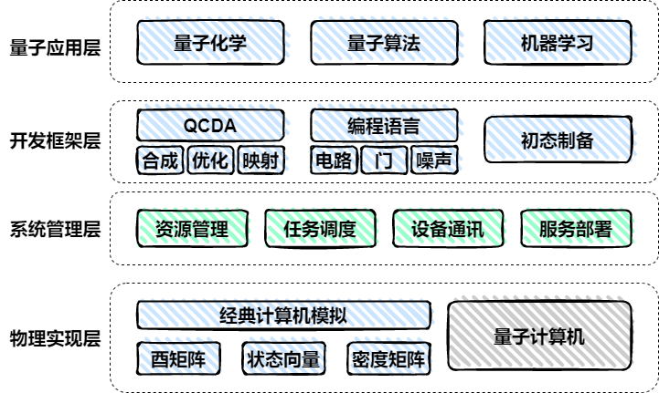

[](./LICENSE)     [](http://49.235.108.172:8080/)    


<<<<<<< HEAD
## QuICT 平台简介
QuICT (Quantum Computer of Institute of Computing Technology)是一个开源量子计算操作平台。目前QuICT已能支持6种常见指令集以及20余种量子门操作，已实现3种不同类型的量子电路模拟器，并且都有对CPU/GPU的支持和加速，可进行含噪声量子电路仿真模拟。设计并实现了QCDA(Quantum Circuit Design Automation)量子电路辅助设计模块，包括量子初态制备、指令集转换、酉矩阵合成、量子电路优化和映射等功能。算法方面，实现了shor、grover、qae等常见量子算法，可进行因数分解、SAT问题求解等；也实现了QML领域内的QAOA 和 QNN算法，支持图求解最大割问题和MNIST手写数字图片二分类。 QuICT同时也构建了量子算法电路库和针对量子计算机的性能基准测试，通过设计不同的量子电路赛道，来实现针对不同量子机特性的基准测试。

主要模块
- QuICT.algorithm: 包含多种常见量子算法，例如shor, grover, qaoa, vqe等。
- QuICT.core: 包含构建电路所需的组件，Circuit, Gates, Qubits等。
- QuICT.qcda: 量子电路生成、优化和映射
- QuICT.simulation: 量子电路模拟器，支持 Unitary、StateVector、DensityMatrix。

<div align=center></div>
=======
## In case that you have a favor over Docker
>>>>>>> ceb3be5e076f8251ddfc3e14dd65c38088e75607

相关链接
- 代码库：https://gitee.com/quictucas/quict
- 文档：https://pypi.org/project/quict/
- Pypi：https://pypi.org/project/quict/
- UI：http://49.235.108.172:8080/

## How to Install QuICT
### Install from Pypi
```
pip install quict
```

<<<<<<< HEAD
### Install from Source
- Prerequisites
  - C++ Compiler
    - Windows: [Installing Clang/LLVM for use with Visual Studio](https://devblogs.microsoft.com/cppblog/clang-llvm-support-in-visual-studio/)

    - Linux: `clang/LLVM`
    ```sh
    sudo apt install build-essential libtbb2 libtbb-dev clang llvm python3 python3-setuptools python3-numpy python3-scipy
    # if you handle python parts in another way, just install
    sudo apt install build-essential libtbb2 libtbb-dev clang llvm.
    ```
=======
## Build & Install QuICT

**Make sure to upgrade pip wheel and setuptools before building!**

> For Windows users, please see the special notes for Building on Windows.
>>>>>>> ceb3be5e076f8251ddfc3e14dd65c38088e75607

- Clone QuICT from Gitee
    ```sh
    # git clone
    git clone https://gitee.com/quictucas/quict.git
    ```

<<<<<<< HEAD
- For Ubuntu \
Following commands would build QuICT and install it system-wide. You might need "sudo" privileges to install QuICT into system python package path.

    > Due to some missing features in low version GCC (<=11), current QuICT is recommended to be built with clang. In future versions, GCC will be supported.
    ```sh
    export CC=clang && export CXX=clang++ && ./build.sh && ./install.sh
=======
> Due to some missing features in low version GCC (<=11), current QuICT is recommended to be built with clang.
> In future versions, GCC will be supported.

```bash
export CC=clang && export CXX=clang++ && ./build.sh && ./install.sh
```
>>>>>>> ceb3be5e076f8251ddfc3e14dd65c38088e75607

    # If you are encountered with permission issues during installing, try
    export CC=clang && export CXX=clang++ && ./build.sh && ./install.sh --user
    ```

<<<<<<< HEAD
- For Windows \
It is recommended to use clang-cl.exe, which is the clang compiler with MSVC CLI. Other compilers may work but not tested. Open "Developer PowerShell for VS", changing the working directory to QuICT repository root. Then build with following commands:

    ```powershell
    $ENV:CC="clang-cl.exe"
    $ENV:CXX="clang-cl.exe"
    $ENV:ComSpec="powershell.exe"
    python3 .\setup.py bdist_wheel
    ```

- In case that you have a favor over Docker
    ```sh
    # Build QuICT docker for target device [cpu/gpu]
    sudo docker build -t quict/{device} -f dockerfile/{device}.quict.df .
    ```

- Using Command Line Interface
    > please run following command firstly.
    ```python
    from QuICT.tools.cli import JobCreator, shortcut_for_quict

    shortcut_for_quict()
    ```

    > how to using QuICT CLI
    ```sh
    quict --help
    ```

## 使用示例
在 [example](./example)下，有关于QuICT各个主要模块的用例，另外在[Tutorial](https://gitee.com/quictucas/quict)中会有更详细的教程说明。

这里是一个简单例子关于QuICT的电路构建。

```python
from QuICT.core import Circuit

# Construct the circuit with 5 qubits and 20 random gates.
circuit = Circuit(5)
circuit.random_append(20)

print(circuit.qasm())
```

## Contributors
All stuff in the Laboratory for Quantum Computation and Theoretical Computer Science, ICT, CAS

## Related Papers


## License

Copyright (c) Institute of Computing Technology, Chinese Academy of Sciences. All rights reserved.

Licensed under the Apache 2.0 License.
=======
```bash
export CC=clang && export CXX=clang++ && ./build.sh && ./install.sh --user
```

### Building on Windows

It is recommended to use `clang-cl.exe`, which is the clang compiler with MSVC CLI. Other compilers may work but not tested. Open "Developer PowerShell for VS", changing the working directory to QuICT repository root. Then build with following commands:

```powershell
$ENV:CC="clang-cl.exe"
$ENV:CXX="clang-cl.exe"
$ENV:ComSpec="powershell.exe"
python3 .\setup.py bdist_wheel
```
>>>>>>> ceb3be5e076f8251ddfc3e14dd65c38088e75607
