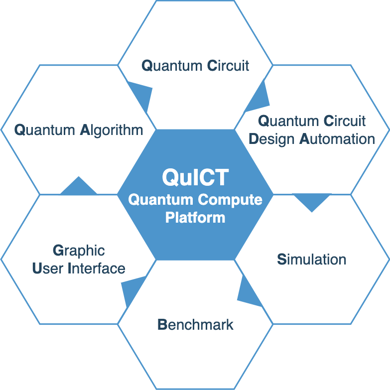

[](./LICENSE)     [](http://49.235.108.172:8080/)    
<div align=center></div>

## QuICT 平台简介
QuICT (Quantum Computer of Institute of Computing Technology)是一个开源量子计算操作平台。目前QuICT已能支持6种常见指令集以及20余种量子门操作，已实现3种不同类型的量子电路模拟器，并且都有对CPU/GPU的支持和加速，可进行含噪声量子电路仿真模拟。设计并实现了QCDA(Quantum Circuit Design Automation)量子电路辅助设计模块，包括量子初态制备、指令集转换、酉矩阵合成、量子电路优化和映射等功能。算法方面，实现了shor、grover、qae等常见量子算法，可进行因数分解、SAT问题求解等；也实现了QML领域内的QAOA 和 QNN算法，支持图求解最大割问题和MNIST手写数字图片二分类。 QuICT同时也构建了量子算法电路库和针对量子计算机的性能基准测试，通过设计不同的量子电路赛道，来实现针对不同量子机特性的基准测试。

<div align=center></div>

主要模块
- QuICT.algorithm: 包含多种常见量子算法，例如shor, grover, QAOA, VQE等。
- QuICT.core: 包含构建电路所需的组件，量子电路、量子门、量子比特等。
- QuICT.qcda: 量子电路生成、优化和映射。
- QuICT.simulation: 量子电路模拟器，支持酉矩阵、状态向量和密度矩阵。
- QuICT.tools: 辅助模块，包括画图、QASM转换、量子电路库以及Benchmark等。

更多功能
- QuICT_ML: 包含多种机器学习相关的量子算法库，比如QAOA、VQE，以及基于强化学习的量子电路映射算法
- QuICT_SIM: 量子电路模拟库，包含一个基于CPU的更高效快速的状态向量模拟器，以及多节点全振幅模拟器（暂未开源）

相关链接
- QuICT代码库：https://gitee.com/quictucas/quict
- QuICT_ML代码库： https://edu.gitee.com/quictucas/repos/quictucas/quict-ml/sources
- QuICT_SIM代码库： https://edu.gitee.com/quictucas/repos/quictucas/quict-sim/sources
- 文档：https://pypi.org/project/quict/
- Pypi：https://pypi.org/project/quict/
- UI：http://49.235.108.172:8080/

## 安装说明
### 预先准备
- PYTHON VERSION >= 3.8
- GPU环境要求
    - Cuda Toolkit: [Installing CUDA](https://developer.nvidia.com/cuda-toolkit-archive)
    - Cupy: [Installing Cupy](https://docs.cupy.dev/en/stable/install.html)
        ```sh
        nvcc -V     # 获得cuda版本号

        pip install cupy-cuda{version}      # 根据cuda版本号进行安装
        ```


### 从 pypi 安装
```
pip install quict
```

### 从Gitee处安装
- 克隆 QuICT 仓库
    ```sh
    # git clone
    git clone https://gitee.com/quictucas/quict.git
    ```

- QuICT 安装
    ```sh
    # 在quict仓库根目录下
    python setup.py install
    ```

- Docker 构建指令
    ```sh
    # Build QuICT docker for target device [cpu/gpu]
    sudo docker build -t quict/{device} -f dockerfile/{device}.quict.df .
    ```

### QuICT 命令行界面

```sh
quict --help
```

## 使用示例
在 quict/example 下，有关于QuICT各个主要模块的用例，另外在[Tutorial](https://gitee.com/quictucas/quict)中会有更详细的教程说明。

这里是一个简单例子关于QuICT的电路构建。

```python
from QuICT.core import Circuit

# Construct the circuit with 5 qubits and 20 random gates.
circuit = Circuit(5)
circuit.random_append(20)

print(circuit.qasm())
```

## 作者及引用
作者为量子计算和理论计算机科学实验室, 中国科学院计算技术研究所。如果您使用QuICT，请按照[此文件](./citation)进行引用

## 开源协议
版权所有 (c) 中国科学院计算技术研究所

许可基于 Apache 2.0 许可证
