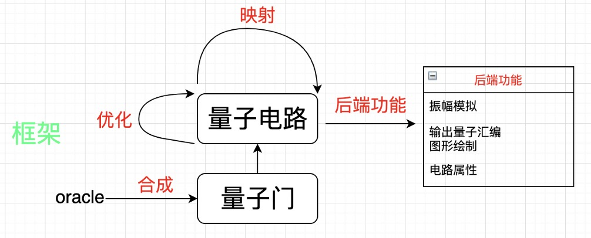

# QuICT项目文档

## 概述

QuICT是使用python作为输入输出处理语言，C++作为后端主要计算语言的量子电路模拟、量子电路化简代码，其框架如图所示：



### QuICT开发目的	

* 用作一个实验平台——具体而言，平台希望提供一些benchmark，这些benchmark要能够转化为OpenQASM 等较为通用的格式
* 作为一些量子模拟计算项目的基础模块，开发者只需要使用平台的API，就可以略过底层代码的编写，而直接完成对一些量子电路的描述与运算
* 对前沿的算法工作进行展示，包括量子算法与量子电路自动设计（EDA）
* 期望平台本身起到一个survey的作用，能够系统的整理一些已有的成果，减少研究者的调研成本


### 目前QuICT的功能

* 描述电路，电路的属性包括量子门、拓扑结构和噪声。

* 展示电路，包括电路的属性，其中，深度和总消耗可以用来衡量一个电路的优劣， 是实验的重要参数：
    + 文本化、图形化
    + 通用化（生成OpenQASM代码、IBMQ可执行代码）
    + 深度
	
* 运算电路振幅

* 简易可视化界面

* 电路生成，按照一定的规则生成benchmark

* 量子算法集成模块，集成一定的量子算法 (Algorithm)，如 Shor 算法等。

* 集成量子电路自动设计算法，包括读合成 (Synthesis)、优化 (Optimization)、映射

  (Mapping)。

## 安装

需要Python 3.0或以上的版本支持, 依赖**numpy**库，**目前只支持Linux和OS X系统运行**

#### 安装方式

运行QuICT根目录下的**install.sh**脚本进行安装

#### 注意事项

**install.sh**安装脚本中的最后一个语句如下:

```shell
sudo python3 setup.py install
```

该语句默认python3链接到了python3.0或以上版本，若提示python3不存在，可通过以下命令查看依赖

```shell
python --version
```

在python指向python3.0或以上版本的情形下，将**install.sh**中最后语句改为

```shell
sudo python setup.py install
```

即可解决此问题，否则请先手动配置python3.0或以上环境


若提示不存在**numpy**模块，请手动安装模块

## 代码更新

代码版本控制url为http://theory.ict.ac.cn/svn/quict_framework/

开发前期代码版本更迭会较为频繁，每次拉取代码后，重新执行安装脚本即可使用