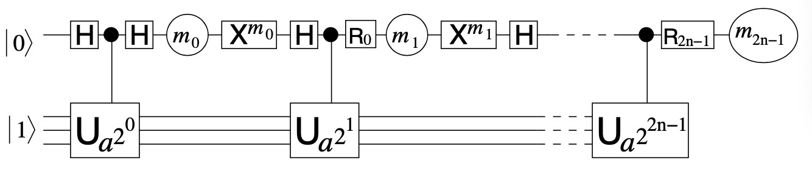
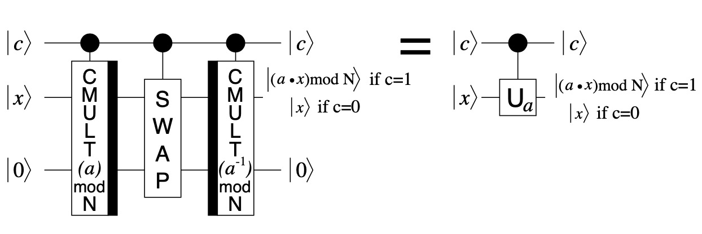
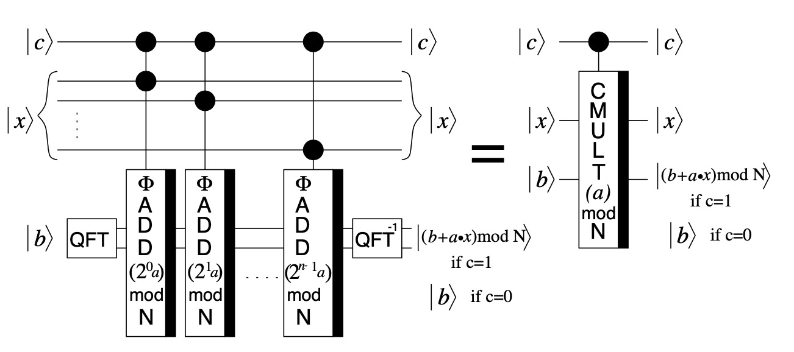
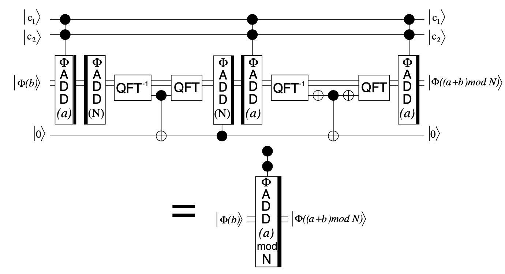
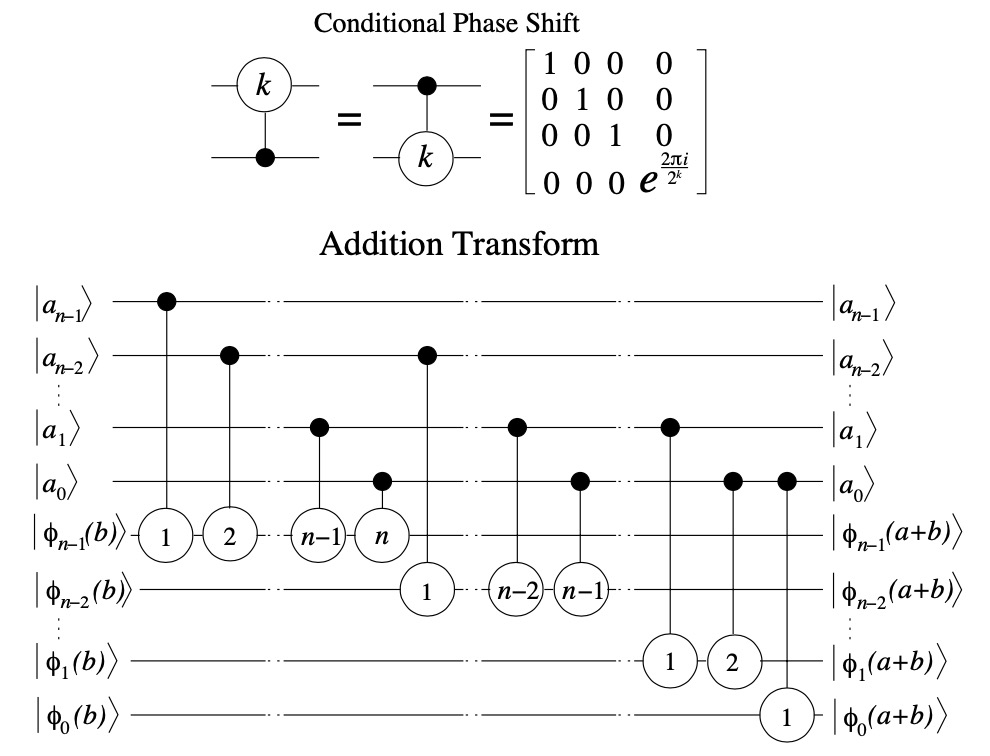
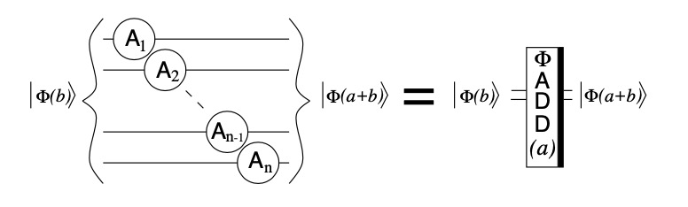
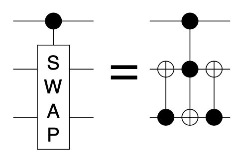
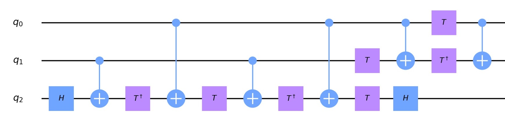

# 量子算法

在这里，我们描述QuICT算法库中的量子算法，即那些依赖量子计算机实现其高效性的算法

***

## Deutsch算法

### 问题描述

对一个有单变量的布尔函数\\(f(x) : \\{0, 1\\} \rightarrow \\{0, 1\\}\\)，求\\( f(0) \oplus f(1) \\)，其中\\(  \oplus \\)代表异或运算，规则为：\\( 0 \oplus 0 = 0, 1 \oplus 1 = 0, 0 \oplus 1 = 1, 1 \oplus 0 = 0 \\)

#### 算法输入

一个有单变量的布尔函数\\(f(x) : \\{0, 1\\} \rightarrow \\{0, 1\\}\\)

#### 算法输出

\\( f(0) \oplus f(1) \\)的值

#### 算法实现

1. 创建2位的量子电路，使其初始态为\\( |0 \rangle |1 \rangle \\)，由于平台量子比特初态为\\( |0 \rangle \\)，为构建初态，需要一个\\(X\\)门（\\( X|0 \rangle = |1 \rangle, X|1 \rangle = |0 \rangle \\)） 
2. 在两个量子比特上都作用\\(H\\)门，量子态变为:$$ \left [ \frac{|0 \rangle + |1 \rangle}{\sqrt{2}} \right ] \left [ \frac{|0 \rangle - |1 \rangle}{\sqrt{2}} \right ] $$（\\( H|0 \rangle =   \frac{|0 \rangle + |1 \rangle}{\sqrt{2}}, H|1 \rangle =  \frac{|0 \rangle - |1 \rangle}{\sqrt{2}} \\)）
3. 根据f，构造酉变换\\(U_f\\)，它将\\( |x \rangle |y \rangle \\)变为\\( |x \rangle |y \oplus f(x) \rangle \\)，在电路上作用\\(U_f\\)。 若\\( f(0) = f(1) \\)，可以计算得到量子态变为$$\pm \left [ \frac{|0 \rangle + |1 \rangle}{\sqrt{2}} \right ] \left [ \frac{|0 \rangle - |1 \rangle}{\sqrt{2}} \right ] $$ 若\\( f(0) \neq f(1) \\)，可以计算得到量子态变为$$ \pm \left [ \frac{|0 \rangle - |1 \rangle}{\sqrt{2}} \right ] \left [ \frac{|0 \rangle - |1 \rangle}{\sqrt{2}} \right ] $$  

4. 在电路第1位作用\\(H\\)门，由\\(H\\)门作用效果，量子态变为$$ \pm |f(0) \oplus f(1) \rangle \left [ \frac{|0 \rangle - |1 \rangle}{\sqrt{2}} \right ]   $$
5. 以\\(|0 \rangle\\)和\\(|1 \rangle\\)为基测量第1位： 若\\( f(0) \oplus f(1) = 0 \\)，测量结果为0 若\\( f(0) \oplus f(1) = 1 \\)，测量结果为1

#### 备注

由于算法第三步的\\(U_f\\)依赖于输入的\\(f(x)\\)，不同的函数就对应不同的电路，可以先假定函数\\(f(x)\\)，再给出电路

***

## Deutsch–Jozsa算法

### Deutsch's problem

对一个有\\(n\\)个变量的布尔函数\\(f\\)，每次可以询问\\(f(x)\\)的值(\\(x \in [0, 2^n-1])\\)。已知\\(f(x)\\)要么\\(constant\\)，要么\\(balanced\\)(对所有可能的\\(x\\)，一半的\\(f(x)\\)取值为0/Users/hanyu/Downloads/framework_fold/QuICT/QuICT/QuICT/doc/docs/algorithm.md，另一半取值为1)，问如何最快判断这个函数是\\(constant\\)还是\\(balanced\\)的。

在量子版本中，询问操作是一个酉变换\\(U_f\\)，它将\\( |x \rangle |y \rangle \\)变为\\( |x \rangle |y \oplus f(x) \rangle \\)

#### 算法输入

一个酉变换\\(U_f\\)，它将\\( |x \rangle |y \rangle \\)变为\\( |x \rangle |y \oplus f(x) \rangle \\)，函数\\(f\\)要么是\\(constant\\)的，要么是\\(balanced\\)的。

#### 算法输出

\\(U_f\\)对应的函数是\\(constant\\)还是\\(balanced\\)的。

#### 算法实现

1. 创建\\(n+1\\)位的量子电路，使其初始态为\\( |0 \rangle ^{\otimes n}|1 \rangle \\)，为构建初态，需要一个\\(X\\)门
2. 在某个量子比特上作用\\(H\\)门，量子态变为:$$ \sum_{x \in \\{0, 1\\}^n } \frac{|x \rangle}{\sqrt{2^n}} \left [ \frac{|0 \rangle - |1 \rangle}{\sqrt{2}} \right ] $$
3. 在电路上作用\\(U_f\\)，由于\\( |0 \oplus 1 \rangle - |1 \oplus 1 \rangle  = - (|0  \rangle - |1  \rangle )  \\)，量子态变为:$$ \sum_{x \in \\{0, 1\\}^n } \frac{(-1)^{f(x)}|x \rangle}{\sqrt{2^n}} \left [ \frac{|0 \rangle - |1 \rangle}{\sqrt{2}} \right ] $$ 

4. 在电路前\\(n\\)位作用\\(H\\)门，由$$ H^{\otimes n} |x_1, \cdots, x_n \rangle = \frac{\sum_{y_1, \cdots, y_n}(-1)^{x_1y_1 + \cdots + x_ny_n}| y_1, \cdots, y_n\rangle}{\sqrt{2^n}} $$电路的态变为$$ \sum_{y}\sum_{x \in \\{0, 1\\}^n } \frac{(-1)^{x \cdot y+ f(x)}|y \rangle}{2^n} \left [ \frac{|0 \rangle - |1 \rangle}{\sqrt{2}} \right ] $$
5. 注意到\\(|0 \rangle^{\otimes n}\\)的振幅为\\(\frac{\sum_x(-1)^{f(x)}}{2^n}\\)，以\\(|0 \rangle\\)和\\(|1 \rangle\\)为基测量前n位： 若函数是\\(constant\\)的，则\\(|0 \rangle^{\otimes n}\\)的振幅为\\(\pm 1\\)，测量结果一定全为0 若函数是\\(balanced\\)的，则\\(|0 \rangle^{\otimes n}\\)的振幅为0，测量结果一定不全为0

#### 算法分析

##### 对比传统算法

传统算法在最坏情况下需要询问\\(2^{\frac{n}{2}} + 1\\)次询问才能确定答案，量子版本只需调用一次\\(U_f\\)

##### 使用量子门个数

+ \\(X\\)门：\\(1\\)个
+ \\(H\\)门：\\(O(n)\\)个
+ \\(n+1位的U_f\\)门：1个
+ 测量位数：n位

***

## Shor算法

### 大数分解问题

对一个大数N，其二进制位数为n，寻找其一个非平凡质因子。

在QuICT平台上，我们使用了CNOT门与常见单比特门实现了Shor算法电路。

#### 算法输入

一个大数N。

#### 算法输出

N的一个质因子。

#### 参考文献

下文中算法与大部分图片来源于论文：

Beauregard S. Circuit for Shor’s algorithm using 2n+3 qubits[J]. arXiv preprint quant-ph/0205095, 2002.

#### 符号定义

+ 定义\\(\Phi(b)\\)为b经量子傅立叶变换后得到的数
+ 定义单比特门\\(Rz\\)，\\(Rz(\theta)\\)对应的矩阵为：

$$
\left[
 \begin{matrix}
   1 & 0 \\\\
   0 & e^{i\theta} \\\\
  \end{matrix} 
\right]
$$

+ 定义酉矩阵\\(U_a\\)，它使得\\(U_a |x \rangle = |(ax) \bmod N \rangle \\)
+ 定义酉矩阵\\(CMULT_a\\)，它使得\\(CMULT_a |x \rangle|b \rangle = |x \rangle|(ax + b) \bmod N \rangle \\)
+ 定义酉矩阵\\(ADDMOD_a\\)，它使得\\(ADDMOD_a |\Phi(b) \rangle = |\Phi((b + a) \bmod N) \rangle \\)
+ 定义酉矩阵\\(ADD_a\\)，它使得\\(ADD_a |\Phi(b) \rangle = |\Phi(b + a) \rangle \\)

#### 算法实现

1. 若\\(N\\)为偶数，返回\\(2\\)
2. 判断\\(N\\)是否有形式\\(N = a^b, a \geq 1, b \geq 2\\)，经典实现如下（实际在QuICT平台上，直接使用了浮点数运算）： (1)枚举所有\\(b(1 \leq b \leq n)\\) (2)计算\\(u_1 = floor(2^{\frac{n}{b}})\\)，\\(u_2 = ceil(2^{\frac{n}{b}})\\)，这步只需要\\(O(n^2)\\)的时间 (3)计算\\(u_1^b\\)和\\(u_2^b\\)，判断是否与N相等，若相等，则\\(N = a^b\\)，使用快速幂，这步只需要\\(O(n^2)\\)的时间 
3. 随机生成一个\\(x(1 \leq x \leq N-1)\\)，若\\(gcd(x, N) > 1\\)，返回\\(gcd(x, N)\\)
4. 寻找\\(x\\)对\\(N\\)的阶\\(r\\)，即\\(x^r \equiv 1(mod N) \\)，具体流程如下： (1)定义\\(Rth = 0, M = 0\\) (2)创建\\(2n+3\\)位的量子电路，其中后\\(n+2\\)位为辅助比特 (3)令\\(i = 0\\)，在\\(0\\)位上作用\\(H\\)门，并以\\(0\\)位为控制位，在\\(1\\)到\\(n\\)位上作用\\(U_{a^{2^i}}\\)门，这需要后\\(n+2\\)位进行辅助（具体拆分到两比特门见**算法细节-带控制的\\(U_{a}\\)门**）。 (4)在\\(0\\)位上作用\\(Rz(Rth)\\)门，再在\\(0\\)位上作用一个\\(H\\)门，然后在\\(0\\)位上作用测量门(见**算法细节-Shor算法的2n位qubit**) (5)若测量结果为1，则令\\(Rth = Rth + 1, M = M + 1 >> 2^{(2n - i)} \\)，并在\\(0\\)位上作用测量门 (6)令\\(Rth = \frac{Rth}{2}\\) (7)令\\(i\\)循环到\\(2n\\)，从第(3)步重复此过程 (8)使用连分数算法，求出阶r
5. 若\\(r\\)是偶数，或者\\(x^{r/2} \not \equiv -1 (mod N) \\)，则计算\\(gcd(x^{r/2} - 1, N)\\)和\\(gcd(x^{r/2} + 1, N)\\)，由于，其中一定有一个\\(N\\)的质因子。否则返回第3步。

#### 算法细节

##### Shor算法的2n位qubit

在Shor算法中，需要\\(2n\\)位近似阶\\(r\\)，这部分电路包含量子傅立叶逆变换在内，事实上只需要1个量子比特即可实现，只是需要不断作用测量门，再根据测量门结果控制电路门。

##### 带控制的\\(U_{a}\\)门

以\\(|c \rangle \\)所在位为控制位，以\\(n+1\\)到\\(2n + 2\\)位为辅助位，在\\(1\\)到\\(n+1\\)位上作用\\(U_{a}\\)门作用\\(U_{a}\\)门：

1. 以\\(c\\)为控制位，以\\(1\\)到\\(n\\)位作为\\(|x \rangle \\)，\\(n+2\\)到\\(2n + 1\\)位作为\\(|b \rangle \\)，作用\\(CMULT_a\\)

2. 令\\(i\\)从\\(1\\)循环到\\(n\\)，以\\(c\\)位控制位，\\(i、 i + n + 1\\)为控制位，作用Fredkin门(controlled-swap门，其也可以分解为CNOT门和一些特殊单比特门。

3. 以\\(c\\)为控制位，以\\(1\\)到\\(n\\)位作为\\(|x \rangle \\)，\\(n+2\\)到\\(2n + 1\\)位作为\\(|b \rangle \\)，作用\\(CMULT_{a^{-1}}\\)，其中\\(a^{-1}\\)为\\(a\\)在\\(N\\)下的乘法逆

   

##### 带控制的\\(CMULT_a\\)门

以\\(|c \rangle \\)所在位为控制位，\\(n\\)位作为\\(|x \rangle \\)，\\(n\\)位作为\\(|b \rangle \\)，\\(anc_1, anc_2\\)位作为辅助比特，作用\\(CMULT_a\\)：

设\\(x = (x_{n-1}, x_{n-2}, \cdots, x_{0})\\)，\\(a = (a_{n-1}, a_{n-2}, \cdots, a_{0})\\)，那么\\(ax = \sum_{i = 0}^{n - 1} 2^ia_ix_i  \\)。同时，由于\\(b+ax\\)可能产生进位，需要为\\(|b \rangle \\)预留一个进位，那么可以将\\(CMULT_a\\)门作一下拆解：

1. 对\\(|b, anc_1 \rangle\\) 进行量子傅立叶变换

2. 将\\(i\\)从\\(0\\)到\\(n-1\\)循环，以\\(|c \rangle \\)所在位和\\(|x \rangle \\)的第\\(i\\)位为控制位，\\(|b ,anc_1 \rangle\\)为作用位，作用\\(ADDMOD_{2^ia}\\)门

3. 对\\(|b, anc_1 \rangle\\)进行量子傅立叶逆变换

   

##### 带控制的\\(ADDMOD_{a}\\)门

以\\(|c_1 \rangle, |c_2 \rangle \\)所在位为控制位，在\\(\Phi(b)\\)上作用\\(ADDMOD_a\\)门，并且利用辅助比特\\(anc\\)：

事实上，\\((a+b) \bmod N\\)要么等于\\(a+b\\)，要么等于\\(a+b-N\\)，加法可以使用\\(ADD_a\\)门，减法则只需要使用其逆即可。当\\(a+b\\)产生进位的时候，\\((a+b) \bmod N\\)会变为\\(a+b-N\\)，那我们还需要一位存储其进位，按照这个思路，我们将\\(n\\)位，给出如下拆解：

1. 以\\(|c_1 \rangle, |c_2 \rangle \\)所在位为控制位，在\\(\Phi(b)\\)位上作用\\(ADD_{a}\\)门
2. 在\\(\Phi(b)\\)上作用\\(ADD_{N}\\)门的逆，即减去\\(N\\)
3. 在\\(\Phi(b)\\)上作用量子傅立叶逆变换，此时，电路状态为\\(\Phi(a+b-N)\\)或\\(\Phi(b-N)\\)，若\\(\Phi\\)中数小于0，则类似补码加法运算规则，\\(\Phi(b)\\)最高位上会产生进位
4. 以\\(\Phi(b)\\)最高位为控制位，\\(anc\\)为作用位，添加\\(CX\\)门
5. 在\\(\Phi(b)\\)上作用量子傅立叶变换
6. 以\\(anc\\)为控制位，在\\(\Phi(b)\\)位上作用\\(ADD_{N}\\)门，此时，如果刚才在\\(\Phi(b)\\)最高位上产生了进位，则会为\\(\Phi(b)\\)加上一个\\(N\\)，抵消掉之前减去\\(N\\)的影响，则此时电路状态为\\(\Phi((a+b) \bmod N)\\)或\\(\Phi(b \bmod N)\\)
7. 以\\(|c_1 \rangle, |c_2 \rangle \\)所在位为控制位，在\\(\Phi(b)\\)位上作用\\(ADD_{a}\\)门的逆，若之前\\(\Phi(b)\\)最高位没有产生进位，则这次会产生进位；若之前产生了进位，则这次不会产生进位
8. 在\\(\Phi(b)\\)上作用量子傅立叶逆变换，然后在\\(\Phi(b)\\)最高位上作用\\(X\\)门，再以\\(\Phi(b)\\)最高位为控制位，\\(anc\\)为作用位，添加\\(CX\\)门，最后再在\\(\Phi(b)\\)最高位上作用\\(X\\)门，再在\\(\Phi(b)\\)上作用量子傅立叶变换。这一步将\\(anc\\)还原为\\(|0 \rangle \\)态
9. 以\\(|c_1 \rangle, |c_2 \rangle \\)所在位为控制位，在\\(\Phi(b)\\)位上作用\\(ADD_{a}\\)门

##### 带两位控制的\\(ADD_{a}\\)门

先给出\\(ADD\\)门的原理，事实上就是由一组带控制位的\\(Rz\\)门组成：

由于\\(a\\)的值是提前知道的，可以省去控制位，直接给出一组\\(Rz\\)门。又因为相邻的\\(Rz\\)门可以合并，最后\\(ADD\\)门可以进一步简化为：

最后只需分解带两位控制的Rz门即可，可以分解为\\(CNOT\\)门和\\(Rz\\)门

##### \\(Fredkin\\)门的具体分解

 Toffoli门则可以分解为：

#### 使用量子门个数

作用了\\(2n\\)个\\(U_a\\)门

每个\\(U_a\\)门作用O(1)个\\(CMULT\\)门和其他O(n)个单比特门和\\(CNOT\\)门

每个\\(CMULT\\)门作用n个双控制位的\(ADDMOD)\门和其他O(n)个单比特门和\\(CNOT\\)门

每个双控制位的\(ADDMOD)\门作用O(n)个单比特门和\\(CNOT\\)门

+ 单比特门：\\(O(n^3)\\)
+ \\(CNOT\\)门：\\(O(n^3)\\)

#### 时间复杂度

除量子部分外，时间复杂度为\\(O(n^3)\\)；量子部分作用的单比特和\\(CNOT\\)门都为\\(O(n^3)\\)级别

#### 算法成功率

阶寻找算法的成功率大于等于\\(\frac{1}{4}\\)，阶r满足条件的概率大于等于\\(\frac{1}{2}\\)，则成功率大于等于\\(\frac{1}{8}\\)，具体分析过程可见《Quantum Computation and Quantum Information》

