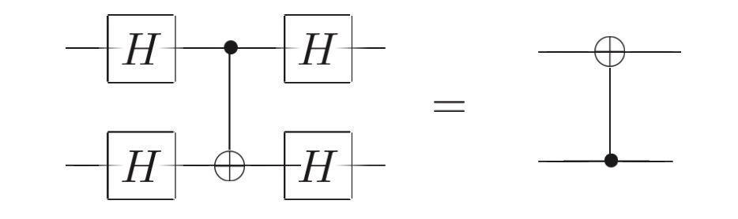
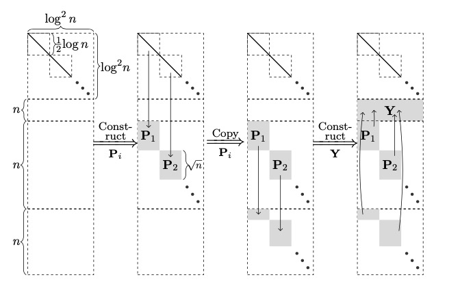

# 量子电路化简算法

在这里，我们描述QuICT算法库中的量子电路化简算法，实际上是一些经典算法

***

## Solovay-Kitaev 算法 

### 算法描述

将一个\\(n\\)比特的任意量子电路对应的酉矩阵用一系列固定的\\(n\\)比特量子门进行逼近

目前，由于计算资源限制，平台只支持单比特量子电路的SK分解

#### 参考文献

DAWSON C M, NIELSEN M A. The solovay-kitaev algorithm[J]. arXiv preprint quant-ph/0505030, 2005.

#### 符号定义与相关定理

定义\\(n\\)维量子堆(\\(qudit\\))上的量子门的有限集合\\(\mathcal{G}\\)，称为指令集(\\(instruction set\\))：

1. 对所有\\(g \in \mathcal{G}\\)，\\(g\\)都在\\(SU(n)\\)中，其特征值为1
2. 对所有\\(g \in \mathcal{G}\\)，\\(g^{\dagger}\\)也在\\(\mathcal{G}\\)中
3. \\(\mathcal{G}\\)是\\(SU(d)\\)中的一个宇集(universal set)，即\\(\mathcal{G}\\)生成的群在\\(SU(d)\\)中是稠密的

定义两个酉矩阵\\(U\\)，\\(S\\)的范数距离\\(\Vert U - S \Vert = sup_{\Vert \varphi \Vert = 1} \Vert (U - S)\varphi \Vert \\) 

Solovay-Kitaev定理：对于\\(SU(n)\\)中的一个指令集\\(\mathcal{G}\\)，给定一个精确度\\(\epsilon\\)。存在一个常数c，对于任意\\(U \in SU(n)\\)，有一个由\\(\mathcal{G}\\)中的量子门组成的长度为\\(O(log^c(\frac{1}{\epsilon}))\\)的序列\\(S\\)，\\(U\\)和\\(S\\)的范数距离小于\\(\epsilon\)。

#### 算法输入

一个\\(2^n \times 2^n\\)的酉矩阵

#### 算法输出

一个包含若干个n位量子门的数组

#### 算法实现

1. 设定\\(l_0\\)，枚举长度为\\(l_0\\)的量子门组合\\(\mathcal{G} _ {basic}\\)，同时计算\\(\epsilon_{0}, \epsilon_{0} \geq \min_{S \in \mathcal{G} _ {basic}}sup_{U \in SU(n)}\Vert S - U \Vert  \\\)。在平台实现单比特量子电路SK分解时，使用的指令集包括\\(H, Rz(\pi / 8),  Rz(-\pi / 8)\\)，\\(l_0 = 16\\)，\\(\epsilon_{0} = 0.14\\)

2. 定义\\(GC-Approx-Decompose(U)\\)，返回两个酉矩阵\\(V, W\\)，使得\\(VWV^{\dagger}W^{\dagger}\\)近似\\(U\\): (1)设\\(U\\)为\\(d \times d\\)的酉矩阵，计算\\(H = -i\log{U}\\)(使用特征值分解)，\\(G = diag(-\frac{d-1}{2}, -\frac{d-1}{2} + 1, \cdots, \frac{d-1}{2})\\) (2)计算\\(F\\)，$$ F_{jk} = \begin{cases} \frac{iH_{jk}}{G_{kk} - G_{jj}} & \mbox{if \\(j \\neq k\\)} \\\\ 0  &  \mbox{if \\(j = k\\)} \end{cases} $$ (3)调整\\(F\\)和\\(G\\)的特征值的模一致，具体做法为计算\\(f = det(F), g = det(G)\\)，\\(F = \sqrt{\frac{g}{f}}F, G = \sqrt{\frac{f}{g}}G \\) (4)计算\\(V = e^{iF}, W = e^{iG}\\) 

   获取最坏的近似值\\(c_{approx}\\)，在单比特情况下，\\(c_{approx} < \frac{1}{\sqrt{2}}\\)，在运算中将\\(c_{approx} 取为 \frac{1}{\sqrt{2}}\\)

3. 计算$$ n = \lceil \frac{\ln{ \left [ \ln(1/\epsilon c_{approx}^2) / \ln(1/\epsilon_0 c_{approx}^2 \right ] }}{\ln(3/2)} \rceil $$

4. 调用递归函数\\(Solovay-Kitaev(U, n)\\): (1)若\\(n = 0\\)，遍历\\(\mathcal{G} _ {basic}\\)，返回与\\(U\\)范数距离最近的组合 (2)令\\(U_{n-1} = Solovay-Kitaev(U, n - 1)\\)   (3)令\\(V, W = GC-Approx-Decompose(UU_{n-1}^{\dagger}) \\) (4)令\\(V_{n-1} = Solovay-Kitaev(V, n - 1)\\) (5)令\\(W_{n-1} = Solovay-Kitaev(W, n - 1)\\) (6)返回\\(V_{n-1}W_{n-1}V_{n-1}^{\dagger}W_{n-1}^{\dagger}U_{n-1}\\)

#### 算法分析

1. 根据递归函数的性质，序列长度为\\(5^n\\)，时间复杂度为\\(3^n\\)（共轭转置信息可以折叠起来，使得时间复杂度可以短于序列长度，但在实际情况中，由于输出了每个门，时间复杂度为\\(5^n\\)），代入单比特情况与设定指令集的参数，长度为\\(O(ln^{ln 5 / ln(3/2)}(1/\epsilon))\\)，时间为\\(O(ln^{ln 3 / ln(3/2)}(1/\epsilon))\\)，即时间复杂度约为\\(O(log^{2.71}(\frac{1}{\epsilon}))\\)，序列长度约为\\(O(log^{3.71}(\frac{1}{\epsilon}))\\)
2. 在实际运行中，常数\\(3^{16}\\)是运行较慢的主要原因（3为指令集元素个数，16为\\(l_0\\)）

## Quantum Shannon Decomposition算法

### 算法描述

使用Cartan decomposition，将一个n位的任意酉矩阵递归分解为\\(O(4^n)\\)个\\(CNOT\\)门和\\(O(4^n)\\)个单比特门

#### 参考文献

1. Childs A M, Haselgrove H L, Nielsen M A. Lower bounds on the complexity of simulating quantum gates[J]. Physical Review A, 2003, 68(5): 052311.
2. Vatan F, Williams C. Optimal quantum circuits for general two-qubit gates[J]. Physical Review A, 2004, 69(3): 032315.
3. Nakajima Y, Kawano Y, Sekigawa H. A new algorithm for producing quantum circuits using KAK decompositions[J]. arXiv preprint quant-ph/0509196, 2005.
4. Mottonen M, Vartiainen J J. Decompositions of general quantum gates[J]. arXiv preprint quant-ph/0504100, 2005.
5. Drury B, Love P. Constructive quantum Shannon decomposition from Cartan involutions[J]. Journal of Physics A: Mathematical and Theoretical, 2008, 41(39): 395305.

#### 算法输入

一个\\(2^n \times 2^n\\)的酉矩阵

#### 算法输出

n位的量子电路，只包含\\(CNOT\\)门和单量子比特门

#### 算法描述

定义递归函数\\(NKS(U)\\)，它返回对\\(U\\)进行Quantum Shannon Decomposition分解产生的量子门序列：

1. U为\\(4 \times 4\\)酉矩阵时，使用Cartan decomposition \\(\textbf{AI}\\)型进行特殊分解： (1)令\\(B = \frac{1}{\sqrt{2}} \left( \begin{matrix} 1& i & 0 & 0 \\\\ 0 & 0 & i & 1 \\\\ 0 & 0 & i & -1 \\\\ 1 & -i & 0 & 0 \end{matrix} \right) \\)，\\(U^{'} = B^{\dagger}UB \\) (2)令\\(M2 = (U^{'})^TU^{'}\\)，并将其对角化为\\(PDP^{\dagger}\\)(\\(P \in SO(4)\\)) (3)计算\\(K^{'} = U^{'}PD^{-\frac{1}{2}}P^{\dagger}, K_1 = BK^{'}PB^{\dagger}, K_2 = BP^{\dagger}B^{\dagger}, A = BD^{\frac{1}{2}}B^{\dagger} \\)，则\\(U = K_1AK_2\\) (4)分解\\(K_1, K_2 \in SU(2) \otimes SU(2) \\) (5)分解\\(A \in exp(span_{\mathbb{R}}i\\{XX, YY, ZZ\\})\\)，产生3个\\(CNOT\\)门和4个单比特门，分解方法见参考文献1和2
2. 令\\(\Theta(U^{\dagger}) = Z^nU^{\dagger}Z^n\\)，\\(Z^n = I^{\otimes (n-1)} \otimes Z \\)
3. 令\\(M2 = \Theta(U^{\dagger})U\\)，将其对角化为\\(pbp^{\dagger}\\)，对角化方法见参考文献3的3.2.1
4. 计算\\(y = \sqrt{b}, m = pyp^{\dagger}, k = Um^{\dagger}, k^{'} = kp\\)，则\\(U =  k^{'}yp^{\dagger}\\)
5. 分解\\(k^{'}, p^{\dagger}\\)，它们都有\\(g0 \otimes |0\rangle \langle0| + g1 \otimes |1\rangle \langle1| \\)的形式，这个形式可以分解成两个\\(n-1\\)量子门和\\(uniformlyRz\\)门，分解方法见参考文献5
6. y则对应一个\\(uniformlyRx\\)门，分解方法见参考文献5

## 带拓扑结构的CNOT-Rz电路优化

### 算法描述

对于一个带拓扑结构的只含\\(CNOT \mbox{门和} Rz \mbox{门}\\)，将其进行化简

#### 符号定义和相关定理

斯坦纳树:	在一个非负边权无向图\\(\mathcal{G}\\)中，给定k个关键点 ，选取图中的边连通这k个关键点的边权和最小的树

\\(CNOT\\)门方向问题：量子电路的拓扑结构是有向的，使用\\(4\\)个\\(H\\)门就能调转\\(CNOT\\)门的方向：

由于一般认为单量子比特门代价远小于\\(CNOT\\)门，在算法实现过程中，我们就将拓扑结构看作无向的，最后再按照实际拓扑进行翻转即可。

由于\\(CNOT\\)门的作用效果相当于异或，\\(Rz门\\)的作用只是对\\(|1 \rangle\\)态的振幅相位进行变换，不会对\\(CNOT\\)门的作用产生影响，故而\\(Rz\\)门的作用可以写成 \\(|x \rangle\\) 态下的旋转( \\( x \in [0, 2^n)\\))，所以算法只需要用\\(CNOT\\)门表现出各个态，再作用\\(Rz\\)门即可，最后再表示成电路无\\(Rz\\)门的等价形式。

#### 算法输入

一个\\(n\\)位的只含\\(CNOT \mbox{门和} Rz \mbox{门}\\)的量子电路

#### 算法输出

化简后的量子电路

#### 算法描述

1. 按照拓扑结构，将有向边看作无向边，构建无向图\\(\mathcal{G}\\)，设定其边权为1，读取量子电路的各个门，用异或的方式处理\\(CNOT\\)门，记录各个态的旋转以及最终的态。设产生旋转的态的集合为\\(S\\)，其中元素为\\((x, \theta_x)\\)，分别为态对应的数字和对应的旋转角度( \\( x \in [0, 2^n)\\))
2. 若\\(S\\)为空，取出上一步记录的最终的态，否则从\\(S\\)中取出一组尽量多的线性无关的态并保持线性无关地扩充到\\(n\\)个，用\\(CNOT\\)门生成这些态，设这些态共有\\(k\\)个，我们尝试在前k个量子比特上生成这些态。由于电路可能已经经过了一系列变化，我们以\\(n\\)个量子比特的当前状态为基，对这些态进行变换。变换完毕后，进行高斯消元，最后将添加的门反转，就能生成对应态，高斯消元具体实现方法如下： (1)进行\\(n\\)轮消元，第\\(i\\)轮时，在\\(i\\)到\\(n\\)行寻找第1个第\\(i\\)列不为0的行。在一般的高斯消元中，会将该行变换到第\\(i\\)行，这里使用bfs在\\(\mathcal{G}\\)上寻找最短路径，沿路径作用\\(CNOT\\)门 (2)寻找所有需要消去的行，以它们为关键点在\\(\mathcal{G}\\)上构建斯坦纳树，用简单的dfs操作即可以进行消去 (3)对第\\(i\\)行进行回消，以涉及到的行为关键点在\\(\mathcal{G}\\)上构建斯坦纳树用简单的dfs操作即可以进行回消
3. 若上一步\\(S\\)为空，跳到第5步 
4. 按照第1步的记录的角度，在对应的量子比特上作用相应\\(Rz\\)门
5. 检查所有的门，对\\(CNOT\\)门按照拓扑的方向进行对应的调整，最后再反转所有的门

## 使用辅助比特对CNOT电路进行优化

### 算法描述

对于一个\\(n\\)比特的只包含\\(CNOT\\)门的量子电路，使用\\((3s+1)n\\)个辅助比特进行优化，将\\(CNOT\\)电路的深度降到\\(O(\frac{n}{slogn})\\)(\\(1 \leq s \leq \frac{n}{log^2n}\\))

#### 参考文献

JIANG J, SUN X, TENG S H, et al. Optimal space-depth trade-off of cnot circuits in quantum logic synthesis[C]//Proceedings of the Fourteenth Annual ACM-SIAM Symposium on Discrete

Algorithms. SIAM, 2020: 213-229.

#### 算法输入

一个\\(n\\)位的只含\\(CNOT\\)门的量子电路和参数\\(s\\)(\\(1 \leq s \leq \frac{n}{log^2n}\\))

#### 算法输出

一个包含\\((3s+2)n\\)个量子比特的量子电路，深度为\\(O(\frac{n}{slogn})\\)

#### 算法实现

1. 读取所有\\(CNOT\\)门，用异或的方式生成矩阵\\(M \in GL(n, 2)\\)
   1. 构建\\(\mathcal{C_1}\\)，使得\\(C_1|x\rangle |j\rangle|0\rangle^{\otimes 3sn} = |x\rangle |j \otimes Mx \rangle|0\rangle^{\otimes 3sn} \\)，具体步骤如下： (1)如上所说，\\(\mathcal{C_1}\\)的作用效果为\\( \left [ \begin{matrix} I & & \\\\ M &  I & * \\\\ & & I_{3sn} \end{matrix} \right ] \\)，将\\(M\\)按\\(slog^2n\\)列为一块分块实现 (2)分块实现可以看作使用\\(CNOT\\)门构建矩阵\\( \left [ \begin{matrix} I & & \\\\ Y &  I & * \\\\ & & I_{3sn} \end{matrix} \right ] \\)，Y为\\(n \times slog^2n\\)的矩阵，\\(slog^2n\\)又可以以\\(log^2n\\)列为一块分块实现，注意到，由于共有\\(3sn\\)个可用的辅助比特，相当于每一块可以分到\\(3n\\)的辅助量子比特而互相不干扰。每一块使用\\(2n\\)个辅助比特，在\\(n\\)个量子比特上产生内容，最后使用\\(CNOT\\)门转移到相应位置上，然后作用之前门的逆，将\\(3sn\\)个辅助比特清空 (3)第(2)步的辅助比特使用如下，\\(P_i\\)是\\(2^{\frac{1}{2}logn}\\)种二进制串的枚举，用\\(O(logn)\\)深度电路就可以实现，最后\\(n\\)量子比特上生成所需内容
2. 求\\(M\\)的逆\\(M^{-1}\\)，构建\\(\mathcal{C_2}\\)，使得\\(C_2|j\rangle |x\rangle|0\rangle^{\otimes 3sn} = |j \otimes M^{-1}x\rangle |x \rangle|0\rangle^{\otimes 3sn} \\)，具体步骤同上
3. \\(\mathcal{C_1C_2}\\)即为化简后量子门序列

## 可逆布尔电路的分解

### 算法描述

对一个 n 位的偶置换可逆布尔函数，将其分解为7个\\(n-1\\)位的可逆布尔函数\\(n \geq 6\\)。

#### 参考文献

JIANG J, SUN X, SUN Y, et al. Structured decomposition for reversible boolean functions[J]. IEEE

Transactions on Computer-Aided Design of Integrated Circuits and Systems, 2019.

#### 算法输入

一个只包含经典量子门的\\(n\\)位的量子电路

#### 算法输出

一个最多包含7个\\(n-1\\)位置换量子门的量子电路

#### 算法实现

## 电路单振幅模拟

### 算法描述

对于一个\\(n\\)比特的任意量子电路，以全\\(0\\)态作为初始态，计算其某个态\\(|x \rangle\\)的振幅

#### 参考文献

BOIXO S, ISAKOV S V, SMELYANSKIY V N, et al. Simulation of low-depth quantum circuits as complex undirected graphical models[J]. arXiv preprint arXiv:1712.05384, 2017.

#### 算法输入

一个\\(n\\)位的量子电路和需要求的状态对应的数\\(x, 0 < x < 2^n\\)

#### 算法输出

一个复数，表示\\(|x \rangle \\)态的振幅

#### 算法实现

由于QuICT平台的量子门运算方式还在调整，代码部分还需要进一步进行调整