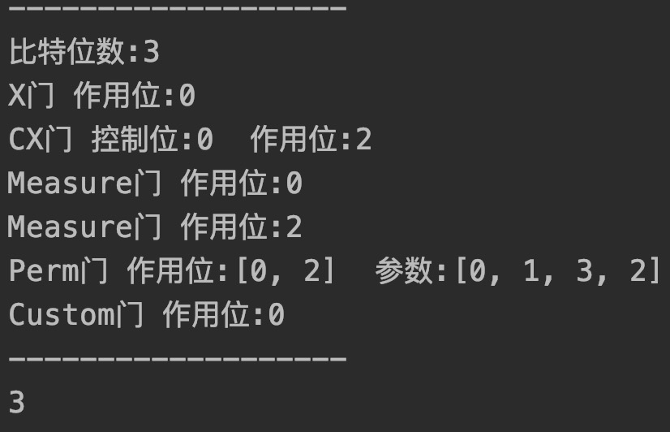
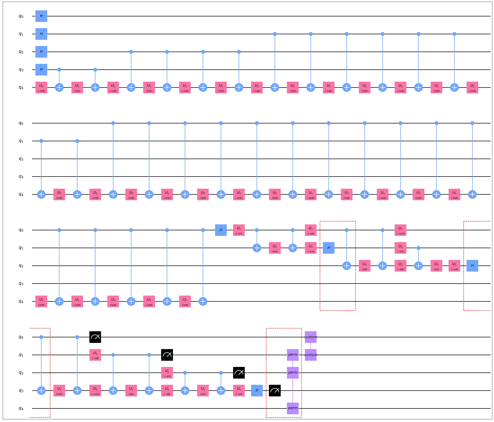
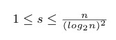
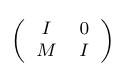
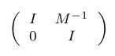
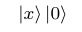
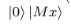
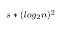
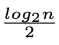

## 手册目的

用户手册的编写目的是为QuICT的使用者提供使用指导与使用建议，明确QuICT的可用功能与优势

## 主要功能

* 描述电路，电路的属性包括量子门、拓扑结构和噪声。

* 展示电路，包括电路的属性，其中，深度和总消耗可以用来衡量一个电路的优劣， 是实验的重要参数：
    + 文本化、图形化
    + 通用化（生成OpenQASM代码、IBMQ可执行代码）
    + 深度
	
* 运算电路振幅

* 电路生成，按照一定的规则生成benchmark

* 调用库中的量子算法和量子电路自动设计算法


### 电路构建与运行（以下类和实例均在QuICT.model中）

#### 量子比特类Qubit与Qureg

电路的基本组成元素，Qureg在数据结构上是一个Qubit的列表(数组)，当Qubit作用了**测量**门后可以获取其整数值0/1，详见之后的**门**类型

#### 电路类Circuit

1、初始化，给出电路qubit数量以生成实例

```python
def __init__(self, wires):
	"""
	:param wires: 电路位数
	"""
```

```python
n = 10
circuit = Circuit(n)	# 生成的circuit是一个线路数为10的量子电路
```

2、电路常用属性

+ 电路的Qureg，是一个Qubit的列表（数组）

```python
@property
def qubits(self) -> Qureg:
	return self.__qubits
```

可使用以下方式获取电路的相应Qubit

```python
# 获取整个Qureg
qureg = circuit.qubits
# 获取部分Qubit组成的Qureg
qureg = circuit([1, 2])	# 通过传入list获取1号Qubit和2号Qubit组成的Qureg
qureg = circuit((1, 2)) # 通过传入元组获取1号Qubit和2号Qubit组成的Qureg
```

+ 电路的拓扑关系

```python
'''
topology是二元组的列表(数组)，数组的每个元素都是一个表征有向拓扑关系的二元组(u, v)
它声明从u到v可以作用一个2-qubit门。为方便起见，当该数组为空时，认为电路是全连通的
'''
@property
def topology(self) -> list:
	return self.__topology
```

+ 电路上已有的门

```python
# 作用在电路上的门的列表(数组)
@property
def gates(self) -> list:
	return self.__gates
```

3、电路的常用方法

+ 添加拓扑二元组

```python
'''
输入一个二元组或者二元组的列表，二元组(u, v)声明从u到v可以作用一个2-qubit门
u可以是Qubit，单元素的Qureg或者int值(表征在电路中的序号)
'''
def add_topology(self, topology):
	"""
	添加拓扑逻辑
	:param topology:
		1) tuple<qureg(len = 1)/qubit/int>
		2) list<tuple<qureg(len = 1)/qubit/int>>
	:raise TypeException
  """
```

+ 使一个Qureg全联通

```python
'''
输入一个Qureg, 使它们拓扑关系变为全联通
(对于包含m个Qubit的Qureg，等价于添加m * (m - 1)条拓扑关系)
'''
def add_topology_complete(self, qureg : Qureg):
	"""
	添加完全图拓扑逻辑
	:param qureg: 在它们之间构建完全拓扑图
	"""
```

+ 使量子电路执行添加到其中的所有门

```python
# 为保证运行效率，添加到电路上的门并非马上被执行，而是在需要运算值时再进行执行，也可以调用flush进行手动刷新
def flush(self):
	"""
	作用所有未处理的门
	:raise 给出了无法处理的门
	"""
```

+ 输出电路信息
```python
def print_infomation(self):
  # 输出电路的比特信息和其上门的信息
```

#### 基础门类型

|   名称   | 作用位数量 | 控制位数量 | 参数个数 |        额外说明         |
| :------: | :--------: | :--------: | :------: | :---------------------: |
|    H     |     1      |     0      |    0     |                         |
|    S     |     1      |     0      |    0     |                         |
| S_dagger |     1      |     0      |    0     |                         |
|    X     |     1      |     0      |    0     |                         |
|    Y     |     1      |     0      |    0     |                         |
|    Z     |     1      |     0      |    0     |                         |
|    ID    |     1      |     0      |    0     |                         |
|    U1    |     1      |     0      |    1     |                         |
|    U2    |     1      |     0      |    2     |                         |
|    U3    |     1      |     0      |    3     |                         |
|    Rx    |     1      |     0      |    1     |                         |
|    Ry    |     1      |     0      |    1     |                         |
|    Rz    |     1      |     0      |    1     |                         |
|    T     |     1      |     0      |    0     |                         |
| T_dagger |     1      |     0      |    0     |                         |
|    CZ    |     1      |     1      |    0     |                         |
|    CX    |     1      |     1      |    0     |        即CNOT门         |
|    CH    |     1      |     1      |    0     |                         |
|   CRz    |     1      |     1      |    1     |     带控制位的Rz门      |
|   CCX    |     1      |     2      |    0     |        tofflin门        |
| Measure  |     1      |     0      |    0     |         测量门         |
| Reset     |     1| 0 | 0 | 重置门，将一位还原为0 |
|   Swap   |     2      |     0      |    0     |         交换门         |
|   Perm   |   自定义   |     0      |  自定义  | 对2^n个振幅进行任意置换 |
|  Custom  |   自定义   |     0      |  自定义  |    可表示任意酉矩阵     |

1、作用方式	

```python
'''
对于不带参数的门，直接用｜语法作用在Qubit/Qureg上即可，默认控制位在前，作用位在后，例如
'''
from QuICT.model import *
circuit = Circuit(3)    # 构建一个3位的量子电路	
X | circuit(0)          # 在电路的0位上作用一个X门
qureg = circuit([0, 2])	#	获取电路的0位和2位组成的Qureg
CX | qureg              # 在qureg上作用CNOT门，控制位为0，作用位为2
# 当一个单比特门作用于一个Qureg上时，默认会作用在所有Qubit上
Measure | qureg         # 在电路的0位和2位上各作用一个测量门

'''
对于带参数的门，用｜语法作用在Qubit/Qureg上的同时还需要指定参数，参数用小括号给出
作用位的个数会通过参数的个数自动计算，如果不符合约束，会进行报错
'''
Perm([0, 1, 3, 2]) | qureg           # 将10和11的振幅进行置换
Custom([0, 1, 1, 0]) | circuit(0)    # 自定义一个X门，作用在电路0位上

circuit.print_infomation() # 输出电路信息   
circuit.flush()         # 执行以上门
print(qureg)					  
# 输出qureg对应的测量结果，在前的Qubit为低位，即输出('0'的测量结果 + '2'的测量结果 * 2)
```

作用结果:



2、常用属性

+ 基本属性
```python
# 门对应控制位数controls
@property
def controls(self) -> int:
  return self.__controls
# 门对应控制位索引，即门作用在电路的Qubit的序号
@property
def cargs(self):
	"""
	:return:
	当控制位多于1位时，返回list；否则返回int
  """

'''
相应的，
对应作用位数和作用位索引的属性分别为targets和targs
对应参数位数和参数的属性分别为params和pargs
'''  

# 门对应的矩阵，对应numpy中的ndarray(处理速度较python原生list更快)
@property
def matrix(self) -> numpy.ndarray:
```

#### 组合门类型
|   名称   | 参数个数 |        额外说明         |
| :------: | :------: | :---------------------: |
|    QFT  |    0     |对一个Qureg进行QFT|
| IQFT |0|对一个Qureg进行IQFT|
| RZZ |1|RZZ门|
| CU1 |1|CU1门|
| CU3 |3|CU3门|
| Fredkin |0|Fredkin门|
| PermShift | 2(shift, N) |对小于N的状态，振幅做一个shift的平移，大于等于N的状态，振幅不变。基于Perm，pargs获取的参数为一个置换|
| ControlPermShift | 2(shift, N) |在PermShift基础上添加了一个控制位|
| PermMulGate | 2(shift, N) |对小于N的状态，振幅乘上shift做一个平移，大于等于N的状态，振幅不变。基于Perm，pargs获取的参数为一个置换|
| ControlPermMulGate | 2(shift, N) |在PermMulGate基础上添加了一个控制位|
| PermFxGate | 1(布尔函数) |对一个qureg进行f : {0,1}^n -> {0, 1} 的oracle操作。基于Perm，pargs获取的参数为一个置换|
| ShorInitalGate | x, N, u |创建Shor算法在作用IQFT前的初态：在(x, N)作用下，最后作用oracle的寄存器测量结果为u时，第一个寄存器的状态|

#### 电路本地图形化

```python
def draw_photo(self, filename = None, show_depth = True):
	"""
	:param filename:    输出的文件名(不包含后缀)，默认为电路名称
	:param show_depth:  在图形化界面中展示同层信息
	:return:
	"""
```

效果展示:



PS：图形化使用了matplotlib，类同qiskit的风格，引用并修改了qiskit的开源代码，之后会加入证书信息


### 调用库中的量子电路转换算法（以下类与实例均在QuICT.algorithm中）

当前算法:

|   名称    | 参数个数 |        额外说明         |
| :------: | :------: | :---------------------: |
| CNOT_RZ  |   CX门，Rz门   |对包含CNOT和RZ电路进行化简|
| CNOT_ANCILLAE |CX门|对一个Qureg进行IQFT|
| ALTER_DEPTH_DECOMPOSITION |CX门、Swap门、X门、CCX门、Perm门|将任意n-bit的RBF分解为7个(n-1)-bit的RBF|
| Amplitude |1(电路)| 输出电路的全振幅，会自动调用flush|
| SyntheticalUnitary |1(电路)| 输出电路的门综合出的酉矩阵|

一个简单的算法使用实例可见Example中的CNOT_RZ.py

#### CNOT_ANCILLAE算法说明:

+ 算法引用来源：
  + Jiaqing Jiang, Xiaoming Sun, Shang-Hua Teng, Bujiao Wu, Kewen Wu, and Jialin Zhang, “Optimal Space-Depth TradeOff of CNOT Circuits in Quantum Logic Synthesis,” arXiv eprints (2019), arXiv:1907.05087 [quant-ph].
  + 其中的定理7与引理4
+ 算法参数：
  + 一个只包含CX电路的电路
  + 算法中的参数s，要求
+ 算法介绍：应用3 * s * n + n个辅助位，对一个CNOT电路进行深度上的优化
+ 算法效果：电路深度下降为

+ 算法时间复杂度:O(n^3)， 受限于矩阵求逆，若已知矩阵与矩阵逆，时间复杂度为O(n^2)
+ 算法实现简要介绍:
  + 根据文章中的定理7，若输入的n比特CNOT电路生成的矩阵为M，则只需要生成矩阵和矩阵，作用在向量上，就可以产生向量
  + 根据引理4，将矩阵M分成t = 块进行生成
  + 使用推论3，将每块矩阵再分成subL = 块进行生成
    + 应用引理6，对最小的矩阵进行生成

### 与OPENQASM描述的电路相互转化（在QuICT.interface模块中）

#### 转化接口OPENQASMInterface

1、类方法load_circuit，返回一个OPENQASMInterface的实例

```python
@staticmethod
def load_circuit(circuit : Circuit):
    instance = OPENQASMInterface()
    instance.circuit = circuit
    instance.analyse_code_from_circuit()
    return instance
```

如果转化成功，实例的valid_qasm属性为True，qasm为相应字符串

调用实例方法output_qasm，可以输出qasm，默认在控制台输出，给出filename会生成相应文件

```python
def output_qasm(self, filename = None):
    if not self.valid_qasm or self.qasm is None:
        return
    if filename is None:
        print(self.qasm)
    else:
        with open(filename, 'w') as file:
            file.write(self.qasm)
```

2、类方法load_file，返回一个OPENQASMInterface的实例

```python
@staticmethod
def load_file(filename : str):
    instance = OPENQASMInterface()
    instance.ast = Qasm(filename).parse()
    instance.analyse_circuit_from_ast(instance.ast)
    return instance
```

如果转化成功，实例的valid_circuit属性为True，circuit为相应电路

3、示例

```python
# 从文件pea_3_pi_8.qasm读取qasm并自动生成电路
qasm = OPENQASMInterface.load_file("pea_3_pi_8.qasm")
if qasm.valid_circuit:
    # 生成电路并打印信息
    circuit = qasm.circuit
    circuit.print_infomation()

    # 再读取电路，生成qasm文件
    new_qasm = OPENQASMInterface.load_circuit(circuit)
    # 将文件输出到test.qasm
    new_qasm.output_qasm("test.qasm")
else:
    print("这个qasm文件无法转化为QuICT中的电路")
```

"pea_3_pi_8.qasm":

```
// Name of Experiment: pea_3*pi/8 v3
OPENQASM 2.0;
include "qelib1.inc";
qreg q[5];
creg c[4];

gate cu1fixed (a) c,t {
	u1 (-a) t;
	cx c,t;
	u1 (a) t;
	cx c,t;
}
gate cu c,t {
	cu1fixed (3*pi/8) c,t;
}

h q[0];
h q[1];
h q[2];
h q[3];
cu q[3],q[4];
cu q[2],q[4];
cu q[2],q[4];
cu q[1],q[4];
cu q[1],q[4];
cu q[1],q[4];
cu q[1],q[4];
cu q[0],q[4];
cu q[0],q[4];
cu q[0],q[4];
cu q[0],q[4];
cu q[0],q[4];
cu q[0],q[4];
cu q[0],q[4];
cu q[0],q[4];
h q[0];
cu1(-pi/2) q[0],q[1];
h q[1];
cu1(-pi/4) q[0],q[2];
cu1(-pi/2) q[1],q[2];
h q[2];
cu1(-pi/8) q[0],q[3];
cu1(-pi/4) q[1],q[3];
cu1(-pi/2) q[2],q[3];
h q[3];
measure q[0] -> c[0];
measure q[1] -> c[1];
measure q[2] -> c[2];
measure q[3] -> c[3];
```

"test.qasm":

```
OPENQASM 2.0;
include "qelib1.inc";
qreg q[5];
creg c[4];
h q[0];
h q[1];
h q[2];
h q[3];
u1(-1.1780972450961724) q[4];
cx q[3], q[4];
u1(1.1780972450961724) q[4];
cx q[3], q[4];
u1(-1.1780972450961724) q[4];
cx q[2], q[4];
u1(1.1780972450961724) q[4];
cx q[2], q[4];
u1(-1.1780972450961724) q[4];
cx q[2], q[4];
u1(1.1780972450961724) q[4];
cx q[2], q[4];
u1(-1.1780972450961724) q[4];
cx q[1], q[4];
u1(1.1780972450961724) q[4];
cx q[1], q[4];
u1(-1.1780972450961724) q[4];
cx q[1], q[4];
u1(1.1780972450961724) q[4];
cx q[1], q[4];
u1(-1.1780972450961724) q[4];
cx q[1], q[4];
u1(1.1780972450961724) q[4];
cx q[1], q[4];
u1(-1.1780972450961724) q[4];
cx q[1], q[4];
u1(1.1780972450961724) q[4];
cx q[1], q[4];
u1(-1.1780972450961724) q[4];
cx q[0], q[4];
u1(1.1780972450961724) q[4];
cx q[0], q[4];
u1(-1.1780972450961724) q[4];
cx q[0], q[4];
u1(1.1780972450961724) q[4];
cx q[0], q[4];
u1(-1.1780972450961724) q[4];
cx q[0], q[4];
u1(1.1780972450961724) q[4];
cx q[0], q[4];
u1(-1.1780972450961724) q[4];
cx q[0], q[4];
u1(1.1780972450961724) q[4];
cx q[0], q[4];
u1(-1.1780972450961724) q[4];
cx q[0], q[4];
u1(1.1780972450961724) q[4];
cx q[0], q[4];
u1(-1.1780972450961724) q[4];
cx q[0], q[4];
u1(1.1780972450961724) q[4];
cx q[0], q[4];
u1(-1.1780972450961724) q[4];
cx q[0], q[4];
u1(1.1780972450961724) q[4];
cx q[0], q[4];
u1(-1.1780972450961724) q[4];
cx q[0], q[4];
u1(1.1780972450961724) q[4];
cx q[0], q[4];
h q[0];
u1(-0.7853981633974483) q[0];
cx q[0], q[1];
u1(0.7853981633974483) q[1];
cx q[0], q[1];
u1(-0.7853981633974483) q[1];
h q[1];
u1(-0.39269908169872414) q[0];
cx q[0], q[2];
u1(0.39269908169872414) q[2];
cx q[0], q[2];
u1(-0.39269908169872414) q[2];
u1(-0.7853981633974483) q[1];
cx q[1], q[2];
u1(0.7853981633974483) q[2];
cx q[1], q[2];
u1(-0.7853981633974483) q[2];
h q[2];
u1(-0.19634954084936207) q[0];
cx q[0], q[3];
u1(0.19634954084936207) q[3];
cx q[0], q[3];
u1(-0.19634954084936207) q[3];
u1(-0.39269908169872414) q[1];
cx q[1], q[3];
u1(0.39269908169872414) q[3];
cx q[1], q[3];
u1(-0.39269908169872414) q[3];
u1(-0.7853981633974483) q[2];
cx q[2], q[3];
u1(0.7853981633974483) q[3];
cx q[2], q[3];
u1(-0.7853981633974483) q[3];
h q[3];
measure q[0] -> c[0];
measure q[1] -> c[1];
measure q[2] -> c[2];
measure q[3] -> c[3];
```

PS：为实现OPENQASM，引用了qiskit开源代码，并做了修改，之后会加入证书信息

