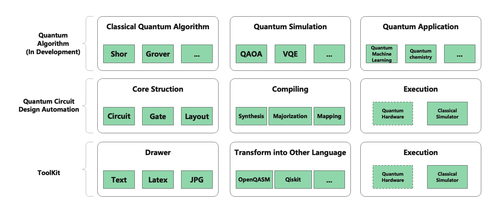

The Design Philosophy of QuICT
-----------------------------------------------------------------------
QuICT platform is a tool to design, compile and simulate quantum computer.
In QuICT's Design Philosophy, the compiling and simulation of the quantum circuit
is separated.

- Compiling: Design the quantum circuit with the given gate set. The input of the compiling can be some unitary or quantum circuit. QuICT devote itself to design an executable circuit with as small cost as possible in physical layout. Then, QuICT output IR(Intermediate representation) to the part of execution.

- Simulation: Execute the quantum circuit with classical simulator or actual quantum computers.

Key Components
-----------------------------------------------------------------------

According to the Design Philosophy of QuICT, QuICT's code and Components is
divide in several parts:

- Core: it provides the based element to build quantum qubit or circuit

- Algorithm Library: it provides classical quantum algorithm(Shor, Grover and so on)

- QCDA(Quantum Circuit Design Automation): it provide the data struction of quantum circuit, compiling process(including synthesis, optimization and mapping) and classical simulation.     # TODO: given one lines to describe QCDA.

- Simulation: it provides the different simulator to simulate the execution of quantum circuit in quantum machine.

- Toolkit: it provide toolkit for users, including drawer of circuit and so on.

Quick Start
-------------

.. code-block:: python

    from QuICT.core import Circuit
    from QuICT.core.gate import *
    from QuICT.simulation.gpu_simulator import ConstantStateVectorSimulator

    # Build quantum circuit
    circuit = Circuit(3)

    H           | circuit(2)
    CX          | circuit([2, 1])
    T_dagger    | circuit(1)
    CX          | circuit([0, 1])
    T           | circuit(1)
    CX          | circuit([2, 1])
    T_dagger    | circuit(1)
    CX          | circuit([0, 1])
    T           | circuit(1)
    CX          | circuit([0, 2])
    T_dagger    | circuit(2)
    CX          | circuit([0, 2])
    T           | circuit(0)
    T           | circuit(2)
    H           | circuit(2)

    # Simulate the quantum circuit by state vector simulator
    simulator = ConstantStateVectorSimulator(
        precision="double",
        optimize=False,
        gpu_device_id=0,
        sync=True
    )
    amplitude = simulator.run(circuit=circuit)

Contents
----------

.. toctree::
    :maxdepth: 2
    :caption: Installaion

    install/package.rst
    install/docker.rst

.. toctree::
    :maxdepth: 1
    :caption: Algorithm

    algorithm/quantum_algorithm/grover.rst
    algorithm/quantum_algorithm/shor.rst
    algorithm/quantum_algorithm/hhl.rst
    algorithm/synthetical_unitary.rst
    algorithm/weight_decision.rst

.. toctree::
    :maxdepth: 2
    :caption: Core

    core/qubit.rst
    core/gates.rst
    core/circuit.rst

.. toctree::
    :maxdepth: 2
    :caption: Quantum Circuit Design Automation

    workflow/QCDA.rst
    workflow/synthesis/gate_decomposition.rst
    workflow/synthesis/gate_transform.rst
    workflow/synthesis/unitary_transform.rst
    workflow/synthesis/arithmetic_circuit.rst
    workflow/optimization/commutative_optimization.rst
    workflow/optimization/cnot_without_ancillae.rst
    workflow/optimization/template_optimization.rst
    workflow/mapping/1D-mapping.rst

.. toctree::
   :maxdepth: 2
   :caption: Simulation

   simulator/unitary.rst
   simulator/statevector.rst
   simulator/multi-device.rst

.. toctree::
   :maxdepth: 2
   :caption: Toolkit

   toolkit/drawer.rst
   toolkit/translator.rst

.. toctree::
   :maxdepth: 2
   :caption: API-Documents

   apidoc/QuICT.rst
