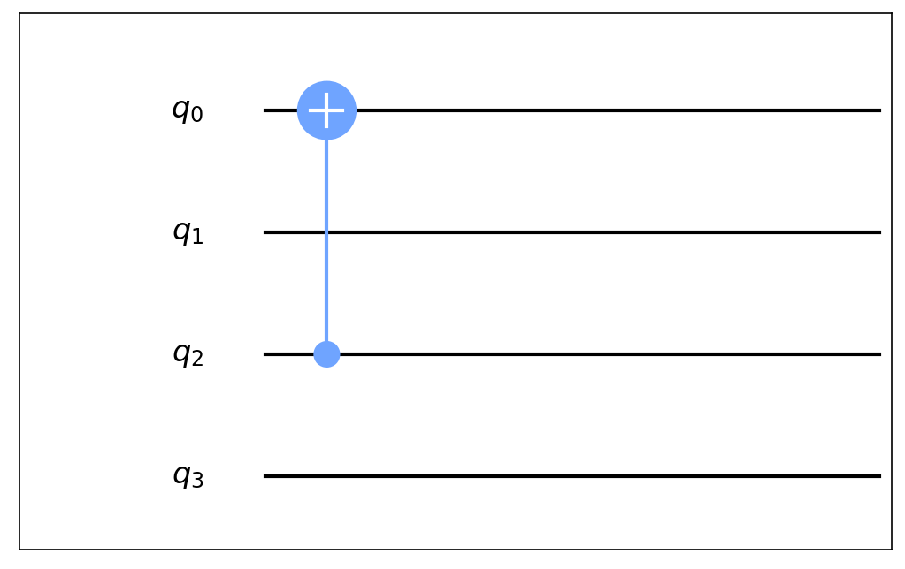

Amplitude Simulator
===================

This chapter briefly introduces current version of amplitude simulator.

Data Arrangement
----------------

With the help of binary representations, the state of an m-bit quantum
system

.. math::

   \sum_{i_1, i_2, \cdots, i_m \in \{0,1\}} \lambda_{i_1, i_2, \cdots, i_m} \left| i_1 \right\rangle \otimes \cdots \otimes \left| i_m \right\rangle

has an amplitude vector of length :math:`2^m`, in which the
:math:`\overline{i_1 i_2 \cdots i_m}`-th entry is
:math:`\lambda_{i_1, i_2, \cdots, i_m}`.

Gate Operation Over An Amplitude Vector
---------------------------------------

When a :math:`k`-bit quantum gate G is applied to the circuit, each
affected qubit’s state would be replaced with a linear combination of
all affected qubit states.

.. math::

       & G \sum_{i_1, i_2, \cdots, i_m \in \{0,1\}} \lambda_{i_1, i_2, \cdots, i_m} \left| i_1 \right\rangle \otimes \cdots \otimes \left| i_{j_1} \right\rangle \otimes \cdots \otimes \left| i_{j_k} \right\rangle \otimes \cdots \otimes \left| i_m \right\rangle \\
       & = \sum_{i_1, i_2, \cdots, i_m \in \{0,1\}} \left| i_1 \right\rangle \otimes \cdots \otimes \left( \sum_{l} g_{1l} \left| i_{j_l} \right\rangle \right) \otimes \cdots \otimes \left(\sum_{l} g_{kl} \left| i_{j_l} \right\rangle \right) \otimes \cdots \otimes \left| i_m \right\rangle

In binary representation,
:math:`\overline{i_1 i_2 \cdots i_{j_1} \cdots i_{j_k} \cdots i_m}`-th
entry in amplitude vector would be replaced with a linear combination of
:math:`\overline{i_1 i_2 \cdots x_1 \cdots x_k \cdots i_m}`-th entries,
where :math:`x_1, x_2, \cdots, x_k \in \{0, 1\}`

Example
~~~~~~~

A CNOT gate is applied to :math:`q_2, q_0` of a 4-bit system.

The amplitude vector changes are:

.. math::

       v\left[ \overline{i_3 0 i_1 0} \right] &\leftarrow v\left[ \overline{i_3 0 i_1 0} \right] \\
       v\left[ \overline{i_3 0 i_1 1} \right] &\leftarrow v\left[ \overline{i_3 0 i_1 1} \right] \\
       v\left[ \overline{i_3 1 i_1 0} \right] &\leftarrow v\left[ \overline{i_3 1 i_1 1} \right] \\
       v\left[ \overline{i_3 1 i_1 1} \right] &\leftarrow v\left[ \overline{i_3 1 i_1 0} \right], \forall i_1, i_3 \in \{0, 1\}

By enumerate certain :math:`k` bits in binary form,
:math:`\overline{i_3 * i_1 *}` yields 4 different numbers, then we
perform CNOT operation over these 4 entries.

In general, when a :math:`k`-bit gate is applied to an :math:`m`-bit
system, we divide :math:`2^m` entries of amplitude vector into
:math:`2^{m-k}` groups with :math:`2^k` entries each. And the gate is
applied over these :math:`2^k` long sub-vectors.

   Some of the operations could be optimized with AVX instructions.
