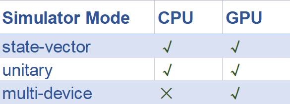

Classical Simulator
===================
How to validate the correctness of the quantum algorithm is one of the most important parts of Quantum Computation.
Using the classical machine to simulate the quantum circuit is a way to validate the quantum algorithm. In QuICT, the Simulator
is used to simulate the qubits' state during running in the quantum circuit.

The simulator will return a data structure that stores the information about the simulation of quantum circuit
    - device: the hardware
    - backend: the mode of the simulator
    - shots: the repeat times of simulation
    - options: the parameters for the simulator
    - time: spending times
    - counts: the dict of the measurement results for each simulation

.. toctree::
   :maxdepth: 1

   modes.rst
