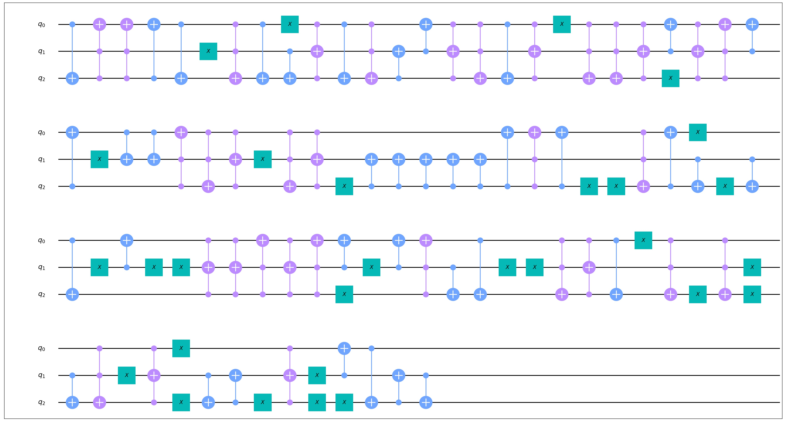
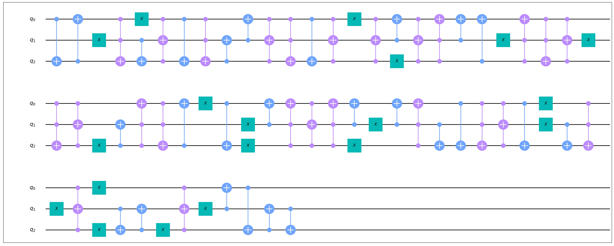
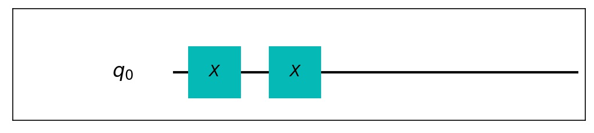
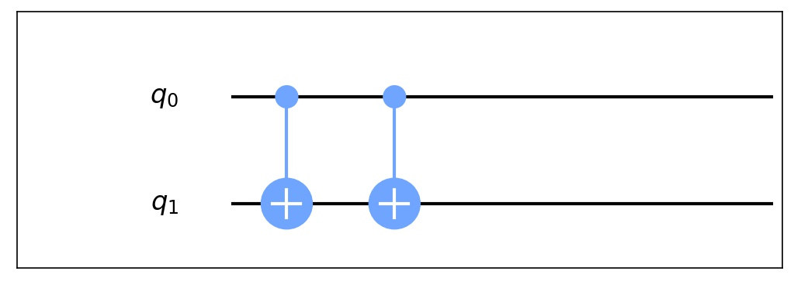
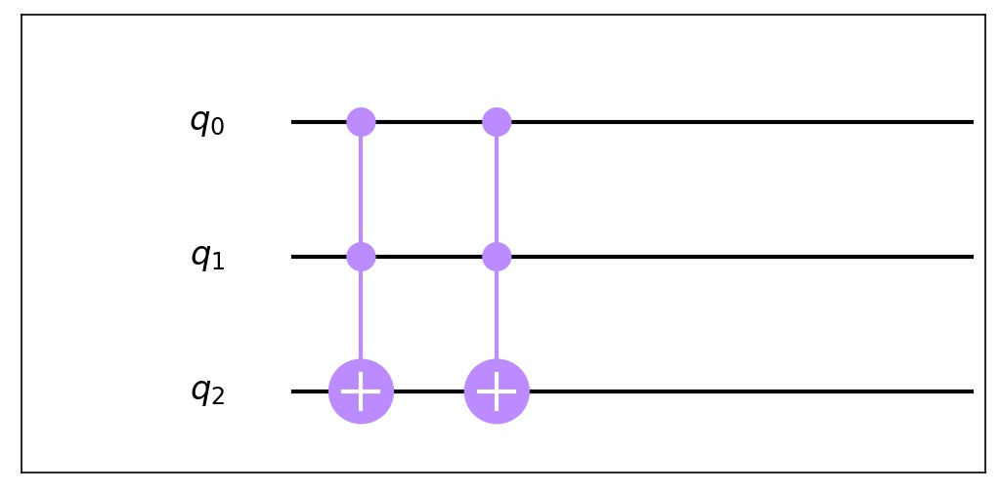

Template Optimization
==============================

**NOTICE**: Code of this model is revised from qiskit-terra.

Template optimization is a grammar-based method of circuit optimization. The insight is
that if we have non-trivial equations of quantum gates, we can try to match some part of
the given circuit with that of our equations. Then by direct replacement we could optimize
the target circuit.

Example(Template Optimization)
----------------------------------------

Here is an example on the usage of this model.

.. code-block:: python
    :linenos:

    from QuICT.core import *
    from QuICT.qcda.optimization.template_optimization.templates import (template_nct_2a_1,
                                                                         template_nct_2a_2,
                                                                         template_nct_2a_3)
    from QuICT.qcda.optimization.template_optimization import TemplateOptimization

    if __name__ == '__main__':
        circuit = Circuit(3)
        circuit.random_append(100, typeList = [GATE_ID["X"], GATE_ID["CX"], GATE_ID["CCX"]])
        circuit.draw(filename='0.jpg')

        templates = [template_nct_2a_1(), template_nct_2a_2(), template_nct_2a_3()]
        while True:
            circuit_opt = TemplateOptimization.execute(circuit, templates)
            if circuit_opt.circuit_size() == circuit.circuit_size():
                break
            circuit = circuit_opt
        circuit_opt.draw(filename='1.jpg')

In this code we randomly create a circuit with 3 qubits and 100 NCT (i.e. NOT-CNOT-Toffoli) gates
and try to optimize it with 3 basic templates. Check the `templates` folder for more possible
templates.

Random circuit:

Circuit after optimization:

Templates used:

Notes
--------------------

In this version, only Clifford+T gates and Toffoli gates are supported.

More templates need to be added.
