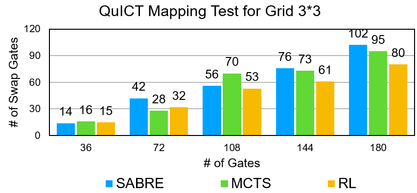
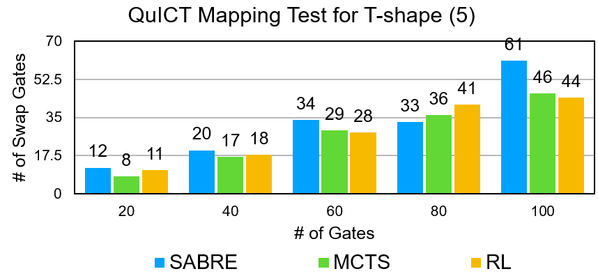
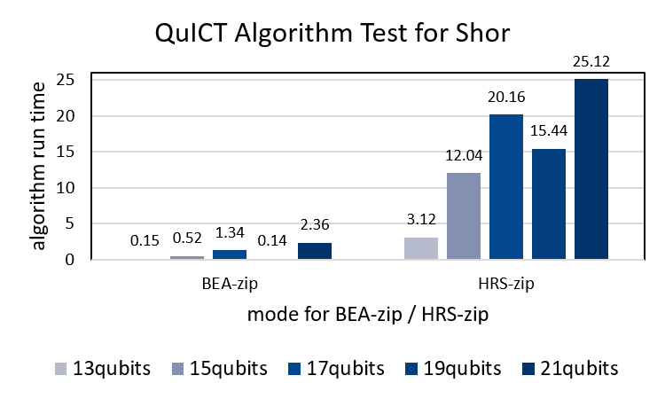
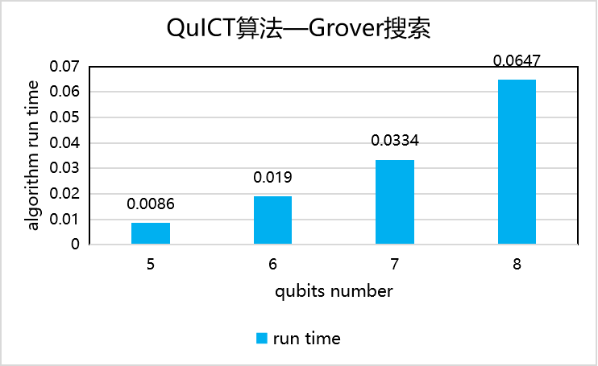
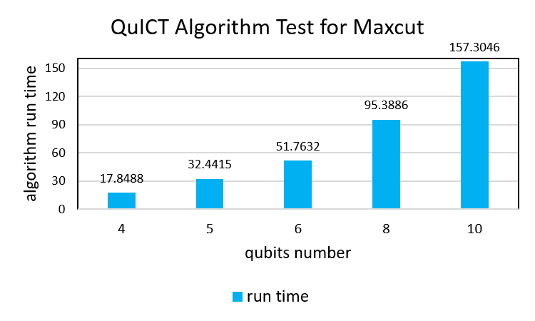
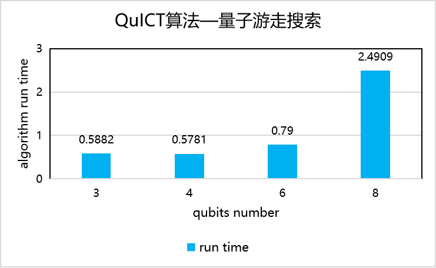
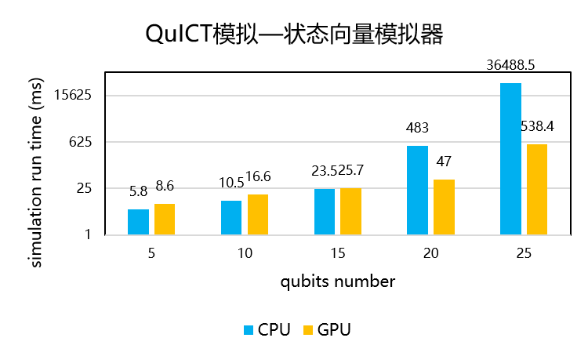
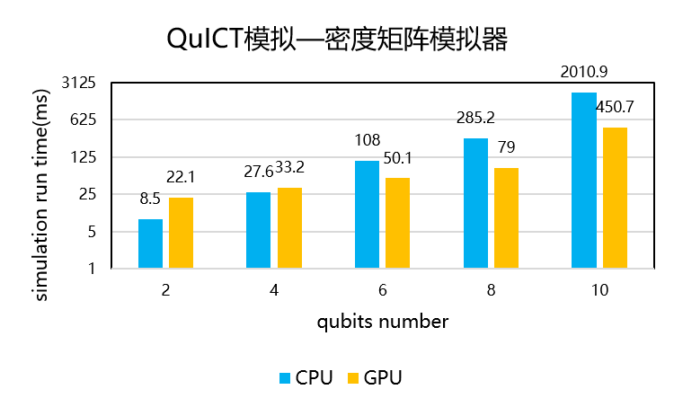
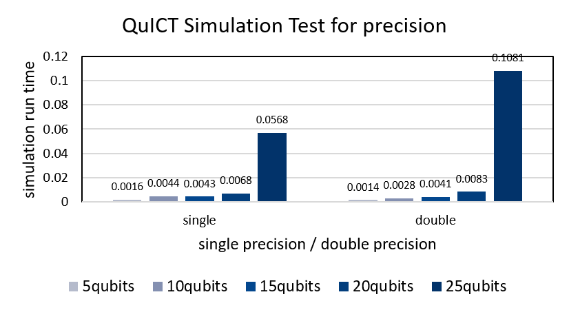

# Benchmark（QuICT平台基准测试）
###简介
QuICT平台benchmark是针对于QuICT量子计算云平台本身的量子算法、量子电路设计自动化(QCDA)、量子模拟等模块进行的基准测试。
**量子电路设计自动化基准测试模块**分为映射基准测试、优化基准测试、合成基准测试。映射基准测试展示不同拓扑结构下不同电路的交换门门数；优化基准测试展示电路优化前后电路属性如电路深度宽度、单双量子门的数量对比等；
**量子算法基准测试模块**展示量子算法在不同的比特数下执行的相干时间对比；
**量子模拟基准测试模块**展示不同模拟器，不同精度下运行时间对比。

###数据分析展示
####QCDA基准测试
- **映射基准测试**
选择3×3网状拓扑和5比特ibmq_lima拓扑结构、18量子比特、36~180量子门数的量子电路，对SABRE、MCTS、RL量子电路映射后量子电路中新增的交换门门数进行对比，以衡量映射算法的结果作为映射基准。

- **优化基准测试**

Clifford+Rz电路优化
由5~ 25量子比特、50~250量子门数、随机指令集构造的量子电路，对Clifford+Rz电路优化前后量子电路的门数、深度、可控非门门数进行对比，以测试结果作为优化基准。

局部暴力搜索电路优化
由5~ 25量子比特、50~250量子门数、单一可控非门构造的的量子电路，对局部暴力搜索电路优化前后量子电路的门数、深度、可控非门门数进行对比，以测试结果作为优化基准。

无辅助比特合成电路优化
由5~ 25量子比特、50~250量子门数、单一可控非门构造的的量子电路，对局部暴力搜索电路优化前后量子电路的门数、深度、可控非门门数进行对比，以测试结果作为优化基准。

交换优化
由5~ 25量子比特、50~250量子门数、随机指令集构造的的量子电路，对Clifford+Rz电路优化前后量子电路的门数、深度、可控非门门数进行对比，以测试结果作为优化基准。

Clifford电路与symbolic优化
由5~ 25量子比特、50~250量子门数、克里弗电路指令集构造的的量子电路，对Clifford+Rz电路优化前后量子电路的门数、深度、可控非门门数进行对比，以测试结果作为优化基准。

模板匹配优化
由5~ 25量子比特、50~250量子门数、克里弗电路指令集构造的的量子电路，对Clifford+Rz电路优化前后量子电路的门数、深度、可控非门门数进行对比，以测试结果作为优化基准。

- **合成基准测试**
门转换
由5~ 20量子比特、50~200量子门数、随机指令集构造的的量子电路，选择六种指令集对门转换电路优化前后量子电路的门数、深度进行对比，以测试结果作为合成基准。

量子态制备
由4~8量子比特的态向量构造的的量子电路，对返回的量子电路的量子电路的门数、深度进行对比，以测试结果作为合成基准。

酉矩阵分解
由4~8量子比特的酉矩阵构造的的量子电路，对酉矩阵返回的量子电路的量子电路的门数、深度进行对比，以测试结果作为合成基准。

####**算法基准测试**
Shor因子分解算法
构建13~21量子比特电路，对比BEA_zip和HRS_zip方法测试Shor算法运行的时间，以测试结果作为Shor因子分解算法基准。

Grover搜索算法
构建3~6量子比特电路，测试Grover搜索算法运行的时间，以测试结果作为Grover搜索算法基准。

Maxcut算法
构建4~10量子比特电路，测试Grover搜索算法运行的时间，以测试结果作为Grover搜索算法基准。

Quantum walk search算法
构建3~8量子比特电路，测试Grover搜索算法运行的时间，以测试结果作为Grover搜索算法基准。

####**模拟基准测试**
状态向量模拟器基准测试
由5~ 25量子比特、50~250量子门数、随机指令集构造的的量子电路，测试用状态向量模拟器模拟量子电路运行过程中量子比特的状态时的运行时间，以测试结果作为模拟速度的基准。

密度矩阵模拟器基准测试
由2~ 10量子比特、20~100量子门数、随机指令集构造的的量子电路，测试用密度矩阵模拟器模拟量子电路运行过程中量子比特的状态时的运行时间，以测试结果作为模拟速度的基准。

单双精度模拟基准测试
由5~ 25量子比特、50~250量子门数、随机指令集构造的的量子电路、状态向量模拟器模拟，测试单精度双精度下量子电路运行过程中量子比特的状态时的运行时间，以测试结果作为不同精度下模拟速度的基准。
