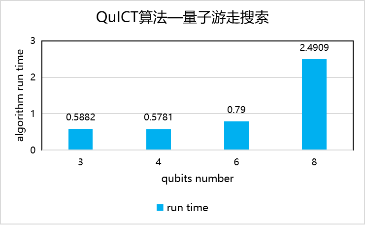

# 算法基准测试

## Shor因数分解算法

用Shor因数分解算法的变体中的HRS_zip变体（电路宽度12~20）和BEA_zip变体（电路宽度13~21），输入5~9位数，获取order-finding部分的电路后执行因数分解的运行时间对比。

<figure markdown>

</figure>

## Grover搜索算法

构建5~8变量的MCToracle电路，运行Grover搜索算法得到搜索结果的运行时间对比。

<figure markdown>

</figure>

## 最大割算法

随机生成节点数为4, 5, 6, 8, 10，对应边数分别为4, 6, 8, 11, 15的图，根据图生成哈密顿量，并初始化QAOA网络，网络层数均为4层，进行100轮迭代训练，记录训练从开始到结束的时间。训练完成后通过量子测量对最终获得的量子态进行多次随机采样，并统计比特串的概率分布得出分割策略。

<figure markdown>

</figure>

## 量子游走搜索算法

在3, 4, 5, 6, 8维的超立方体上进行量子游走搜索算法，标记节点编号均为4。记录搜索从开始到结束的时间。搜索结束后通过量子测量对最终获得的量子态进行多次随机采样，并统计比特串的概率分布获得搜索的节点编号。

<figure markdown>

</figure>
