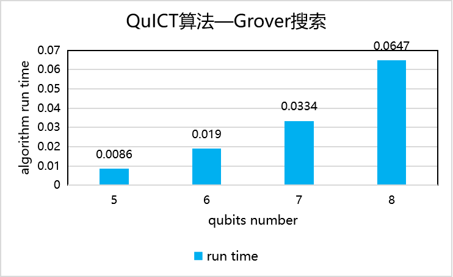

# 算法基准测试

## Shor因数分解算法

构建13~21量子比特电路，对比BEA_zip和HRS_zip方法测试Shor算法运行的时间，以测试结果作为Shor因子分解算法基准。

<figure markdown>

</figure>

## Grover搜索算法

构建3~6量子比特电路，测试Grover搜索算法运行的时间，以测试结果作为Grover搜索算法基准。

<figure markdown>

</figure>

## 最大割算法

构建4~10量子比特电路，测试Maxcut算法运行的时间，以测试结果作为Maxcut算法基准。

<figure markdown>

</figure>

## 量子游走搜索算法

构建3~8量子比特电路，测试QWS运行的时间，以测试结果作为QWS算法基准。

<figure markdown>

</figure>