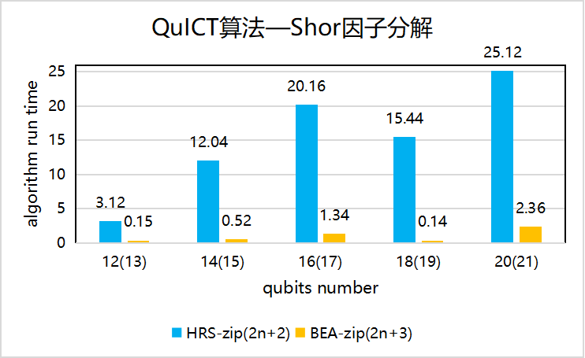

# 算法基准测试

## Shor因数分解算法

编译规则：构建13~21量子比特随机指令集电路，BEA_zip方法和HRS_zip方法进行因子计算

基准度量：Shor算法运行的时间对比

<figure markdown>

</figure>

## Grover搜索算法

编译规则：在5~8量子比特的MCT oracle上运行Grover搜索算法得到搜索结果

基准度量：Grover搜索算法运行的时间对比

<figure markdown>

</figure>

## 最大割算法

编译规则：构建4~10点数，4~15边数，4层量子电路层数的电路

基准度量：Maxcut算法法运行的时间对比

<figure markdown>

</figure>

## 量子游走搜索算法

编译规则：构建3~8位的量子比特随机指令集电路到训练结束，执行量子游走搜索算法

基准度量：quantum walk search(QWS)算法运行的时间对比

<figure markdown>

</figure>
