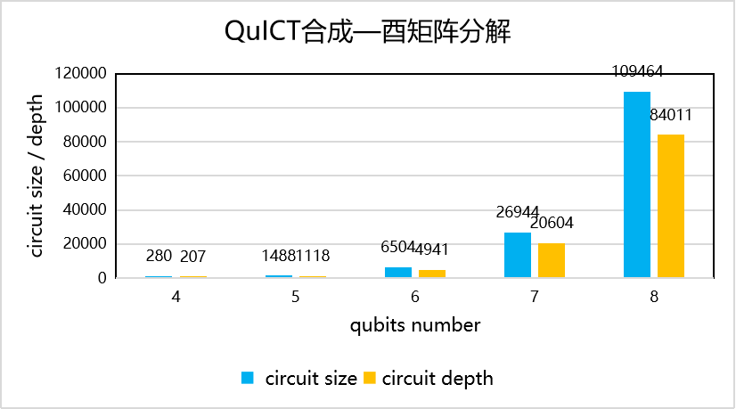

# QCDA基准测试

## 映射基准测试

编译规则：构建3×3网状拓扑结构、9量子比特、36~180量子门数的量子电路，执行SABRE、MCTS、RL三种映射方法

基准度量：量子电路映射后量子电路中新增的交换门门数进行对比

<figure markdown>

</figure>

编译规则：构建5比特T型拓扑结构、5量子比特、36~180量子门数的量子电路，执行SABRE、MCTS、RL三种映射方法

基准度量：量子电路映射后量子电路中新增的交换门门数进行对比

<figure markdown>

</figure>

## 优化基准测试

### Clifford+Rz电路优化

编译规则：构建4~20量子比特、80~400量子门数、克里弗电路指令集构造的的量子电路构造的量子电路，对每一个电路执行Clifford+Rz电路优化

基准度量：量子电路优化前后的门数、深度、双比特门门数进行对比

<figure markdown>

</figure>

### 无辅助比特合成电路优化

编译规则：构建4~20量子比特、80~400量子门数、单一可控非门构造的的量子电路，执行无辅助比特合成电路优化

基准度量：量子电路优化前后的门数、深度、双比特门门数进行对比

<figure markdown>

</figure>

### 交换优化

编译规则：构建4~20量子比特、80~400量子门数、随机指令集构造的的量子电路，执行无辅助比特合成电路优化

基准度量：量子电路优化前后的门数、深度、双比特门门数进行对比

<figure markdown>

</figure>

### Clifford电路与Symbolic优化

编译规则：构建4~20量子比特、80~400量子门数、随机指令集构造的的量子电路，执行Clifford电路与Symbolic优化电路优化

基准度量：量子电路优化前后的门数、深度、双比特门门数进行对比

<figure markdown>

</figure>

### 模板匹配优化

编译规则：构建4~20量子比特、80~400量子门数、克里弗电路指令集构造的的量子电路，执行电路模板匹配

基准度量：量子电路优化前后的门数、深度、双比特门门数进行对比

<figure markdown>

</figure>

## 合成基准测试

### 门转换

编译规则：构建5量子比特、50量子门数、随机指令集构造的的量子电路，选择六种指令集对每个电路执行门转换电路优化

基准度量：量子电路指令集转换前后的门数、深度进行对比

<figure markdown>

</figure>

### 量子态制备

编译规则：构建4~8量子比特的态向量构造的的量子电路，执行量子态制备算法

基准度量：原量子电路和返回的量子电路的门数、深度进行对比

<figure markdown>

</figure>

### 酉矩阵分解

编译规则：构建4~8量子比特的酉矩阵构造的的量子电路，执行酉矩阵分解

基准度量：原量子电路和返回的量子电路的门数、深度进行对比

<figure markdown>

</figure>