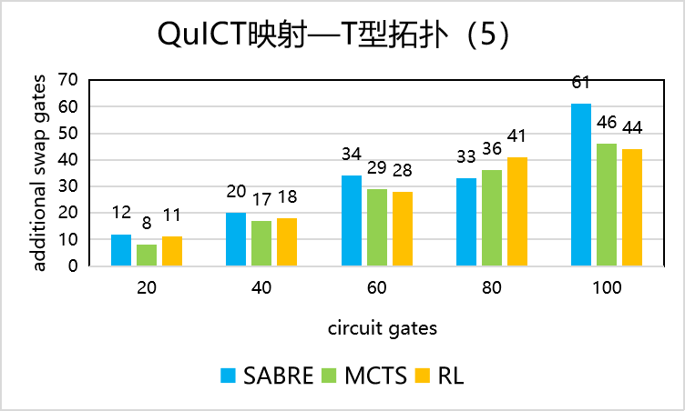

# QCDA基准测试

## 映射基准测试

对3×3网状结构拓扑、36~180量子门数的量子电路执行SABRE、MCTS、RL三种映射方法后量子电路映射后量子电路中新增的交换门门数进行对比。

<figure markdown>

</figure>

对5比特T型结构拓扑、36~180量子门数的量子电路执行SABRE、MCTS、RL三种映射方法后量子电路映射后量子电路中新增的交换门门数进行对比。

<figure markdown>

</figure>

## 优化基准测试

### Clifford+Rz电路优化

对4~20量子比特、80~400量子门数、clifford指令集电路执行Clifford+Rz电路优化前后的门数、深度、双比特门数对比。

<figure markdown>

</figure>

### 无辅助比特可控非门电路优化

对4~20量子比特、80~400量子门数的可控非门电路执行无辅助比特优化前后的门数、深度、双比特门数对比。

<figure markdown>

</figure>

### 交换优化

对4~20量子比特、80~400量子门数的随机电路执行交换优化前后的门数、深度、双比特门数对比。

<figure markdown>

</figure>

### Clifford电路与Symbolic优化

对4~20量子比特、80~400量子门数的随机电路执行Clifford电路转化与Symbolic优化前后的门数、深度、双比特门数对比。

<figure markdown>

</figure>

### 模板匹配优化

对4~20量子比特、80~400量子门数的clifford指令集电路执行模板匹配后的门数、深度、双比特门数对比。

<figure markdown>

</figure>

## 合成基准测试

### 门转换

对5量子比特、50量子门数的随机电路用六种指令集对每个电路执行门转换优化后的门数、深度对比。

<figure markdown>

</figure>

### 量子态制备

对4~8量子比特的电路执行量子态制备后的原量子电路和返回的量子电路的门数、深度对比。

<figure markdown>

</figure>

### 酉矩阵分解

对4~8量子比特的电路执行酉矩阵分解后的原量子电路和返回的量子电路的门数、深度对比。

<figure markdown>

</figure>