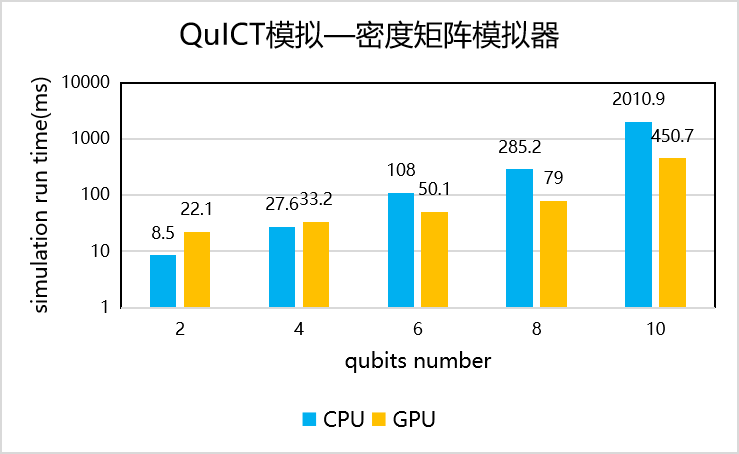

# 模拟基准测试

## 状态向量模拟器基准测试

构建5~25量子比特、50~250量子门数、随机指令门集的量子电路，测试量子电路在CPU与GPU状态向量模拟器模拟运行运行时间对比。

<figure markdown>

</figure>

## 密度矩阵模拟器基准测试

构建2~10量子比特、20~100量子门数、随机指令门集构造的的量子电路，测试量子电路在CPU与GPU密度矩阵模拟器模拟运行时间对比。

<figure markdown>

</figure>

