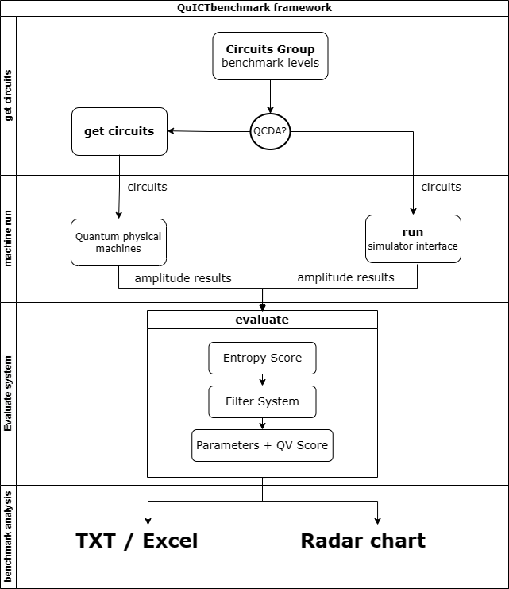

# 量子物理机基准测试

## 介绍

量子计算机是一种可以实现量子计算的机器，是对可逆机的不断探索促进了量子计算机的发展，它是不断迭代并不断受到评估的，QuICT物理机基准测试是通过设计科学的测试方法和测试系统对执行各项任务的能力进行排名，实现对量子物理设备的基准测试。

<figure markdown>


 <figcaption>通过基准测试流程框架图可以清晰的观察到基准测试每一步的操作</figcaption>

</figure>

## 基准测试流程

### 1. 获得电路

不同于仅使用完全随机量子门电路进行基准测试衡量性能，QuICT基准测试采用三种电路组供选择，其中包含特殊基准测试电路、量子算法电路、随机指令集电路，通过不同的方向提供对真实量子物理机性能进行更广泛更准确的测试方法。

```markdown
| 组别   | 电路                                                 |
| ------ | ---------------------------------------------------- |
| 第一组 | 特殊随机电路、指令集电路                             |
| 第二组 | 特殊随机电路、指令集电路、基础算法电路               |
| 第三组 | 特殊随机电路、指令集电路、基础算法电路、进阶算法电路 |
```


**特殊随机电路**

- 高度并行化电路：不同量子算法的结构允许不同程度的并行化，通过比较量子门数量，门数和电路深度的比率高度并行的应用将大量运算放入相对较小的电路深度中。

- 高度串行化电路：设置电路深度的最长路径上两个量子位相互作用的数量接近总的双比特数量。

- 高度纠缠电路：通过计算两个量子位相互作用的所有门操作的比例，测试电路种两个量子位相互作用程度。

- 中间态测量电路：对于多个连续层的门操作组成的电路，测量门在不同层数为程序执行期间和之后提取信息。

**指令集电路**

- 由ctrl_unitary, diag, single_bit, ctrl_diag, google, ibmq, ionq, ustc, nam, origin指令集创建的指令集电路

**基础算法电路**

- adder, clifford, qft算法电路

**进阶算法电路**

- grover, cnf, maxcut, qnn, quantum_walk, vqe算法电路

电路组选择根据待测量的量子物理机属性，例如：物理机物理量子比特数、拓扑结构以及物理机特定指令集，在选择电路组后会根据比特数提供该范围内比特数的电路组，并且可以选择每一个量子电路是否通过QuICT平台特有的量子电路设计自动化，即根据待测量物理机拓扑结构执行量子电路映射，根据带测量物理机特定指令集实现量子门指令集转换。

### 2. 运行测试

测试流程包含两种方法：

- 方法一：获得电路组后，在量子物理机模拟出振幅结果后进入评分系统。

- 方法二：此基准测试提供物理机接口，从QuICT电路库中得到电路后实时进行物理机模拟，接着进入评分系统进行基准测试（该流程大大的节省电路输出以及物理机结果输入时间，减少系统错误率）。

### 3. 评分系统

#### 对所有电路进行熵值的评分

熵值（相对熵函数、交叉熵函数、回归损失函数）评分是一种通过量子电路并测量观察到的模拟振幅值与真实物理机振幅值预期概率之间分布的差异来评估物理机性能的方法，并用函数值的平均值的百分制作为电路熵值的评分。

#### 筛选出有效电路

在量子计算机上运行的每个电路的成功与否是根据每个电路的平均熵值是否大于阙值决定的，评判电路是否属于有效电路后才能进行后续测试。

#### 对特殊基准电路进行指标值分析

- 高度并行化电路
    - P = （ng / nd -1）/ (nw - 1) 其中ng表示门的总数，nd表示电路深度，nw表示电路宽度，P越接近1的电路并行化程度越高。

- 高度串行化电路
    - S = 1 - ns / ng 其中ng表示门的总数，ns表示不在最长路径上的双比特门数，S越接近1的电路串行化程度越高。

- 高度纠缠电路
    - E = 1 - ne / ng 其中ng表示门的总数，ne表示电路完全纠缠下多余的双比特门数，E越接近1的电路纠缠程度越高。

- 中间态测量电路
    - M = md / nd 其中md表示电路中测量门所在的层数，nd表示电路深度，E越接近1的电路测量性能越完整。

#### 对算法电路进行量子体积分析

量子体积（Quantum Volume），是一个用于评估量子计算系统性能的协议。量子计算系统的操作保真度越高，关联性越高，有越大的校准过的门操作集合便会有越高的量子体积。量子体积与系统的整体性能相关联，即与系统的整体错误率，潜在的物理比特关联和门操作并行度相联系。总的来说，量子体积是一个用于近期整体评估量子计算系统的一个实用方法，数值越高，系统整体错误率就越低，性能就越好。量子体积被定义为指数形式：

\begin{equation}
V_{Q} = 2^n
\end{equation}

其中 $n$ 表示在给定比特数目 $m$ （ $m$ 大于 $n$ ）和完成计算任务的条件下，电路的最大逻辑深度，如果电路的最大逻辑深度 $n$ 大于电路比特数 $m$ ，那么系统的量子体积就是 $2^m$ 。

当然为了数据耦合度高，我们结果分析展示的是去除二次方的结果。基准测试对每一个电路都进行量子体积的分析。

### 4. 结果分析展示

结果分析分为三个展示方向，分别是Radar Chart雷达图、TxT文本文件以及Excel表格。

文本文件和表格展示对截止于有效电路筛选之前对所有电路组的熵值以及量子体积的评判结果。雷达图（左）展示有效电路中特殊基准电路指标值最优指标值×该电路的量子体积值，随机电路量子体积的最优值，雷达图（右）展示有效电路中各个算法赛道中算法电路的量子体积最优值。

#### 结果展示示例 - 雷达图

<figure markdown>


</figure>

#### 结果展示示例 - TXT文本文件

<figure markdown>


</figure>

## 基准测试基本用法

### 通过物理机接口实时进行基准测试

`QuICTBenchmark`类于`QuICT.benchmark`，`QuICTBenchmark`初始化的参数包括：

1. `device`: 模拟设备，默认为`CPU` 
2. `output_path`: 基准测试结果展示文件存储地址，默认当前路径下创建benchmark文件夹
3. `show_type`: 基准测试结果展示形式，默认雷达图和文本文件

`get_circuits`/`run`的参数包括：

1. `simulator_interface`: 待测物理机接口，使后端串联

2. `quantum_machine_info`：包含待测物理机量子比特数、拓扑结构、特定指令集

3. `mapping`: 是否根据物理机的拓扑结构对每一个电路执行映射，默认关闭

4. `gate_transform`: 是否根据物理机特定指令集对每一个电路执行门转换，默认关闭

5. `circuits_list`：电路组

6. `amp_results_list`：物理机模拟振幅

#### 初始化

``` python
from QuICT.benchmark import QuICTBenchmark
from QuICT.core import Layout
from QuICT.core.utils.gate_type import GateType
from QuICT.qcda.synthesis.gate_transform.instruction_set import InstructionSet

# 初始化
benchmark = QuICTBenchmark(device="CPU", output_path="./benchmark", output_file_type="txt")
# 传入拓扑结构
layout = Layout.load_file(os.path.dirname(os.path.abspath(__file__)) + f"/example/layout/line5.json")
# 传入指令集
Inset = InstructionSet(GateType.cx, [GateType.h, GateType.rx, GateType.ry, GateType.rz])
# 这里模拟待测物理机接口设置
def quict_simulation(circuit):
    simulator = StateVectorSimulator()
    results = simulator.run(circuit)

    return results
```

#### 连待测物理机接口执行

``` python
# 传入物理机接口, 直接进入评分系统
benchmark.run(
    simulator_interface=quict_simulation,
    quantum_machine_info={"qubits_number":3, "layout_file":layout, "Instruction_Set":Inset},
    level=3,
    mapping=True,
    gate_transform=True
)
```

#### 分步执行

``` python
# 获得电路
circuits_list = benchmark.get_circuits(
    quantum_machine_info={"qubits_number":3, "layout_file":layout_file, "Instruction_Set":Inset},
    level=3,
    mapping=True,
    gate_transform=True
)
# 传入电路组以及物理机模拟结果，进入评分系统
benchmark.evaluate(circuits_list, amp_results_list)
```

#### 结果展示

<figure markdown>


<figcaption>雷达图</figcaption>

</figure>

<figure markdown>


<figcaption>文本文件部分截图</figcaption>

</figure>