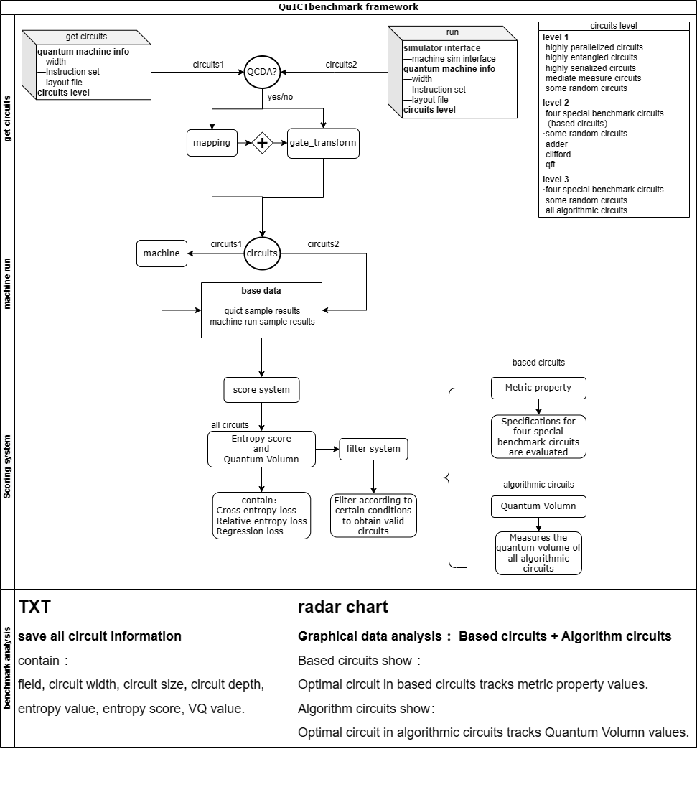
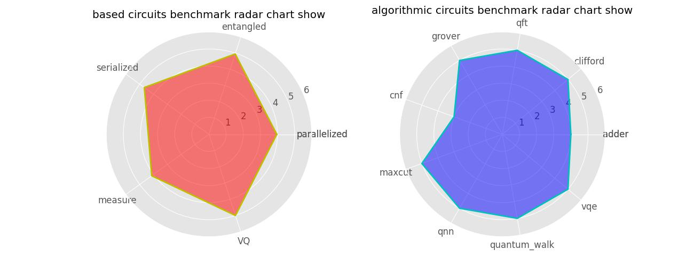

# Benchmark（物理机基准测试）
### 介绍
QuICT物理机benchmark是指通过设计科学的测试方法和测试系统，实现对量子物理设备的基准测试。
### QuICT基准测试基本用法
#### 步骤一  获得电路
#### **电路组选择**
第一种 Level1

- 四种特殊benchamark电路【高度并行化电路、高度串行化电路、高度纠缠电路、中间态测量电路】
- 若干种随机电路【aspen-4, ourense, rochester, sycamore, tokyo, ctrl_unitary, diag, single_bit, ctrl_diag,
        google, ibmq, ionq, ustc, nam, origin】

第二种 Level2

- 四种特殊benchamark电路【高度并行化电路、高度串行化电路、高度纠缠电路、中间态测量电路】
- 若干种随机电路【aspen-4, ourense, rochester, sycamore, tokyo, ctrl_unitary, diag, single_bit, ctrl_diag,
        google, ibmq, ionq, ustc, nam, origin】
- 部分算法电路【adder, clifford, qft】

第三种 Level3

- 四种特殊benchamark电路【高度并行化电路、高度串行化电路、高度纠缠电路、中间态测量电路】
- 五种随机电路【aspen-4, ourense, rochester, sycamore, tokyo, ctrl_unitary, diag, single_bit, ctrl_diag,
        google, ibmq, ionq, ustc, nam, origin】
- 所有算法电路【adder, clifford, qft, grover, cnf, maxcut, qnn, quantum_walk, vqe】

#### 步骤二 提交电路
在运行步骤二之前，请选择存结果分析的路径，选择结构分析的类型（雷达图是默认生成的，您需要选择Txt文本文件或者Excel表格），如果您按照下述构建步骤操作，此库将位于您创建的构建目录下的benchmark文件夹下
**提交电路**
包含两种方法，第一种方法直接从QuICT电路库中得到电路。
第二种方法提供物理机接口，从QuICT电路库中得到电路后实时进入物理机模拟，进而进入步骤三和步骤四。
#### 步骤三 评分系统
**1、对所有电路进行熵值的评分**

我们用相对熵函数、交叉熵函数、回归损失函数等测试QuICT平台与真实物理机之间振幅分布的差异以及差异程度，并用函数值的平均值的百分制作为电路熵值的评分。

**2、筛选出有效电路**

根据每个电路的平均熵值是否大于阙值评判电路是否属于有效电路，有效电路才能进行后续基准测试。

**3、对特殊基准电路进行指标值分析以及量子体积分析**

#### 特殊基准电路介绍
- 高度并行化电路
    - 不同量子算法的结构允许不同程度的并行化，通过比较量子门数量，门数和电路深度的比率高度并行的应用将大量运算放入相对较小的电路深度中。
    - P = （ng / nd -1）/ (nw - 1) 其中ng表示门的总数，nd表示电路深度，nw表示电路宽度，P越接近1的电路并行化程度越高。
- 高度串行化电路
    - 设置电路深度的最长路径上两个量子位相互作用的数量接近总的双比特数量。
    - S = 1 - ns / ng 其中ng表示门的总数，ns表示不在最长路径上的双比特门数，S越接近1的电路串行化程度越高。
- 高度纠缠电路
    - 通过计算两个量子位相互作用的所有门操作的比例，测试电路种两个量子位相互作用程度。
    - E = 1 - ne / ng 其中ng表示门的总数，ne表示电路完全纠缠下多余的双比特门数，E越接近1的电路纠缠程度越高。
- 中间态测量电路
    - 对于多个连续层的门操作组成的电路，测量门在不同层数为程序执行期间和之后提取信息
    - M = md / nd 其中md表示电路中测量门所在的层数，nd表示电路深度，E越接近1的电路测量性能越完整。

**4、对算法电路进行量子体积分析**

量子体积被定义为指数形式：2 ^ min(m, n), 其中n表示在给定比特数目m（m大于n）和完成计算任务的条件下，电路的最大逻辑深度，如果电路的最大逻辑深度n大于电路比特数m，那么系统的量子体积就是 2 ^ m。当然为了数据耦合度高，我们结构分析展示的是去除二次方的结果。基准测试对每一个电路都进行量子体积的分析。

#### 步骤四 结果分析展示
结果分析分为三个展示方向，分别是雷达图、TxT文本文件以及Excel表格，雷达图

### 基准测试框架以及流程

### QuICT基准测试基本用法
第一种方法：程序提供物理机接口，从QuICT电路库中得到电路后实时进入物理机模拟，进而进入步骤三和步骤四。
```python
#初始化
benchmark = QuICTBenchmark(output_path = "./benchmark", show_type = "Txt")
# 传入拓扑结构
layout_file = Layout.load_file("./layout/grid_3x3.json")
#传入指令集
Inset = InstructionSet(GateType.cx, [GateType.h, GateType.rx, GateType.ry, GateType.rz])
#传入物理机接口, 直接进入步骤三和步骤四输出结构分析
results = benchmark.run(simulator_interface=sim_interface， quantum_machine_info = [5, layout_file, Inset], mapping = True, gate_transform = True)
```
第二种方法：从QuICT电路库中得到电路后，拿到物理机模拟后，提供电路组和模拟振幅组执行步骤三和步骤四。
```python
#初始化
benchmark = QuICTBenchmark(output_path = "./benchmark", show_type = "Txt")
# 传入拓扑结构
layout_file = Layout.load_file("./layout/grid_3x3.json")
#传入指令集
Inset = InstructionSet(GateType.cx, [GateType.h, GateType.rx, GateType.ry, GateType.rz])
#获得电路
circuits = benchmark.get_circuits(quantum_machine_info = [5, layout_file, Inset], mapping = True, gate_transform = True)
#传入电路组以及物理机模拟结果，进入评分系统
results = benchmark.evaluate(circuits_list, amp_results_list)
```

**结果分析——雷达图**

该基准测试的结果展示是QuICT的模拟结果之间的展示，没有真实物理机参与。
