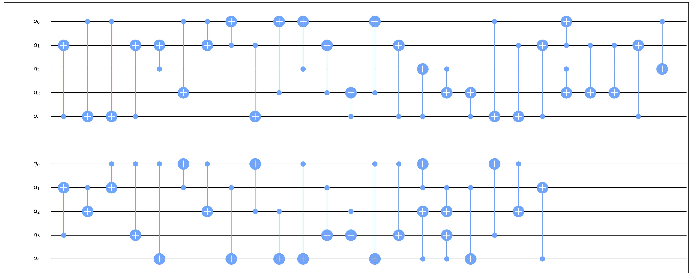
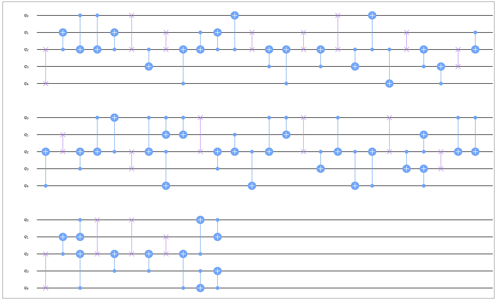

# SABRE量子电路映射启发式算法

在当前的量子物理设备上，只有部分比特之间能作用两比特门，故而大多数量子电路无法直接在NISQ设备上运行。为了解决这个问题，需要通过向电路中插入交换门的方式，使得待执行二比特门的逻辑比特对应的物理比特在拓扑上“相邻”。我们通常将这一步称作量子电路的映射。

SABRE是一个通过启发式搜索进行量子电路映射的算法，其以待执行门相关的逻辑比特在实际物理设备上的距离为依据进行搜索，能够较快的完成数百比特的电路映射。同时，该算法也同时给出了一种设定初始逻辑比特到物理比特的映射的方法[<sup>[1]</sup>](#refer1)。

## 算法原理

为了阐述的简便，先定义一系列符号：

| 符号         | 含义                                                         |
| ------------ | ------------------------------------------------------------ |
| $n$          | 量子电路逻辑比特数                                           |
| $q_i$        | 量子电路的第i个逻辑比特                                      |
| $g$          | 量子电路的门个数                                             |
| $d$          | 量子电路的深度                                               |
| $N$          | 物理设备的比特数                                             |
| $Q_i$        | 物理设备的第$i$个物理设备                                    |
| $G(V, E)$    | 表示量子设备的拓扑图，$V$中的点表示物理比特，$G$中的边表示其所连接的点可直接作用二比特门 |
| $D[i][j]$    | $Q_i$和$Q_j$之间的距离                                       |
| $\pi()$      | 从逻辑比特到物理比特的映射函数                               |
| $\pi^{-1}()$ | 从物理比特到逻辑比特的映射函数                               |

### 预处理流程

- 根据$G(V,E)$，使用floyd算法计算距离矩阵$D_{N \times N}$，其中$D[i][j]$表示$Q_i$和$Q_j$之间的距离。
- 根据量子电路生成初始有向无环图（DAG），其中的点为二比特门，边表示执行顺序上的依赖关系。

### 启发式函数

对于一个DAG，我们定义其第一层（入度为0的点的集合）为$F$。

则可以定义初始的启发式函数：

$$
H_{base}=\frac{1}{|F|}\sum_{gate \in F}D[\pi(gate.q_1)][\pi(gate.q_2)]
$$

在实际操作时，考虑到两个因素：

- 需要考虑后面一部分门，则定义除$F$外，以BFS序进行拓扑排序的前常数个门集合为$E$，以类似的方式根据其距离计算函数值，但需要乘上权重系数$W(W<1)$。
- 防止在一个比特位上连续进行Swap操作，在逻辑比特上定义衰减函数$decay(q_i)$，随着在其上插入Swap门个数的增加，衰减系数也增加，但过一定轮次后会回到初始值。

那么，对于扩展的集合$E$，我们计算其函数值为：

$$
H_{ext}=W*\frac{1}{|E|}\sum_{gate\in E}D[\pi(gate.q_1)][\pi(gate.q_2)]
$$

最终的启发式函数值为：

$$
H=max(decay(SWAP.q_1), decay(SWAP.q_2))*(H_{base}+H_{ext})
$$

### 主算法流程

当$F$不为空时，重复执行以下步骤：

- 检查$F$中的所有门，执行所有可以执行的门，若有门可以执行，则：
  - 执行这些门，并从$F$和$DAG$中删除这些门。
  - 更新$F$，并跳转到循环开头。
- 对于$F$中所有的门，设其涉及的所有逻辑比特对应的物理比特集合为$\hat{Q}$，以涉及$\hat{Q}$中任一比特的所有Swap门作为备选，计算执行这些门后，启发函数的值，选取使得启发式函数最小的Swap门。
- 执行该Swap门，更新映射和衰减系数。

### 初始映射生成

- 以一一对应映射作为初始的映射，执行以上的预处理和主算法流程部分，获得最终的映射$\pi$。
- 将量子电路反转，以$\pi$作为初始映射，重复以上步骤，获得新的最终映射$\hat{\pi}$。
- 以$\hat{\pi}$作为生成的电路初始映射。

## 代码实例

以在一个5比特、50个量子门的随机电路为例，运行SABRE映射算法与初始映射生成

```python
layout = Layout.load_file("example/layout/ibmqx2_layout.json")

circuit = Circuit(5)
circuit.random_append(50, typelist=[GateType.cx])
circuit.draw(filename='0.jpg')

sabre = SABREMapping(layout)
circuit_map = sabre.execute(circuit)
circuit_map.draw(filename='1.jpg')

circuit_initial_map = sabre.execute_initialMapping(circuit)
print(circuit_initial_map)
```

原电路为：

<figure markdown>

</figure>


执行SABRE算法后，电路形式为：

<figure markdown>

</figure>


SABRE算法为其生成的初始映射为：

```
[0, 2, 4, 3, 1]
```

---

## 参考文献

<div id="refer1"></div>

<font size=3>
[1] Li G, Ding Y, Xie Y. Tackling the qubit mapping problem for NISQ-era quantum devices. [Proceedings of the Twenty-Fourth International Conference on Architectural Support for Programming Languages and Operating Systems. 2019: 1001-1014.](https://arxiv.org/pdf/1809.02573)
</font>

---
