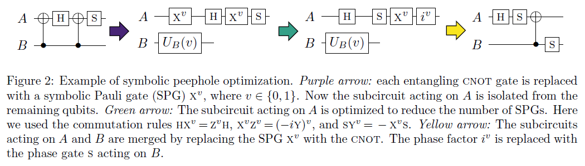

# Clifford电路合成与symbolic优化

Clifford电路要求其中只包含CX，H，S，S_dagger，X，Y，Z这7种门。Clifford群是Pauli群的稳定化子 (stabilizer) ，在量子误差修正中有重要的作用。

## 算法流程

此算法由两个部分组成，即基于Pauli群作用效果的Clifford电路合成以及基于symbolic门的Clifford电路优化

### 基于Pauli群作用效果的Clifford电路合成

合成基于如下的引理[<sup>[1]</sup>](#refer1)：

设有一对$n$-qubit反对易Pauli算符$O, O'$，则存在一个$n$-qubit Clifford电路$L$满足

$$
L^{-1} O L = X_1, L^{-1} O' L = Z_1
$$

其中$X_1, Z_1$分别表示仅在第一个qubit上为$X, Z$，其他为$I$的Pauli算符。

那么设原电路为$C$，取$O = C^{-1} X_1 C, O' = C^{-1} Z_1 C$应用以上引理，则对于$C_1 = L^{-1} C$有$C_1 X_1 = X_1 C_1, C_1 Z_1 = Z_1 C_1$。因此$C_1$在第一个qubit上的作用是平凡的，如此递归即可合成电路$C$。显然在以上过程里qubit的顺序是不重要的，对这一顺序的贪心选择（基于对应的子电路$L$大小）或是随机选择都是可行的。

进一步地，对应于任意一对$n$-qubit反对易Pauli算符$P, P'$，考虑对

$$
O = C P C^{-1}, O' = C P' C^{-1}
$$

和$P, P'$分别应用引理得到两个子电路$L, R$，其中$R$满足

$$
P = R^{-1} X_1 R, P' = R^{-1} Z_1 R
$$

则$C_1 = L^{-1} C R^{-1}$在第一个qubit上的作用即是平凡的。注意到取$P = X_1, P' = Z_1$即退化为前一种方法，通过遍历（显然复杂度会因此显著上升）或是随机选取这样的$P, P'$即可对qubit递归地合成电路$C$。

### 基于symbolic门的Clifford电路优化

这一优化的基本思路是CNOT门的如下表达式

$$
CNOT = \ket{0}\bra{0} \otimes I + \ket{1}\bra{1} \otimes X = \sum_v \ket{v}\bra{v} X^v
$$

以此种方式即可将CNOT门“临时”转化为symbolic X门局部地与1-qubit门进行交换合并等操作以求减少CNOT门数量（但是有可能以1-qubit门数量为代价），以下给出了原论文中的一个例子。

<figure markdown>

<p markdown="1" style="font-size:15px;"> 图片引用自*Clifford Circuit Optimization with Templates and Symbolic Pauli Gates.* [<sup>[1]</sup>](#refer1)
</figure>

接下来需要解决的问题是将哪些CNOT“临时”转化为symbolic X门，这里的做法是取一些qubit作为控制集合 (control set) ，跨越控制集合和非控制集合的CNOT门将被临时“分离”。

## 使用方法

`CliffordUnidirectionalSynthesizer`与`CliffordBidirectionalSynthesizer`分别对应于原理部分所述两种基于Pauli群作用效果的Clifford电路合成。

`CliffordUnidirectionalSynthesizer`可以设定`strategy`参数，即原理部分所述对qubit的贪心`greedy`或随机`random`策略，默认为`greedy`。

`CliffordBidirectionalSynthesizer`则可以设定`qubit_strategy`和`pauli_strategy`两个参数，其中`qubit_strategy`与`CliffordUnidirectionalSynthesizer`完全一致，而`pauli_strategy`则对应于原理部分所述对Pauli算符$P, P'$的遍历`brute_force`或随机`random`选取，默认为`random`。除此之外，由于`brute_force`方法耗时过长，在实现中内置了与`multiprocessing`模块相关的多进程运行代码，亦可调整相关参数。

`SymbolicCliffordOptimization`对应于原理部分所述基于symbolic门的Clifford电路优化，可以依据电路特征自定义一系列控制集合`control_sets`供算法选择。算法默认的`control_sets`是全体2-qubit组合的列表。

## 代码实例

``` python
from QuICT.qcda.synthesis import CliffordUnidirectionalSynthesizer
from QuICT.qcda.optimization import SymbolicCliffordOptimization

CUS = CliffordUnidirectionalSynthesizer()
SCO = SymbolicCliffordOptimization()
circ_syn = CUS.execute(circ)
circ_opt = SCO.execute(circ_syn)
```

如此即可先将Clifford电路`circ`先重新合成为等价电路`circ_syn`，再通过symbolic优化将合成后的电路优化为`circ_opt`，以下给出了一个随机Clifford电路及其经过合成和优化后得到的电路。自然，这两个方法亦均可独立使用。

<figure markdown>

</figure>

<figure markdown>

</figure>

<figure markdown>

</figure>

## 参考文献

<div id="refer1"></div>
<font size=3>
[1] Bravyi, S., Shaydulin, R., Hu, S., & Maslov, D.L. (2021). Clifford Circuit Optimization with Templates and Symbolic Pauli Gates. Quantum, 5, 580. [https://arxiv.org/abs/2105.02291](https://arxiv.org/abs/2105.02291)
</font>
