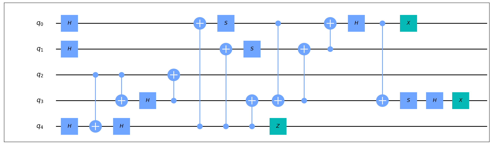
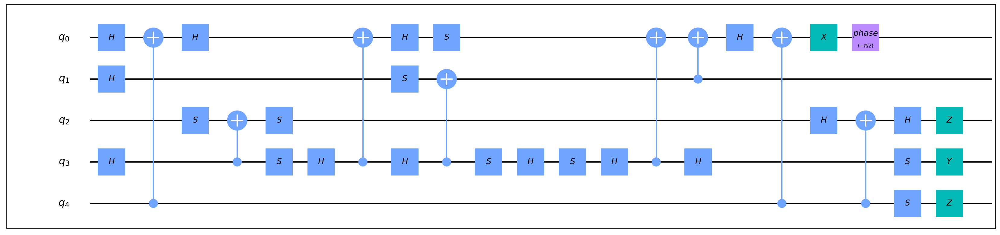

# Clifford电路合成与symbolic优化

Clifford电路要求其中只包含CX，H，S，S_dagger，X，Y，Z这7种门。Clifford群是Pauli群的稳定化子 (stabilizer) ，在量子误差修正中有重要的作用。此部分具体原理请参见对应的原论文。

Bravyi, S., Shaydulin, R., Hu, S., & Maslov, D.L. (2021). Clifford Circuit Optimization with Templates and Symbolic Pauli Gates. Quantum, 5, 580.

## 使用例

``` python
from QuICT.qcda.synthesis import CliffordUnidirectionalSynthesizer
from QuICT.qcda.optimization import SymbolicCliffordOptimization

CUS = CliffordUnidirectionalSynthesizer()
SCO = SymbolicCliffordOptimization()
circ_syn = CUS.execute(circ)
circ_opt = SCO.execute(circ_syn)
```

如此即可先将Clifford电路`circ`先重新合成为等价电路`circ_syn`，再通过symbolic优化将合成后的电路优化为`circ_opt`，以下给出了一个随机Clifford电路及其经过合成和优化后得到的电路。自然，这两个方法亦均可独立使用。





