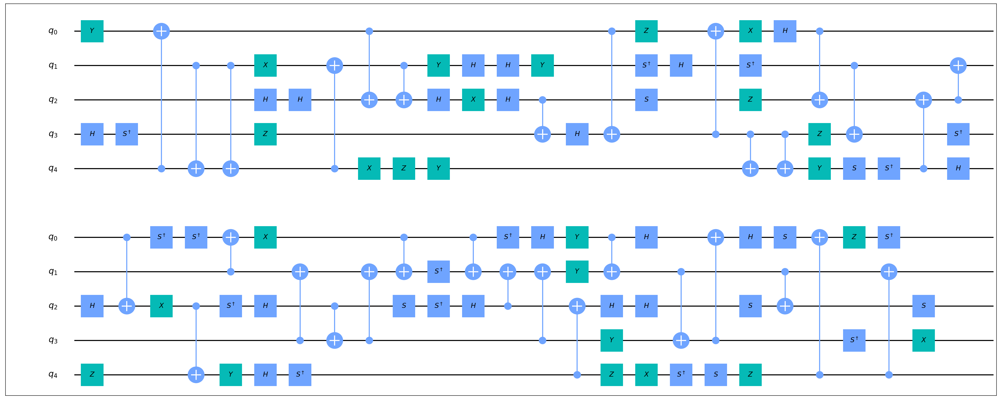

# Clifford 电路合成与 symbolic 优化

Clifford 电路要求其中只包含 CX，H，S，S_dagger，X，Y，Z 这7种门。 Clifford 群是 Pauli 群的稳定化子 (stabilizer) ，在量子误差修正中有重要的作用。

## 算法原理

此算法由两个部分组成，即基于 Pauli 群作用效果的 Clifford 电路合成以及基于 symbolic 门的 Clifford 电路优化。

### 基于 Pauli 群作用效果的 Clifford 电路合成

合成基于如下的引理[<sup>[1]</sup>](#refer1)：

设有一对 $n$ -qubit 反对易 Pauli 算符 $O, O'$ ，则存在一个 $n$ -qubit Clifford 电路 $L$ 满足：

$$
L^{-1} O L = X_1, \quad L^{-1} O' L = Z_1
$$

其中 $X_1, Z_1$ 分别表示仅在第一个qubit上为 $X, Z$ ，其他为 $I$ 的Pauli算符。

那么设原电路为 $C$ ，取：

$$O = C^{-1} X_1 C, \quad O' = C^{-1} Z_1 C$$

应用以上引理，则对于 $C_1 = L^{-1} C$ 有：

$$C_1 X_1 = X_1 C_1, \quad C_1 Z_1 = Z_1 C_1$$

因此 $C_1$ 在第一个 qubit 上的作用是平凡的，如此递归即可合成电路 $C$ 。显然在以上过程里 qubit 的顺序是不重要的，对这一顺序的贪心选择（基于对应的子电路 $L$ 大小）或是随机选择都是可行的。

进一步地，对应于任意一对 $n$ -qubit反对易 Pauli 算符 $P, P'$ ，考虑对

$$
O = C P C^{-1}, \quad O' = C P' C^{-1}
$$

和 $P, P'$ 分别应用引理得到两个子电路 $L, R$ ，其中 $R$ 满足：

$$
P = R^{-1} X_1 R, \quad P' = R^{-1} Z_1 R
$$

则 $C_1 = L^{-1} C R^{-1}$ 在第一个 qubit 上的作用即是平凡的。注意到取 $P = X_1, P' = Z_1$ 即退化为前一种方法，通过遍历（显然复杂度会因此显著上升）或是随机选取这样的 $P, P'$ 即可对 qubit 递归地合成电路 $C$ 。

### 基于 symbolic 门的 Clifford 电路优化

这一优化的基本思路是 CNOT 门的如下表达式：

$$
CNOT = |0⟩⟨0| \otimes I + |1⟩⟨1| \otimes X = \sum_v |v⟩⟨v| X^v
$$

以此种方式即可将 CNOT 门“临时”转化为 symbolic X 门局部地与 1-qubit 门进行交换合并等操作以求减少 CNOT 门数量（但是有可能以 1-qubit 门数量为代价），以下给出了原论文中的一个例子。

<figure markdown>

<p markdown="1" style="font-size:12px;"> 图片引用自*Clifford Circuit Optimization with Templates and Symbolic Pauli Gates.* [<sup>[1]</sup>](#refer1)
</figure>

接下来需要解决的问题是将哪些 CNOT “临时”转化为 symbolic X 门，这里的做法是取一些 qubit 作为控制集合 (control set) ，跨越控制集合和非控制集合的 CNOT 门将被临时“分离”。

## 基本用法

`CliffordUnidirectionalSynthesizer` 与 `CliffordBidirectionalSynthesizer` 分别对应于原理部分所述两种基于 Pauli 群作用效果的 Clifford 电路合成。

`CliffordUnidirectionalSynthesizer` 可以设定 `strategy` 参数，即原理部分所述对 qubit 的贪心 `greedy` 或随机 `random` 策略，默认为 `greedy` 。

`CliffordBidirectionalSynthesizer` 则可以设定 `qubit_strategy` 和 `pauli_strategy` 两个参数，其中 `qubit_strategy` 与 `CliffordUnidirectionalSynthesizer` 完全一致，而 `pauli_strategy` 则对应于原理部分所述对 Pauli 算符 $P, P'$ 的遍历 `brute_force` 或随机 `random` 选取，默认为 `random` 。除此之外，由于 `brute_force` 方法耗时过长，在实现中内置了与 `multiprocessing` 模块相关的多进程运行代码，亦可调整相关参数。

`SymbolicCliffordOptimization` 对应于原理部分所述基于 symbolic 门的 Clifford 电路优化，可以依据电路特征自定义一系列控制集合 `control_sets` 供算法选择。算法默认的 `control_sets` 是全体 2-qubit 组合的列表。

## 代码实例

``` python
from QuICT.qcda.synthesis import CliffordUnidirectionalSynthesizer
from QuICT.qcda.optimization import SymbolicCliffordOptimization

CUS = CliffordUnidirectionalSynthesizer()
SCO = SymbolicCliffordOptimization()
circ_syn = CUS.execute(circ)
circ_opt = SCO.execute(circ_syn)
```

如此即可先将 Clifford 电路 `circ` 先重新合成为等价电路 `circ_syn` ，再通过 symbolic 优化将合成后的电路优化为 `circ_opt` ，以下给出了一个随机 Clifford 电路及其经过合成和优化后得到的电路。自然，这两个方法亦均可独立使用。

原随机电路：

<figure markdown>

</figure>

经过合成后的电路：

<figure markdown>

</figure>

优化后的电路：

<figure markdown>

</figure>

---

## 参考文献

<div id="refer1"></div>
<font size=3>
[1] Bravyi, S., Shaydulin, R., Hu, S., & Maslov, D.L. (2021). Clifford Circuit Optimization with Templates and Symbolic Pauli Gates. Quantum, 5, 580. [https://arxiv.org/abs/2105.02291](https://arxiv.org/abs/2105.02291)
</font>

---