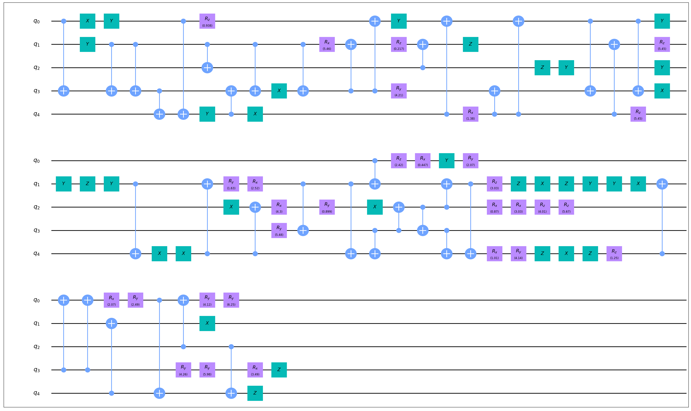
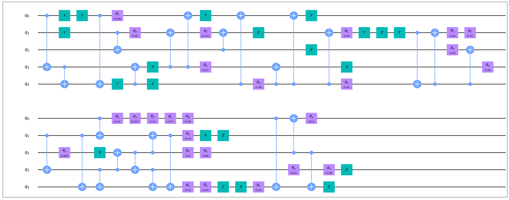

# 交换优化

量子电路的交换优化实际上就是对量子电路中相邻的同类量子门进行合并。矩阵可交换的量子门是可以交换执行的，如果仅考虑量子电路门列表中量子门的相邻，显然会错失大量的优化机会。因此这种合并的核心问题实际上是对相邻性的处理。

## 使用例

``` python
from QuICT.qcda.optimization import CommutativeOptimization

CO = CommutativeOptimization()
circ_opt = CO.execute(circ)
```
获得的`circ_opt`即原电路`circ`经过交换优化后的等价电路，类型上会保持`CompositeGate`或是`Circuit`的一致性，以下给出了一组随机原电路及其优化后的结果。





## 原理：电路的有向无圈图表示

交换优化过程中将电路视作一个有向无圈图，图中顶点表示各个量子门，连边规则为：若通过量子门的容许交换（即对矩阵交换的2个量子门进行交换）量子门$A$可以紧邻位于量子门$B$的左侧，则在图上连边$A\to B$。据此规则构建图时只需按照量子电路门列表的顺序逐个判断连边情况即可。容易注意到，借助构建图的过程即可做到对通过交换可相邻的门进行合并。

## 可选参数

`parameterization`：是否将X，SX，Y，SY，Z，S，T，S_dagger，T_dagger门分别转化为Rx，Ry，Rz门进行合并；

`deparameterization`：优化后是否在可行时将Rx，Ry，Rz门转化回，SX，Y，SY，Z，S，T，S_dagger，T_dagger门。
