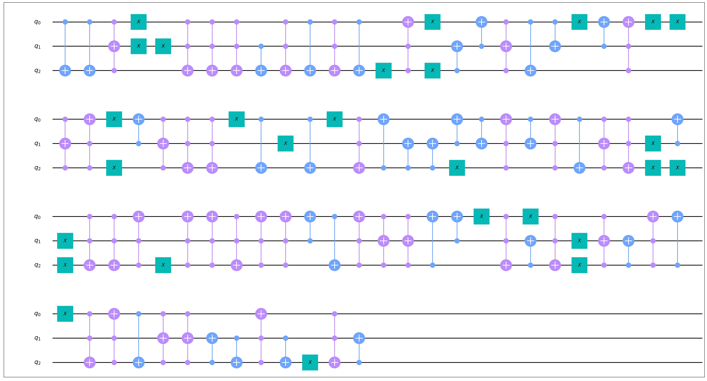
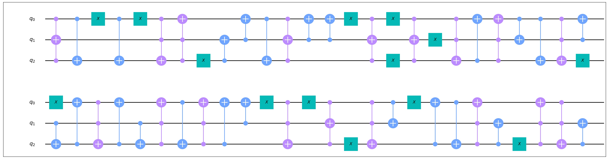

# 模板优化

模板优化 (Template optimization) 是一个基于电路模板匹配的优化算法 [<sup>[1]</sup>](#refer1)。该算法使用一些酉矩阵等于单位阵的小规模路作为模板，例如 $SS^\dagger, HH$ 等，通过将待优化电路与模板进行匹配来优化电路中的量子门的数量。

模板优化算法默认使用 `CircuitLib` 库中的模板，用户可以指定使用的模板的比特数、门数、深度和门类型。用户也可以使用自定义的模板。被用作模板的电路中只可以包含非参数门。

## 基本用法

`TemplateOptimization` 位于 `QuICT.qcda.optimization.template_optimization` 中。对于一个待优化的电路 `circ`，首先实例化一个优化器 `TO=TemplateOptimization()`，然后执行 `TO.execute(circ)` 得到优化后的电路。

### 选择模板

模板优化算法默认使用 `CircuitLib` 库中的模板，用户可以通过四个初始化参数选择合适的模板：

1.  `template_max_width`: 最大比特数，默认为 `None` （无限制）。
2.  `template_max_size`: 最大门数，默认为 `2`.
3.  `template_max_depth`: 最大深度，默认为 `None` （无限制）。
4.  `template_typelist`: 允许的门类型列表列标，默认为 `None` （无限制）。

优化器将会使用`CircuitLib` 库中所有满足限制条件的模板，上述任一参数为 `None` 时，对应的条件不受限制。

如果用户希望使用自定义的模板，可以设置初始化参数 `template_list` ，该参数接受一个 `Circuit` 列表。注意模板只能包含非参数门，且每一个模板都的酉矩阵应当等于单位阵，例如 $HH,SS^\dagger$。`template_list` 的默认值为 `None`，当它不为 `None` 时，`template_max_width` 等四个参数都将被忽略。

## 高级用法

`TemplateOptimization` 还有3个控制启发式算法的初始化参数：

1.  `qubit_fixing_num`: 枚举所有比特对应关系时，额外固定的比特数量，默认为 `1`。
2.  `prune_step`: 反向匹配的树搜索中剪枝的步长，默认为 `3`。
3.  `prune_survivor_num`: 反向匹配的树搜索中一次剪枝后剩余的叶节点数量，默认为 `1`。

总体来说，如果用户希望加快优化器的执行速度，可以增加 `qubit_fixing_num` ，或者减小 `prune_step` 和`prune_survivor_num`，但这可能降低优化效果。这些参数的具体含义请参考 [<sup>[1]</sup>](#refer1)。


## 示例代码

随机生成一个只包含 $X, CX, CCX$ 的电路，用模板匹配优化该电路。

```python
import numpy as np

from QuICT.core.utils import GateType
from QuICT.core import *
from QuICT.qcda.optimization.template_optimization import TemplateOptimization

typelist = [GateType.x, GateType.cx, GateType.ccx]

if __name__ == '__main__':
    # generate a random circuit
    circuit = Circuit(3)
    circuit.random_append(100, typelist=typelist)
    circuit.draw(filename='0.jpg')

    # instantiate a optimizer,
    # no restriction on the size of templates, restrict the gate type
    TO = TemplateOptimization(
        template_max_size=None,
        template_typelist=typelist
    )

    # optimize the circuit until no further gates can be reduced
    cur_circ = circuit
    while True:
        circuit_opt = TO.execute(circuit)
        if circuit_opt.size() == cur_circ.size():
            break
        cur_circ = circuit_opt

    circuit_opt.draw(filename='1.jpg')

    # check the result
    assert np.allclose(circuit_opt.matrix(), circuit.matrix())
```

随机电路：



优化后的电路：



----

## 参考文献

<div id="refer1"></div>
<font size=3>
[1] Iten, Raban, et al. Exact and practical pattern matching for quantum circuit optimization. ACM Transactions on Quantum Computing 3.1 (2022): 1-41. [https://doi.org/10.1145/3498325](https://doi.org/10.1145/3498325)
</font>

---