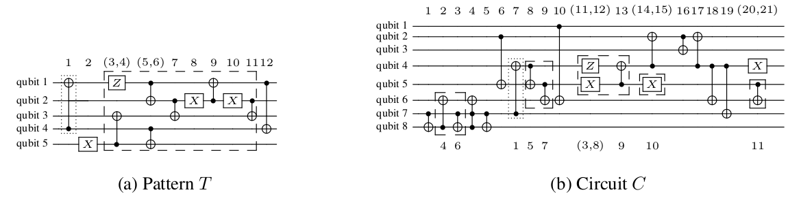

# 模板优化

模板优化 (Template optimization) 是一个基于电路模板匹配的优化算法 [<sup>[1]</sup>](#refer1)。该算法使用一些酉矩阵等于单位阵的小规模路作为模板，例如 $SS^\dagger, HH$ 等，通过将待优化电路与模板进行匹配来优化电路中的量子门的数量。

模板优化算法默认使用 `CircuitLib` 库中的模板，用户可以指定使用的模板的比特数、门数、深度和门类型。用户也可以使用自定义的模板。被用作模板的电路中只可以包含非参数门。

## 算法原理

模板优化算法分为模板匹配和模板替换两个过程，其基本原理如下：

对于一个n比特电路：

$$T=T_1T_2\cdots T_m$$

如果 $T=I_{2^n}$，我们称 $T$ 是一个模板。设待优化的电路为 $C$，如果我们能在 $C$ 中找到子电路：

$$S=T_iT_{i+1}\cdots T_j$$

则 $S$ 可以被替换为:

$$S'=T_{i-1}^\dagger T_{i-2}^\dagger \cdots T_1^\dagger T_m^\dagger T_{m-1}^\dagger \cdots, T_{j+1}^\dagger$$

如果 $S'$ 的代价小于 $S$，则该替换优化了 $C$ 的执行代价。

<figure markdown>

<p markdown="1" style="font-size:12px;"> 图片引用自*Exact and practical pattern matching for quantum circuit optimization.* [<sup>[1]</sup>](#refer1)
</figure>

上图为一个匹配的例子，注意到找到的子电路 $S$ 在 $C$ 中可能并不相邻，但
一定可以通过交换对易的相邻门将 $S$ 中的所有门变换到相邻的位置，这是因为模板匹配算法是在电路的 `DAGCircuit` 表示上执行的。

### 模板匹配

对于模板 $T$ 和待匹配电路 $C$，将 $T$ 和 $C$ 转换为 `DATCircuit` 表示，然后：

1. 枚举 $C$ 中的门 $i$，$T$ 中的所有与 $i$ 相等的门 $j$，枚举 $i$ 和 $j$ 的所有可能的比特对应关系 $m$：
   
      - `ForwardMatch`：从 $j$ 往后贪心地匹配所有 $T$ 中可以与 $C$ 匹配上的门
      - `BackwardMatch`：基于 `ForwardMatch` 的结果，考虑 $C$ 中在 $j$ 之前的每一个门 $g$，搜索 $g$ 可能的匹配情况，找出最大可能的匹配。
   
2. 保留第一步中找出的所有匹配中匹配长度极大的匹配，返回匹配列表 $M$。

对模板匹配算法的启发式优化：

1. 遍历所有可能的比特对应关系需要指数时间，可以通过检查与 $i$ 相邻的门来多固定 $L$ 个比特上的对应关系，从而加快执行速度，$L$ 是一个可选的启发式参数。
2. `BackwardMatch` 中需要搜索所有可能的匹配情况，通过对搜索树剪枝，从而优化执行速度，可以在搜索树上每 $D$ 层执行一次剪枝，每次剪枝只保留当前最优的 $W$ 个节点，$(D,W)$ 是可选的启发式参数。

### 模板替换

给定模板匹配得到的匹配列表 $M$，$M$ 中可能存在冲突的或者会导致代价变大的替换。

1. 模板替换算法首先删除那些替换后电路代价变大的匹配。
2. 贪心地从 $M$ 中选择一个可行的替换集合 $N$：遍历所有 $M$ 中的匹配 $m$，如果 $m$ 不与 $N$ 中已有的匹配冲突，则将 $m$ 加入 $N$。
3. 执行 $N$ 中的所有替换。

### 模板示例

容易知道一些平凡的模板 $HH$, $SS^\dagger$ , $CNOT\cdot CNOT$ 等，下面是一个非平凡的3比特模板：

<figure markdown>

<p markdown="1" style="font-size:12px;"> 图片引用自*Exact and practical pattern matching for quantum circuit optimization.* [<sup>[1]</sup>](#refer1)
</figure>

## 基本用法

`TemplateOptimization` 位于 `QuICT.qcda.optimization.template_optimization` 中。对于一个待优化的电路 `circ`，首先实例化一个优化器 `TO=TemplateOptimization()`，然后执行 `TO.execute(circ)` 得到优化后的电路。

### 选择模板

模板优化算法默认使用 `CircuitLib` 库中的模板，用户可以通过四个初始化参数选择合适的模板：

1. `template_max_width`: 最大比特数，默认为 `None` （无限制）。
2. `template_max_size`: 最大门数，默认为 `2`.
3. `template_max_depth`: 最大深度，默认为 `None` （无限制）。
4. `template_typelist`: 允许的门类型列表列标，默认为 `None` （无限制）。

优化器将会使用`CircuitLib` 库中所有满足限制条件的模板，上述任一参数为 `None` 时，对应的条件不受限制。

如果用户希望使用自定义的模板，可以设置初始化参数 `template_list` ，该参数接受一个 `Circuit` 列表。注意模板只能包含非参数门，且每一个模板都的酉矩阵应当等于单位阵，例如 $HH,SS^\dagger$。`template_list` 的默认值为 `None`，当它不为 `None` 时，`template_max_width` 等四个参数都将被忽略。

## 高级用法

`TemplateOptimization` 还有3个控制启发式算法的初始化参数：

1. `qubit_fixing_num`: 枚举所有比特对应关系时，额外固定的比特数量，默认为1。
2. `prune_step`: `BackwardMatch`的树搜索中剪枝的步长，默认为3。
3. `prune_survivor_num`: `BackwardMatch`的树搜索中一次剪枝后剩余的叶节点数量，默认为1。

总体来说，如果用户希望加快优化器的执行速度，可以增加 `qubit_fixing_num` ，或者减小 `prune_step` 和`prune_survivor_num`，但这可能降低优化效果。这些参数的具体含义参考算法原理章节。

## 代码实例

随机生成一个只包含 $X, CX, CCX$ 的电路，用模板匹配优化该电路。

```python
import numpy as np

from QuICT.core.utils import GateType
from QuICT.core import *
from QuICT.qcda.optimization.template_optimization import TemplateOptimization

typelist = [GateType.x, GateType.cx, GateType.ccx]

if __name__ == '__main__':
    # generate a random circuit
    circuit = Circuit(3)
    circuit.random_append(100, typelist=typelist)
    circuit.draw(filename='0.jpg')

    # instantiate a optimizer,
    # no restriction on the size of templates, restrict the gate type
    TO = TemplateOptimization(
        template_max_size=None,
        template_typelist=typelist
    )

    # optimize the circuit until no further gates can be reduced
    cur_circ = circuit
    while True:
        circuit_opt = TO.execute(circuit)
        if circuit_opt.size() == cur_circ.size():
            break
        cur_circ = circuit_opt

    circuit_opt.draw(filename='1.jpg')

    # check the result
    assert np.allclose(circuit_opt.matrix(), circuit.matrix())
```

随机电路：

<figure markdown>

</figure>

优化后的电路：

<figure markdown>

</figure>

----

## 参考文献

<div id="refer1"></div>
<font size=3>
[1] Iten, Raban, et al. Exact and practical pattern matching for quantum circuit optimization. ACM Transactions on Quantum Computing 3.1 (2022): 1-41. [https://doi.org/10.1145/3498325](https://doi.org/10.1145/3498325)
</font>

---