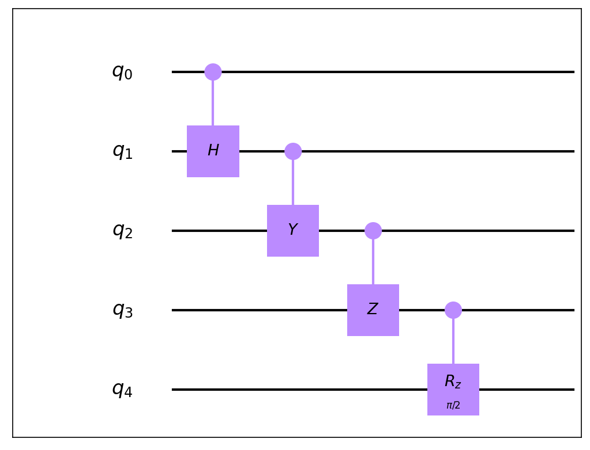
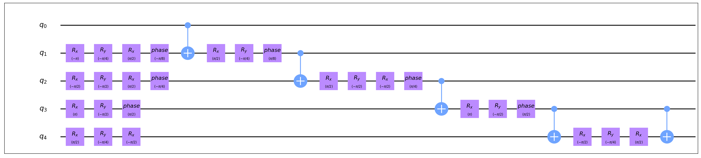

# 门转换

门转换 (GateTransform) 是QuICT自定义的一种进行门类型转换的方法，旨在将输入的电路转化到某个特定的指令集上。

## 转换原理

在开始门转换之前，QuICT会依据复杂门的`build_gate()`方法将复杂门优先拆解为基本的2-qubit门和1-qubit门。然后首先将2-qubit门转换为用指令集支持的2-qubit门表达，QuICT中内置了CX，CY，CZ，CH，CRz，FSim，Rxx，Ryy，Rzz这9种常见2-qubit门相互表达的转换函数。对于1-qubit门，QuICT采用局部合成再分解的策略，先将局部1-qubit门合成为SU(2)矩阵再统一进行分解，QuICT中内置了zyz、xyx、zxz、u3、hrz、ibmq这6种常见分解方法。

## 指令集

指令集 (InstructionSet) 代表目标物理设备可以直接执行的一类门。由普适量子门 (universal quantum gates) 的知识可知，这样的指令集通常应当包含至少一个2-qubit门和若干个1-qubit门。

QuICT中内置的指令集如下：

- GoogleSet：FSim，SX，SY，SW，Rx，Ry

- IBMQSet：CX，Rz，SX，X

- IonQSet：Rxx，Rx，Ry，Rz

- NamSet：CX，H，Rz

- OriginSet：CX，U3

- USTCSet：CX，Rx，Ry，Rz，H，X

## 自定义指令集

用户亦可依据自己的需求自定义指令集：

``` python
from QuICT.core.gate import GateType
from QuICT.qcda.synthesis import InstructionSet

CustomSet = InstructionSet(
    GateType.cx,
    [GateType.rz, GateType.ry]
)
```

以上代码即定义了一个包含CX、Rz、Ry的指令集，为使转换过程保持一致性，可以注意到这里只接受一个2-qubit门。QuICT会依据输入的1-qubit门类型自动选取内置的1-qubit门分解方法，如果需要指定自定义的分解函数，则可以使用如下代码：

``` python
CustomSet.register_one_qubit_rule(custom_rule)
```

其中`custom_rule`将输入的1-qubit门(`BasicGate`)转换为用指定1-qubit门表达的形式(`CompositeGate`)。

## 代码实例

``` python
from QuICT.qcda.synthesis.gate_transform import GateTransform, USTCSet

gt = GateTransform(USTCSet)
circ_syn = gt.execute(circ)
```

如此即可将输入的`circ`转化为用给定指令集表达的等价电路`circ_syn`，以下给出了一组随机原电路及其转换后的结果。

<figure markdown>
{:width="400px"}
</figure>

<figure markdown>

</figure>