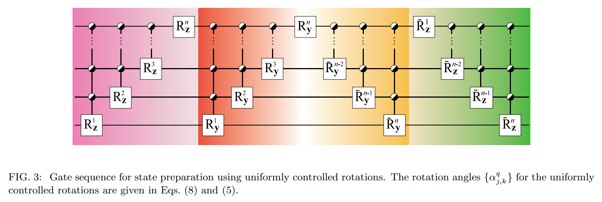
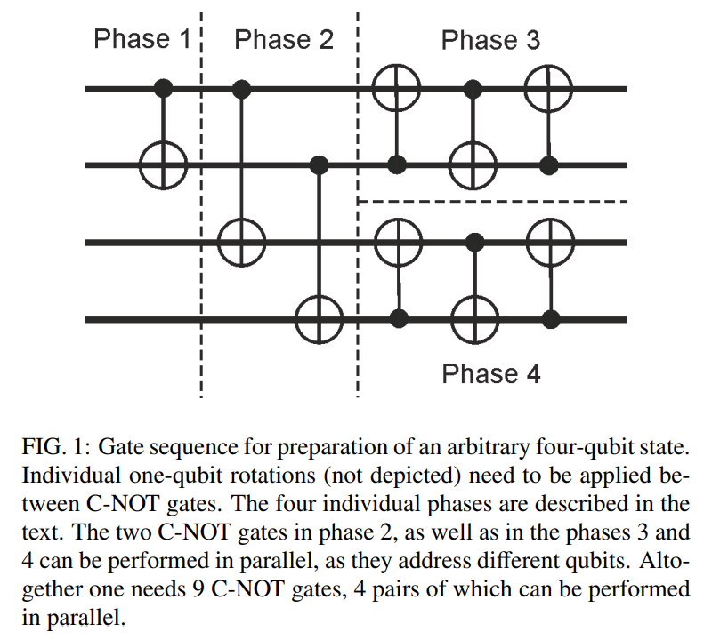
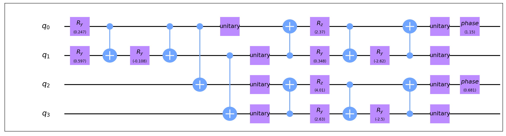
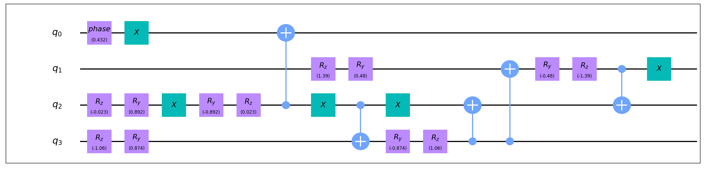

# 量子态制备

量子态制备 (Quantum State Preparation) 算法针对输入的态向量 (state vector) 返回对应的量子电路，使得从 $|0⟩$ 态出发经过该电路后可以得到目标态向量。这是一些量子算法的第一步，亦可视作量子酉矩阵合成的一种特殊情形（即仅给定第一列时的合成）。

QuICT 中目前共实现了3种不同的初态制备算法，其中2种针对一般的量子态，余下1种针对稀疏量子态。

## 算法原理

### 基于 uniformly 控制门的一般量子态制备

考虑量子态制备的逆过程，即将一个给定量子态经过某一电路转化为 $|0⟩$ 态。注意到 uniformly 控制门实际上就是分块对角门，容易想到可以在局部进行旋转操作 $U$ 使得

$$
U |\psi_n⟩ = |\psi_{n - 1}⟩ \otimes |0⟩
$$

其中 $|\psi_n⟩$ 为 $n$ -qubit 初始量子态， $|\psi_{n - 1}⟩$ 为某个 $(n - 1)$ -qubit 量子态，这样就完成了所需的递归制备步骤。

具体说来，算法首先使用一系列 uniformly-Rz 门将态向量逐步变为实向量（相差一个全局相位意义下），再用一系列 uniformly-Ry 门将实态向量逐步消为 $|0⟩$ ，最后将所有步骤取逆即可。如此进行制备的电路图如下图右半部分所示（由于原文意在给出从一个任意态到另一任意态的制备电路，因此左半部分是从某一任意态变为 $|0⟩$ 的电路）

<figure markdown>

<p markdown="1" style="font-size:12px;"> 图片引用自*Transformation of quantum states using uniformly controlled rotations.* [<sup>[1]</sup>](#refer1)
</figure>

### 基于酉矩阵分解的一般量子态制备

为叙述方便，这里主要讨论目标态 qubit 数为偶数的情形，奇数情形是完全类似的。首先对目标态进行 qubit 对半分开的 Schmidt 分解如下：设 qubit 数 $n = 2k$ ，则有

$$
|\Psi⟩ = \sum_{i = 0}^{2^k - 1} \alpha_i |\psi_i⟩ |\phi_i⟩
$$

据此经由如下三步即可得到目标态：

1. 通过基于 uniformly 控制门的量子态制备过程在前半 qubit 上制备 $|\alpha⟩$ 态，即：

    $$
    |0⟩^{\otimes 2k} \to \sum_{i = 0}^{2^k - 1} \alpha_i |i⟩ |0⟩
    $$

2. 通过一系列 CNOT 门复制 $|\alpha⟩$ 态到后半 qubit ，即：

    $$
    \sum_{i = 0}^{2^k - 1} \alpha_i |i⟩ |0⟩ \to \sum_{i = 0}^{2^k - 1} \alpha_i |i⟩ |i⟩
    $$

3. 通过酉矩阵分解将前后两半 qubit 分别转化到对应的态上，即分别：

    $$
    |i⟩ \to |\psi_i⟩, \quad |i⟩ \to |\phi_i⟩
    $$

下图给出了 $n = 4$ 时电路的结构（仅包含 CNOT 门）

<figure markdown>
{:width="500px"}
<p markdown="1" style="font-size:12px;"> 图片引用自*Quantum-state preparation with universal gate decompositions.* [<sup>[2]</sup>](#refer2)
</figure>

### 稀疏量子态制备

对于稀疏量子态，依然采用考虑制备逆过程的方法，此时的主要问题如何在不影响其他态向量元素的情况下“合并”态向量中的两个元素。举例来说，设初始态为：

$$
|\psi⟩ = \alpha |x⟩ + \beta |y⟩ + \gamma |z⟩
$$

其中 $x, y, z$ 分别是一些 $0, 1$ 串表示对应的计算基态。现在想要“合并” $|x⟩, |y⟩$ ，直接的想法是通过一系列 CNOT 门使得量子态转化为：

$$
|\psi'⟩ = \alpha |x'⟩ + \beta |y'⟩ + \gamma |z'⟩
$$

其中 $|x'⟩, |y'⟩$ 只在一个 qubit 上 $0, 1$ 情况不同，从而可以通过 1-qubit 门将其进行“合并”。但是通常这会造成 $|z'⟩$ “分裂”为某两个计算基态的叠加，因此我们需要通过一定的控制来解决这一问题。

为方便进行控制，这里采用的“合并”矩阵为：

$$
M = \begin{pmatrix}
\sin\omega & e^{i\alpha} \cos\omega \\
e^{-i\alpha} \cos\omega & -\sin\omega \\
\end{pmatrix}
$$

这样的多控制 $M$ 门只需一个多控 Toffoli 门和两个 1-qubit 门即可实现。显然选择“合并”的顺序会极大影响算法的执行效果，这里不再详述具体选择的细节，可以参见[<sup>[3]</sup>](#refer3)。

## 基本用法

### 一般量子态制备

在 `QuantumStatePreparation` 中选择需要使用的制备方法即可，可选 `'uniformly_gates'` ， `'unitary_decomposition'` ，默认为 `'unitary_decomposition'` 。

### 稀疏量子态制备

在 `SparseQuantumStatePreparation` 中可以选择初态的输入格式： `state_vector` 即标准的态向量输入； `state_array` 要求输入一个 `dict` ，其 `key` 为态向量非零位置的二进制 `str` ， `value` 为对应位置的振幅。

## 代码实例

### 一般量子态制备

``` python
from QuICT.qcda.synthesis import QuantumStatePreparation

QSP = QuantumStatePreparation('uniformly_gates')
gates = QSP.execute(state_vector)
```

4-qubit 随机初态获得的制备电路如下：

<figure markdown>

</figure>

``` python
from QuICT.qcda.synthesis import QuantumStatePreparation

QSP = QuantumStatePreparation('unitary_decomposition')
gates = QSP.execute(state_vector)
```

4-qubit 随机初态获得的制备电路如下：

<figure markdown>

</figure>

### 稀疏量子态制备

``` python
from QuICT.qcda.synthesis import SparseQuantumStatePreparation

sparseQSP = SparseQuantumStatePreparation('state_vector')
gates = sparseQSP.execute(state_vector)
```

4-qubit 随机初态，其中只有4个非零元素获得的制备电路如下：

<figure markdown>

</figure>

---

## 参考文献

<div id="refer1"></div>
<font size=3>
[1] Möttönen, M., Vartiainen, J.J., Bergholm, V., & Salomaa, M.M. (2005). Transformation of quantum states using uniformly controlled rotations. Quantum Inf. Comput., 5, 467-473. [https://arxiv.org/abs/quant-ph/0407010v1](https://arxiv.org/abs/quant-ph/0407010v1)
</font>

<div id="refer2"></div>
<font size=3>
[2] Plesch, M., & Brukner, V. (2011). Quantum-state preparation with universal gate decompositions. Physical Review A, 83, 032302. [https://arxiv.org/abs/1003.5760](https://arxiv.org/abs/1003.5760)
</font>

<div id="refer3"></div>
<font size=3>
[3] Gleinig, N., & Hoefler, T. (2021). An Efficient Algorithm for Sparse Quantum State Preparation. 2021 58th ACM/IEEE Design Automation Conference (DAC), 433-438. [https://ieeexplore.ieee.org/abstract/document/9586240/metrics](https://ieeexplore.ieee.org/abstract/document/9586240/metrics)
</font>

---