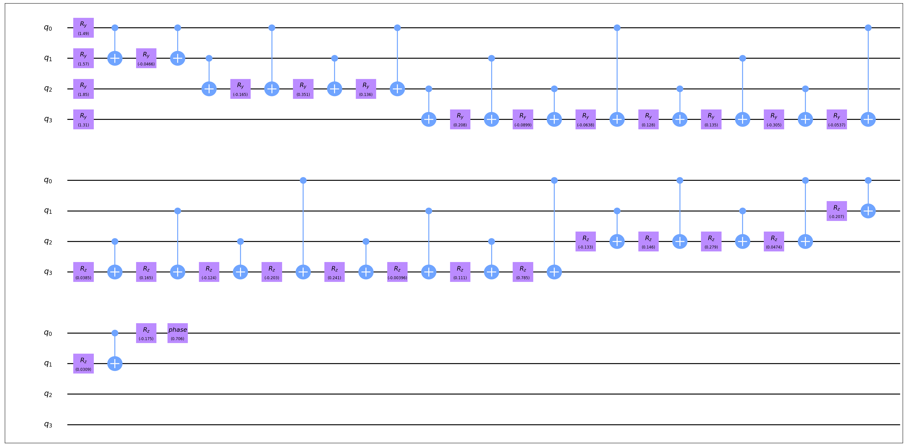

# 量子态制备

量子态制备 (Quantum State Preparation) 算法针对输入的态向量 (state vector) 返回对应的量子电路，使得从$\ket{0}$态出发经过该电路后可以得到目标态向量。这是一些量子算法的第一步，亦可视作量子酉矩阵合成的一种特殊情形（即仅给定第一列时的合成）。

QuICT中目前共实现了3种不同的初态制备算法，其中2种针对一般的量子态，余下1种针对稀疏量子态。此部分具体原理请参见对应的原论文。

## 一般量子态制备

Möttönen, M., Vartiainen, J.J., Bergholm, V., & Salomaa, M.M. (2005). Transformation of quantum states using uniformly controlled rotations. Quantum Inf. Comput., 5, 467-473.

``` python
from QuICT.qcda.synthesis import QuantumStatePreparation

QSP = QuantumStatePreparation('uniformly_gates')
gates = QSP.execute(state_vector)
```

4-qubit随机初态获得的制备电路如下



Plesch, M., & Brukner, V. (2011). Quantum-state preparation with universal gate decompositions. Physical Review A, 83, 032302.

``` python
from QuICT.qcda.synthesis import QuantumStatePreparation

QSP = QuantumStatePreparation('unitary_decomposition')
gates = QSP.execute(state_vector)
```

4-qubit随机初态获得的制备电路如下


## 稀疏量子态制备

Gleinig, N., & Hoefler, T. (2021). An Efficient Algorithm for Sparse Quantum State Preparation. 2021 58th ACM/IEEE Design Automation Conference (DAC), 433-438.

``` python
from QuICT.qcda.synthesis import SparseQuantumStatePreparation

sparseQSP = SparseQuantumStatePreparation('state_vector')
gates = sparseQSP.execute(state_vector)
```

4-qubit随机初态，其中只有4个非零元素获得的制备电路如下


