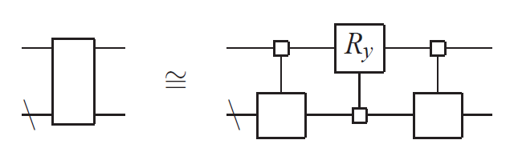
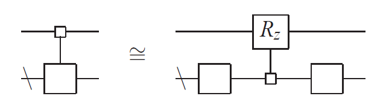
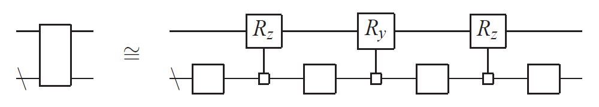
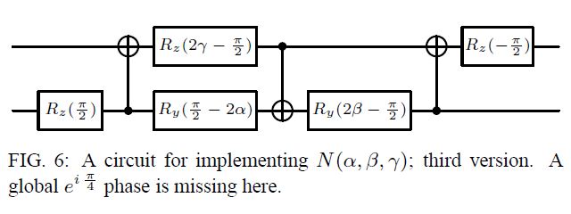
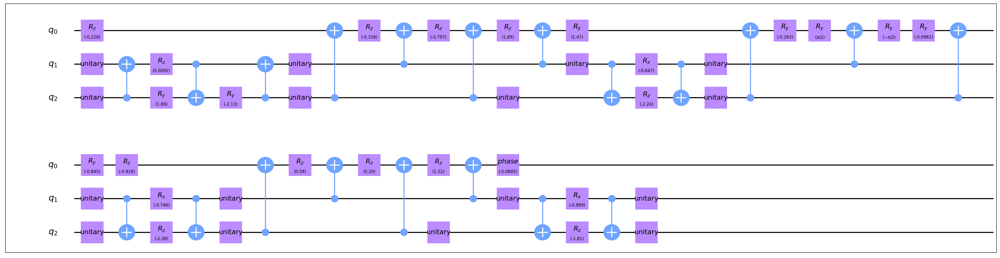

# 酉矩阵分解

酉矩阵分解 (Unitary Decomposition) 算法针对给定的酉矩阵返回对应的量子电路。应用这一方法原则上可以实现对量子态的任意可容许操作，但其电路规模和深度均较高，请斟酌使用。

## 算法流程

算法的基本流程是递归地将待合成电路分解为qubit数更少的待合成电路，这一方法多次利用了对应于电路的矩阵$U$为$2^n$阶酉矩阵的性质。

### Cosine-Sine分解

设有一个$2k$阶酉矩阵$U$，则存在$k$阶酉矩阵$A_1, A_2, B_1, B_2$和$k$阶实对角矩阵$C, S$满足$C^2 + S^2 = I$，并且

$$
U = \begin{pmatrix}
A_1 & \\
 & B_1 \\
\end{pmatrix}
\begin{pmatrix}
C & -S \\
S & C \\
\end{pmatrix}
\begin{pmatrix}
A_2 & \\
 & B_2 \\
\end{pmatrix}
$$

Cosine-Sine分解对应的电路分解如下图

<figure markdown>

<p markdown="1" style="font-size:15px;"> 图片引用自*Synthesis of quantum-logic circuits.* [<sup>[1]</sup>](#refer1)
</figure>

图中空心小方块代表uniformly控制，亦即对控制位的全部可能的$0, 1$情况对作用位执行对应的量子门。空心大方块则代表任意的一个或多个酉矩阵。

### 量子Shannon分解

设$U_1, U_2$是两个$k$阶酉矩阵，则存在$k$阶酉矩阵$V, W$和$k$阶对角酉矩阵$D$满足

$$
\begin{pmatrix}
U_1 & \\
 & U_2 \\
\end{pmatrix} = \begin{pmatrix}
V & \\
 & V \\
\end{pmatrix}
\begin{pmatrix}
D & \\
 & D^\dagger \\
\end{pmatrix}
\begin{pmatrix}
W & \\
 & W \\
\end{pmatrix}
$$

注意到在上式中$U_1 U_2^\dagger = V D^2 V^\dagger$立即给出证明。据此可以进一步分解Cosine-Sine分解得到的电路如下图

<figure markdown>

<p markdown="1" style="font-size:15px;"> 图片引用自*Synthesis of quantum-logic circuits.* [<sup>[1]</sup>](#refer1)
</figure>

综合以上两步分解即得量子Shannon分解如下图

<figure markdown>

<p markdown="1" style="font-size:15px;"> 图片引用自*Synthesis of quantum-logic circuits.* [<sup>[1]</sup>](#refer1)
</figure>

这样就将一个$n$-qubit酉矩阵分解为$(n-1)$-qubit酉矩阵，如此递归并合成每一部分需要的uniformly控制Ry和Rz门即可将给定的酉矩阵转化为量子电路。

### Cartan KAK分解

以上的过程实际上已经在CNOT门数量的阶上达到了下界$\Omega(4^n)$，不过还有一些方法可以优化其常数，这里只介绍相对重要的一个方法，更多细节的优化可以参见[<sup>[1]</sup>](#refer1)的附录部分。

将量子Shannon分解应用于$2$-qubit酉矩阵可以用$6$个CNOT门对其进行合成，但是利用李代数的Cartan分解，实际上$SU(4)$矩阵只需要$3$个CNOT门即可合成。

对任意$U\in SU(4)$，存在$K_1, K_2, K_3, K_4\in SU(2)$和$\vec{k}\in \mathbb{R}^3$满足

$$
U = (K_1 \otimes K_2)
\exp(i\vec{k}\cdot\vec{\Sigma})
(K_3 \otimes K_4)
$$

其中$\vec{\Sigma} = (\sigma_{XX}, \sigma_{YY}, \sigma_{ZZ})$。这样得到的$K_1, K_2, K_3, K_4$是$4$个$1$-qubit门，而$\exp(i\vec{k}\cdot\vec{\Sigma})$可以合成如下图

<figure markdown>

<p markdown="1" style="font-size:15px;"> 图片引用自*Optimal quantum circuits for general two-qubit gates.* [<sup>[2]</sup>](#refer2)
</figure>

通过一系列的矩阵计算即可得到如此合成$SU(4)$矩阵所需的一系列参数，这部分的细节可以参见[<sup>[3]</sup>](#refer3)。

## 使用方法

`UnitaryDecomposition`的可选参数如下：

- `include_phase_gate`：是否将全局相位作为一个`GPhase`门包含于合成电路中：若为`true`，则返回`gates, None`；若为`false`，则返回`gates, phase`。默认为`false`；

- `recursive_basis`：基于量子Shannon分解的递归合成过程在何时结束，若为`1`，则不引入Cartan KAK分解；若为`2`，则对$SU(4)$矩阵采取Cartan KAK分解并对应进行优化。默认为`2`。

## 代码实例

``` python
from QuICT.qcda.synthesis import UnitaryDecomposition

UD = UnitaryDecomposition()
gates, _ = UD.execute(mat)
```

所得`gates`即对应于酉矩阵`mat`的量子电路，这里以`CompositeGate`的形式返回，以下给出了一个随机$SU(8)$矩阵对应的3-qubit量子电路。

<figure markdown>

</figure>

## 参考文献

<div id="refer1"></div>
<font size=3>
[1] Shende, V.V., Bullock, S.S., & Markov, I.L. (2006). Synthesis of quantum-logic circuits. IEEE Transactions on Computer-Aided Design of Integrated Circuits and Systems, 25, 1000-1010. [https://arxiv.org/abs/quant-ph/0406176](https://arxiv.org/abs/quant-ph/0406176)
</font>

<div id="refer2"></div>
<font size=3>
[2] Vatan, F., & Williams, C.P. (2003). Optimal quantum circuits for general two-qubit gates. Physical Review A, 69, 32315. [https://arxiv.org/abs/quant-ph/0308006](https://arxiv.org/abs/quant-ph/0308006)
</font>

<div id="refer3"></div>
<font size=3>
[3] Drury, B., & Love, P.J. (2008). Constructive quantum Shannon decomposition from Cartan involutions. Journal of Physics A: Mathematical and Theoretical, 41, 395305. [https://arxiv.org/abs/0806.4015](https://arxiv.org/abs/0806.4015)
</font>
