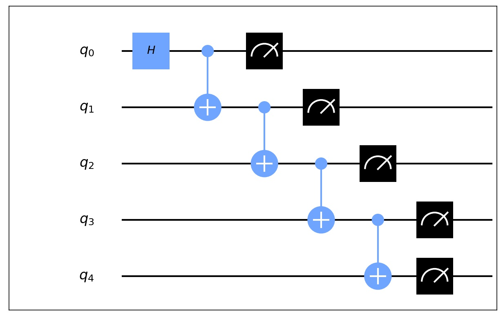
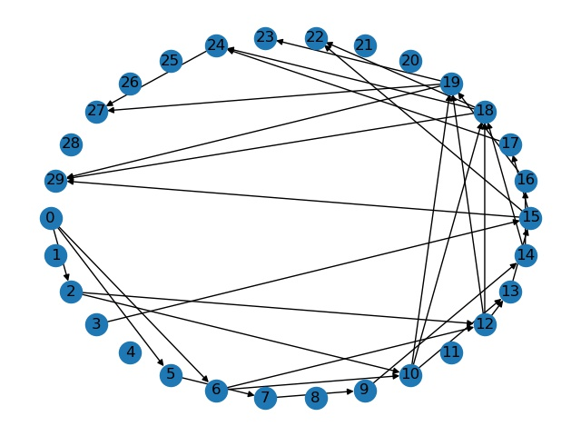

# 量子电路 (Circuit)

量子计算机是由包含电路和基本量子门的量子电路构造的，类似于经典计算机是由包含连线和逻辑门的电路构造的。电路的读法是从左到右。电路中的每一条线代表量子电路的连线。这些连线不一定对应到物理的连线；它可能对应时间段，或者从空间的一处移动到另一处的物理粒子，比如光子。

<figure markdown>
{:width="500px"}
</figure>

一些经典电路的特征在量子电路中通常不会出现：

- 量子电路不允许“环路”，即从量子电路的一部分反馈到另一部分; 我们称电路为非周期的 (acyclic) 。
- 经典电路允许连线汇合，即扇入操作 (FANIN) ，导致单线包含所有输入位的按位或 (bitwise OR) 。显然这个操作不是可逆的，因此也不是酉操作，所以我们不允许量子电路中有扇入操作。
- 与上面相反的操作，扇出操作 (FANOUT) ，即产生一个比特的多个拷贝在量子电路中也是不允许的。


## 如何使用 QuICT 来构建量子电路

在 QuICT 中，量子电路是最重要的单元，它支撑着量子算法的设计和模拟器的运行。 Circuit 是 QuICT 中的一个类，它使用量子位和门来表示量子电路的线路和量子门。在 Circuit 中，它用电线分配量子门，并允许附加随机门和 Supremacy 电路。 Circuit 还提供了绘制量子电路并将其自身转换为 OpenQASM 文件的工具。

Circuit 提供了多种方法来将门添加到量子电路中

- 可以使用运算符 or (|) 将量子门、组合量子门甚至量子电路添加到量子电路中
- 可以使用 circuit.append(gate) 或 circuit.extend(CompositeGate) 添加单个门和多个量子门
- 如果需要构建随机量子电路，可以通过 circuit.random_append() 来实现

!!! tip
    其他详细信息，请阅读 quict/example 中的示例和文档中的教程。

``` python
from QuICT.core import Circuit
from QuICT.core.gate import *

# Build a circuit with qubits 5
circuit = Circuit(5)

# add gates
H | circuit(0)                      # append H gate to all qubits
for i in range(4):
    CX | circuit([i, i+1])          # append CX gate

# Add CompositeGate
qft_gate = QFT(5)
qft_gate | circuit([0, 1, 2, 3, 4])

# append random gates
circuit.random_append(rand_size=10)
```


## 量子电路的基础属性和辅助功能
``` python
circuit.size()      # 电路内量子门个数
circuit.depth()     # 电路深度
circuit.width()     # 电路宽度

circuit.qubits          # 返回量子电路中的量子寄存器
circuit.ancilla_qubits  # 返回量子电路中辅助比特的位置

circuit.gates           # 返回电路内的所有量子门，包括组合量子门
circuit.fast_gates      # 返回电路内的所有量子门的信息，包含量子门，作用位，以及对应门数
circuit.flatten_gates() # 分解所有电路内的组合量子门，之后返回所有基础量子门

circuit.count_1qubit_gate()         # 返回电路中单比特量子门的个数
circuit.count_2qubit_gate()         # 返回电路中双比特量子门的个数
circuit.count_gate_by_gatetype(GateType.cx)    # 返回电路中给定量子门种类的个数

circuit.to_compositegate()  # 将当前电路转换为组合量子门
circuit.inverse()           # 返回反转量子电路，即此电路的量子门为当前电路的所有量子的反转门
circuit.matrix()            # 返回当前电路的酉矩阵
circuit.sub_circuit()       # 提取部分电路
```


## 量子电路可视化和QASM格式转换

QuICT 支持量子电路和 OpenQASM 格式的相互转换，既可以将量子电路保存为 OpenQASM 格式的文件，也支持从现有 OpenQASM 文件中导入电路。
``` python
from QuICT.tools.interface import OPENQASMInterface
# Save to QASM file
circuit.qasm("example.qasm")

# load qasm
file_path = "/path/to/QASM"
qasm_circuit = OPENQASMInterface.load_file(file_path).circuit
```

QuICT 中有两种可视化量子电路的方法，一种是在命令行界面显示量子电路，另一种是将量子电路转化为对应的 png 图片。

```python 
# draw the flatten Quantum Circuit in CLI
circuit.draw(method='command', flatten=True)

# draw the circuit's graph
circuit.draw(method='matp_auto', filename="QuICT")
```


## 有向无环图 (DAG Circuit)

为了实现相关的电路优化算法，也为了更好地对电路结构进行展示，QuICT 可以根据量子电路内量子门的交换性，来构建对应的 DAG Graph ，图中每一个节点都代表着量子电路中的一个量子门，而每一个节点之间的连线都代表着两个量子门之间不可交换，并且可以通过与其他量子门交换来达到先后连接的顺序。

```python
dag_circuit = circuit.get_DAG_circuit()     # 将 circuit 转化为 DAGCircuit
dag_circuit.draw()                          # DAGCircuit 可视化
```

<figure markdown>
{:width="450px"}
</figure>