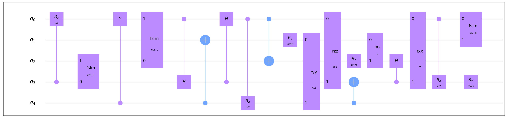
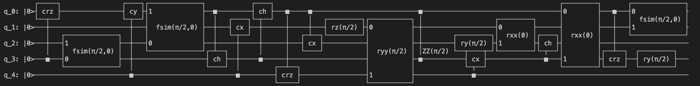
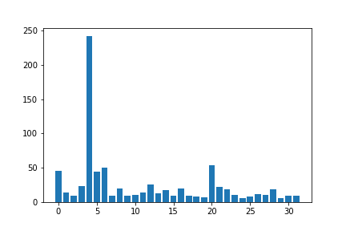
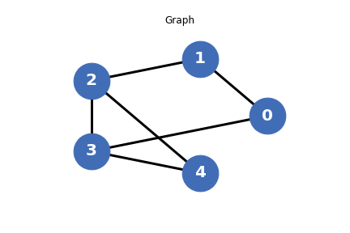
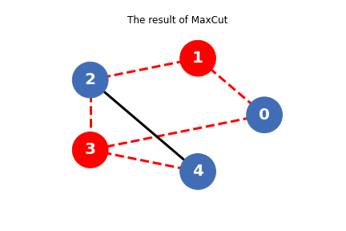

# 工具

## QASM接口

QASM接口 (OPENQASMInterface) 是用来在 QuICT 的 Circuit 类和 QASM 文件之间相互转换的。

``` python
from QuICT.tools.interface import OPENQASMInterface

# load qasm
qasm = OPENQASMInterface.load_file("/path/to/qasm/file")
assert qasm.valid_circuit   # Validate the circuit from qasm file
circuit = qasm.circuit      # Get QuICT Circuit

# Transfer Circuit into qasm
new_qasm = OPENQASMInterface.load_circuit(circuit)
new_qasm.output_qasm("/path/to/qasm/file")       # Save qasm file
```

## 电路画图软件

电路画图软件是 Circuit 类的内置功能之一，它用来根据 Circuit 类里的量子比特和量子门，来画出相对应的量子电路图。

它有两种生成图像方式:

- matp: 生成 JPEG 图像，它有以下四种模式：
    - matp_inline: 交互式显示图形但不将其保存到文件中。
    - matp_file: 将图形保存到文件但不以交互方式显示。
    - matp_auto: 根据matplotlib后端自动选择inline或file模式。
    - matp_silent: 返回绘制的图形但不保存或显示。
- command: 在终端中显示文本图像

``` python
from QuICT.core import Circuit

circuit = Circuit(5)
circuit.random_append(20)
circuit.draw(method='matp_auto')
circuit.draw(method='command')
```

<figure markdown>

</figure>

<figure markdown>

</figure>


## 量子电路算法库

QuICT 内置了一个量子算法电路库，里面包含多种经典量子算法，例如 Grover、VQE、QFT等。也支持基于量子指令集的随机电路生成和 benchmark 测试电路生成。

| 算法电路     | 比特数     | 门数         | 电路深度 |
| ------------ | ---------- | ------------ | -------- |
| adder        | 4~100,1535 | 4~132, 32745 | 4~16376  |
| clifford     | 1~19       | 3~436        | 3~338    |
| grover       | 4~99       | 20~2186      | 11~1507  |
| qft          | 2~100      | 2~5050       | 3~199    |
| vqe          | 4~50       | 22~3150      | 12~173   |
| maxcut       | 4~100      | 17~7625      | 8~542    |
| qnn          | 2~100      | 5~253        | 5~200    |
| quantum walk | 2~20       | 5~10959      | 5~6205   |
| cnf          | 7~50       | 3~5668       | 21~3663  |

```python
from QuICT.tools.circuit_library import CircuitLib

cir_lib = CircuitLib()
cirs = cir_lib.get_algorithm_circuit("grover", [3, 5, 7], max_depth=20)     # 生成Grover算法电路，比特数分别为3、5、7，最大深度为20
```


## 算法画图函数

用于QuICT以及QuICT-ml内置算法的相关图像绘制，目前支持绘制量子态采样图，MaxCut算法的无向无权图，以及MaxCut的分割结果图。

- 量子态采样图（以Quantum Walk Search为例）
  
    ``` python
    # 导入运行库
    from QuICT.algorithm.quantum_algorithm import QuantumWalkSearch
    from QuICT.simulation.state_vector import StateVectorSimulator
    from QuICT.algorithm.tools.drawer.graph_drawer import *

    # 初始化状态向量模拟器和QuantumWalkSearch模块：
    simulator = StateVectorSimulator()
    qws = QuantumWalkSearch(simulator)

    # 开始搜索
    N = 5
    sample = qws.run(index_qubits=N, targets=[4], a_r=5 / 8, a_nr=1 / 8)

    # 画出采样图
    draw_samples_with_auxiliary(sample, N, int(np.ceil(np.log2(N))))
    ```

    <figure markdown>
    {:width="500px"}
    </figure>

- 绘制无向无权图
  
    ```python
    from QuICT.algorithm.tools.drawer.graph_drawer import *

    n = 5
    nodes = list(range(n))
    edges = [[0, 1], [1, 2], [2, 3], [3, 4], [0, 3], [2, 4]]
    draw_graph(nodes, edges)
    ```

    <figure markdown>
    {:width="500px"}
    </figure>

- 绘制MaxCut分割结果图
  
    ```python
    solution_bit = '10100'
    draw_maxcut_result(nodes, edges, solution_bit)
    ```

    <figure markdown>
    {:width="500px"}
    </figure>


## 命令行界面

为了更方便也更灵活的使用QuICT的相关功能，我们开发了 QuICT CLI 相关功能。QuICT CLI 一方面支持电路生成和 benchmark 测试功能，另一方面也支持单机的一键式任务部署。它构建有一套本地任务管理流程，支持相关电路优化、映射、指令集转换和电路模拟功能，在之后的开发中，它也将会支持部署相关任务到远程分布式服务器中。

- 使用 QuICT CLI

    ``` sh
    quict --help
    ```

- 使用命令行指令生成并管理电路

    ``` sh
    # 生成量子随机电路和量子算法电路
    
    ```

