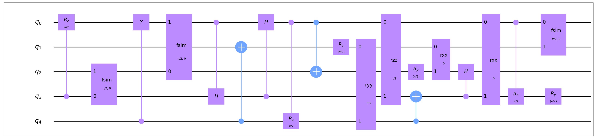
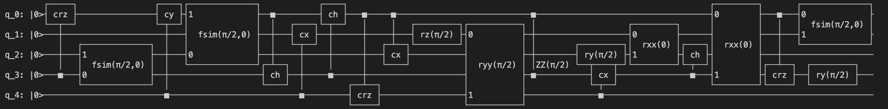

# 工具

## QASM接口
----
QASM接口 (OPENQASMInterface) 是用来在 QuICT 的 Circuit 类和 QASM 文件之间相互转换的。
```python
from QuICT.tools.interface import OPENQASMInterface

# load qasm
qasm = OPENQASMInterface.load_file("/path/to/qasm/file")
assert qasm.valid_circuit   # Validate the circuit from qasm file
circuit = qasm.circuit      # Get QuICT Circuit

# Transfer Circuit into qasm
new_qasm = OPENQASMInterface.load_circuit(circuit)
new_qasm.output_qasm("/path/to/qasm/file")       # Save qasm file
```

## 电路画图软件
----
电路画图软件是 Circuit 类的内置功能之一，它用来根据 Circuit 类里的量子比特和量子门，来画出相对应的量子电路图。

它有两种生成图像方式:
- matp: 生成 JPEG 图像，它有以下四种模式：
    - matp_inline: 交互式显示图形但不将其保存到文件中。
    - matp_file: 将图形保存到文件但不以交互方式显示。
    - matp_auto: 根据matplotlib后端自动选择inline或file模式。
    - matp_silent: 返回绘制的图形但不保存或显示。
- command: 在终端中显示文本图像

```python
from QuICT.core import Circuit

circuit = Circuit(5)
circuit.random_append(20)
circuit.draw(method='matp_auto')
circuit.draw(method='command')
```

<div align=center></div>
<div align=center></div>


## 量子电路算法库
----
QuICT 内置了一个量子算法电路库，里面包含多种经典量子算法，例如 Grover、VQE、QFT等。也支持基于量子指令集的随机电路生成和 benchmark 测试电路生成。

```python
from QuICT.tools.circuit_library import CircuitLib

cir_lib = CircuitLib()
cirs = cir_lib.get_algorithm_circuit("grover", [3, 5, 7], max_depth=20)     # 生成Grover算法电路，比特数分别为3、5、7，最大深度为20
```


## 命令行界面
----
为了更方便也更灵活的使用QuICT的相关功能，我们开发了 QuICT CLI 相关功能。QuICT CLI 一方面支持电路生成和 benchmark 测试功能，另一方面也支持单机和远端分布式的一键式任务部署。它构建有一套本地任务管理流程，支持相关电路优化、映射、指令集转换和电路模拟功能，它也支持部署相关任务到远程分布式服务器中。
### 如何使用 QuICT CLI
- 以下快捷方式暂仅支持 Linux 环境
    ```python
    from QuICT.tools.cli import JobCreator, shortcut_for_quict

    shortcut_for_quict()
    ```

- 使用 QuICT CLI
    ```sh
    quict --help
    ```
