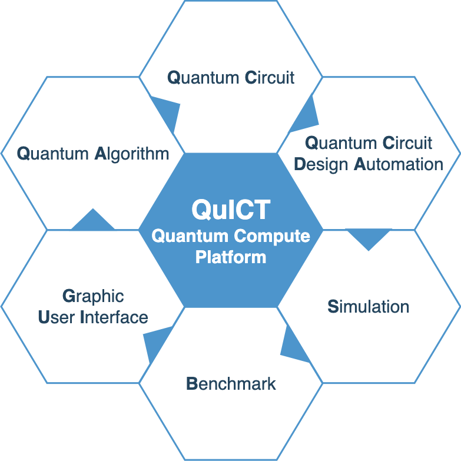

---
hide:
  - navigation
---

## QuICT 平台简介
QuICT (Quantum Computer of Institute of Computing Technology)是一个开源量子计算操作平台。目前QuICT已能支持6种常见指令集以及20余种量子门操作，已实现3种不同类型的量子电路模拟器，并且都有对CPU/GPU的支持和加速，可进行含噪声量子电路仿真模拟。设计并实现了QCDA(Quantum Circuit Design Automation)量子电路辅助设计模块，包括量子初态制备、指令集转换、酉矩阵合成、量子电路优化和映射等功能。算法方面，实现了shor、grover、qae等常见量子算法，可进行因数分解、SAT问题求解等；也实现了QML领域内的QAOA 和 QNN算法，支持图求解最大割问题和MNIST手写数字图片二分类。 QuICT同时也构建了量子算法电路库和针对量子计算机的性能基准测试，通过设计不同的量子电路赛道，来实现针对不同量子机特性的基准测试。

主要模块
- QuICT.algorithm: 包含多种常见量子算法，例如shor, grover, qaoa, vqe等。
- QuICT.core: 包含构建电路所需的组件，Circuit, Gates, Qubits等。
- QuICT.qcda: 量子电路生成、优化和映射
- QuICT.simulation: 量子电路模拟器，支持 Unitary、StateVector、DensityMatrix。

相关链接
- 代码库：https://gitee.com/quictucas/quict
- 文档：https://pypi.org/project/quict/
- Pypi：https://pypi.org/project/quict/
- UI：http://49.235.108.172:8080/
