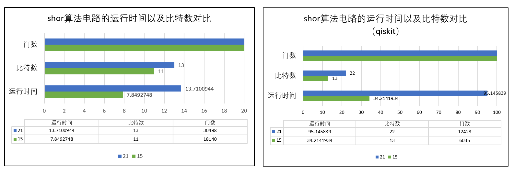
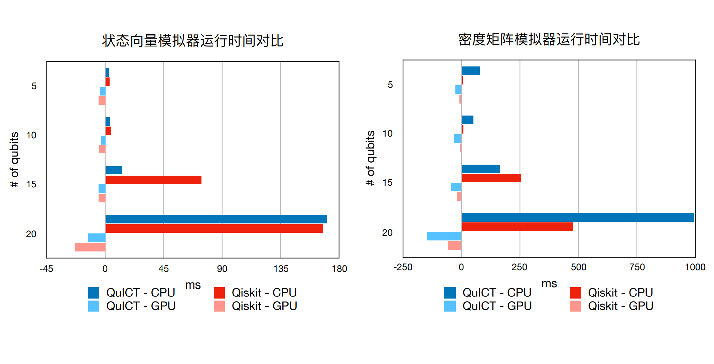

# Benchmark（QuICT平台基准测试）
###简介
QuICT平台benchmark是指对平台本身的算法、模拟、QCDA等模块进行基准测试，以及与其他平台如qiskit等联合做基准测试。
###模块
|    |   QCDA  |   Algorithm  |   Simulation  |
| ------ | ------- | ------- | ------- |
|   1    |   mapping   |   shor   |   state vector   |
|   2    |   optimization   |   cnf   |   density matrix   |
|   3    |   synthesis   |   xxx   |   xxx   |
###数据分析
- **QCDA基准测试**

- **算法基准测试**

- **模拟基准测试**
