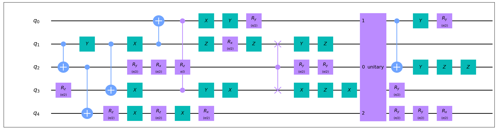
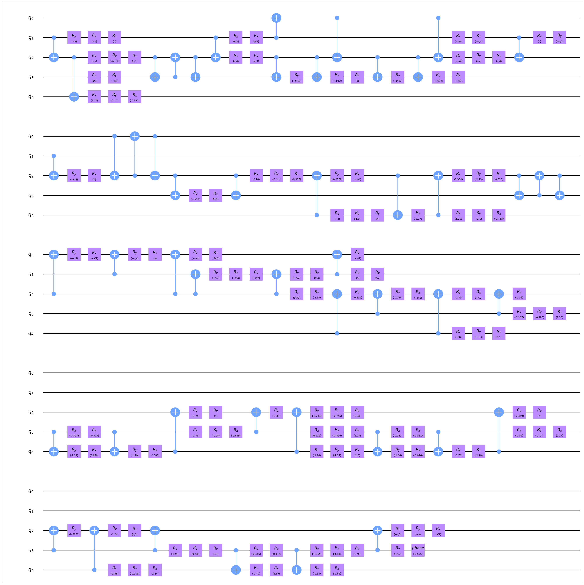

# 量子电路设计自动化 (QCDA, Quantum Circuit Design Automation)

本教程主要介绍如何使用量子电路设计自动化(QCDA)模块进行量子电路的自动合成、优化、映射操作，将输入的量子逻辑电路转化为在实际物理机器上可以运行的电路。请注意，本教程只介绍QCDA整体使用方法，各功能模块的原理及其使用请参见对应模块的教程。

## 核心逻辑

QCDA模块实质上连缀了一系列以`execute()`函数为主执行函数的电路合成、优化、映射方法，其中`execute()`函数以`CompositeGate`对象或`Circuit`对象为输入和输出。依据这一规则用户可以按照自己的需求构建新的电路变换方法并接入QCDA中。

## 使用例

``` python
from QuICT.qcda.synthesis.gate_transform import USTCSet
from QuICT.qcda.qcda import QCDA

qcda = QCDA()
qcda.add_gate_transform(USTCSet)
qcda.add_default_optimization()
qcda.add_default_mapping(layout)
qcda.add_gate_transform(USTCSet)
circuit_phy = qcda.compile(circuit)
```

以上的代码给出了QCDA的一个典型使用例：
``` python
qcda.add_gate_transform(USTCSet)
```
利用GateTransform将输入电路转换到USTC指令集上，

``` python
qcda.add_default_optimization()
```
对转换后电路进行默认优化，

``` python
qcda.add_default_mapping(layout)
```
将电路映射到给定的`Layout`上，

``` python
qcda.add_gate_transform(USTCSet)
```
再利用GateTransform将映射后的swap门分解到USTC指令集上，

``` python
circuit_phy = qcda.compile(circuit)
```
执行以上安排的QCDA流程获得原电路`circuit`给定指令集和`Layout`得到的物理电路`circuit_phy`。以下给出了一组原电路及其对应的物理电路。




