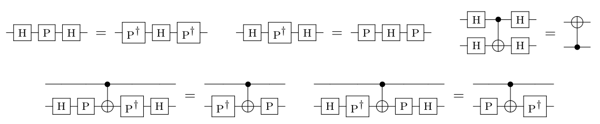
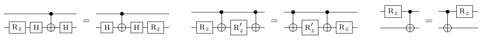
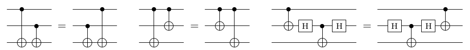
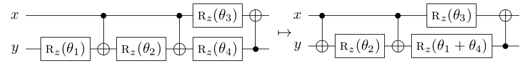
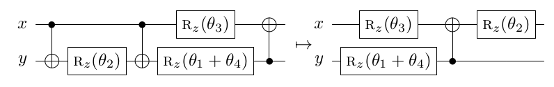
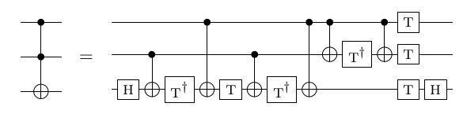
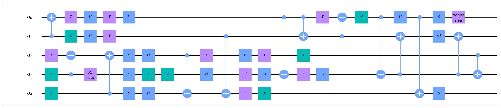

# Clifford+Rz Optimization

Clifford+Rz优化 (Clifford+Rz Optimization) 是一种优化大规模Clifford+Rz电路的启发式算法 [<sup>[1]</sup>](#refer1)。它有两种优化level——light和heavy。Light level的时间复杂度为 $O(g^2)$，其中 $g$ 是电路中的门数量。Heavy level的时间复杂度为 $O(g^3)$，它可能可以消去比light level更多的CNOT门。

除了Clifford+Rz门集合，这个优化算法也支持CCX/CCZ门，它可以贪心地将CCX/CCZ门分解成Clifford+Rz电路，并优化电路规模。电路中不支持的门类型将不会被改动。

## 算法原理

Clifford+Rz优化算法包含了5个子算法：

|编号|子算法|原理|时间复杂度|
| --- | --- | --- | --- |
| 1 | Hadamard gate reduction | 通过匹配特定的模板减少H门的数量 | $O(g)$ |
| 2 | Single-qubit gate cancellation | 合并相邻、或者交换对易的门后相邻的Rz门 | $O(g^2)$ |
| 3 | Two-qubit gate cancellation | 消去相邻、或者交换对易的门后相邻的CNOT门 | $O(g^2)$ |
| 4 | Rotation merging | 将电路划分为CNOT+Rz的子电路，对每个子电路用相位表达式合并Rz门 | $O(g^2)$ |
| 5 | Float rotations | 在CNOT+Rz子电路中移动Rz门的位置，消去更多的CNOT门 | $O(g^3)$ |

Light level的优化会采用前4个子算法，按 `1, 3, 2, 3, 1, 2, 4, 3, 2` 的顺序循环执行，直到没有可以消去的门为止。Heavy level会采用所有的5个子算法，按 `1, 3, 2, 3, 1, 2, 4, 5` 的顺序循环执行，直到没有可以消去的门为止。


Clifford+Rz优化算法也支持对CCX/CCZ门的优化，CCX/CCZ门有各种不同的Clifford+Rz分解方法，不同的分解方法的优化效果可能不同。该优化算法会贪心地选择使得电路门数最少的分解方法。


### 1. Hadamard gate reduction

该子算法在电路中寻找如下子电路模板：



通过将这些子电路替换为等式右边的电路来减少H门数量，这是因为H门会妨碍之后的Rotation merging优化方法。

### 2. Single-qubit gate cancellation

如果两个Rz门相邻，则可以被合并为一个Rz门；更进一步，如果两个Rz门可以通过与对易的电路块交换而相邻，则也可以被合并成同一个Rz门。

该算法枚举电路中的每一个Rz门 $g$，考虑如下对易关系：




通过贪心地将 $g$ 不断与可交换的相邻电路块交换，当碰到了另一个Rz门时，就可以进行合并。

### 3. Two-qubit gate cancellation


使用子算法2完全相同的思路来消去CNOT门，考虑的对易关系如下图：



### 4. Rotation merging

在一个n比特的CNOT+Rz电路块中，每一个Rz门可以被看做在 $\mathbb{F}_2[x_1,x_2\cdots, x_n]$ 的某个单项式 $x_{i_1}\oplus x_{i_2}\oplus \cdots \oplus x_{i_k} (1\leq x_i\leq n)$ 上的相位变换，故可以被写作一个相位多项式（Phase polynomial）。



例如在上图中，左边的电路的相位多项式为 

$$|x,y\rangle \to e^{i p(x,y)}|x\oplus y,y\rangle$$

其中 $p(x,y)=\theta_1y+\theta_2(x\oplus y)+\theta_3x+\theta_4y$，合并 $\theta_1$ 和 $\theta_4$ 得到 $(\theta_1+\theta_4)y+\theta_2(x\oplus y)+\theta_3x$，故可以被优化为右边的电路。


如果两个Rz的单项式相同，则可以被合并，一个含有 $l$ 项的相位多项式只需要 $l$ 个Rz门来表达。基于这个观察，该子算法将枚举电路中的CNOT+Rz电路块，计算其相位表达式来合并其中的Rz门。

### 5. Float rotations

在一个CNOT+Rz子电路中，一个Rz可以被移动到其他位置，使得CNOT门可以得到进一步的合并，例如：



子算法5执行类似于子算法3的步骤，在所有CNOT+Rz电路块中合并CNOT门，不同之处是子算法5考虑了每一个Rz门在电路中所有可能的位置，当遇到一个可以被移走的Rz门，会将它移动到其他的地方。


子算法5还会通过一些模板匹配规则来消去更多的CNOT门，详见 [<sup>[1]</sup>](#refer1)。

### CCX/CCZ门的优化

Clifford+Rz优化算法也支持对CCX/CCZ门的优化，CCX/CCZ门有多种Clifford+Rz分解方法，不同的分解方法的优化效果可能不同。以CCX为例，CCX可以被分解为：



由于 $CCX^\dagger=CCX$，将上述分解中的所有$T(T^\dagger)$ 门取共轭后依然是一个CCX门，这两种分解方式只有 $T(T^\dagger)$ 门的相对相位不同，算法事先并不确定用哪一种分解，而是对每个CCX门设一个相对相位变量 $x_i$，在上述优化流程中用符号计算记录每个Rz门关于相对相位变量的表达式。当优化流程执行完后，遍历每一个CCX $i$，贪心地选择当前能导致电路门数最小的 $x_i$ 取值。


## 基本用法

`CliffordRzOptimization` 位于`QuICT.qcda.optimization.clifford_rz_optimization`，支持三个可选的初始化参数：

1.  `level`: 优化级别，`'light'` 或者 `'heavy'`， 默认为 `'light'`。
2.  `optimize_toffoli`: 是否优化CCX/CCZ门，默认为 `True`。如果为 `True`，优化器会将CCX/CCZ门分解成Clifford+Rz电路；如果为 `False`，优化器不会改变电路中的CCX/CCZ门。
3.  `verbose`: 是否输出优化的具体过程信息，默认为 `False`。

对于一个待优化的电路 `circ`，首先实例化一个优化器 `CRO = CliffordRzOptimization()`（根据需要传入参数），然后执行 `CRO.execute(circ)` 得到优化后的电路。

## 代码示例

生成一个随机电路，然后使用Clifford+Rz优化算法。

```python
from QuICT.core import Circuit
from QuICT.core.utils import GateType
from QuICT.qcda.optimization import CliffordRzOptimization

typelist = [GateType.x, GateType.cx, GateType.h, GateType.s,
            GateType.t, GateType.sdg, GateType.tdg, GateType.rz]

if __name__ == '__main__':

    # generate a random 5-qubit circuit using gates in typelist
    circuit = Circuit(5)
    circuit.random_append(100, typelist=typelist)
    circuit.draw(filename='0.jpg')

    # instantiate a optimizer
    CRO = CliffordRzOptimization()

    # optimize the circuit
    circ_optim = CRO.execute(circuit)
    circ_optim.draw(filename='1.jpg')
```

随机电路：


优化后的电路：



## 参考文献


<div id="refer1"></div>
<font size=3>
[1] Nam, Yunseong, et al. Automated optimization of large quantum
    circuits with continuous parameters. npj Quantum Information 4.1
    (2018): 1-12.
</font>

