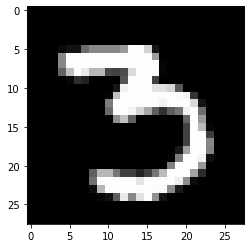
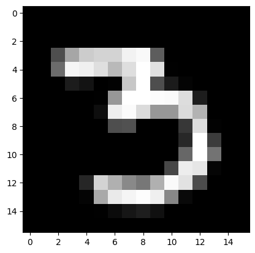
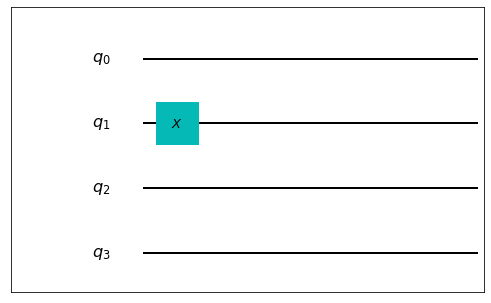
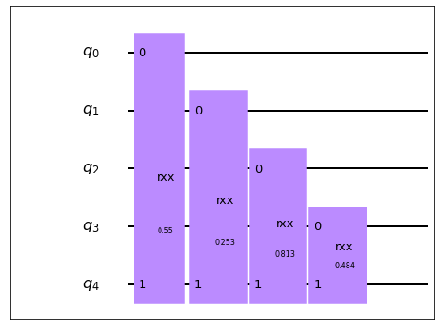
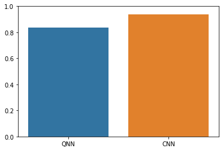

# 量子神经网络（QNN）

本教程旨在介绍如何使用经典机器学习库Pytorch和QuICT中内置的量子神经网络层构建一个用于分类MNIST手写数据集的量子神经网络（Quantum Neural Network, QNN）。

## 导入运行库

首先，导入必要的运行库及相关依赖：

```python
import collections
import torch
import torch.nn as nn
import torch.utils.data as data
import torch.nn.functional as F
import tqdm
from torchvision import datasets, transforms
import matplotlib.pyplot as plt
import seaborn as sns

from QuICT_ml.ansatz_library import QNNLayer
from QuICT_ml.utils.encoding import *
from QuICT_ml.utils.ml_utils import *
from QuICT_ml.model.QNN import QuantumNet
```

## 加载和预处理MNIST数据

在本教程中，我们将遵循Farhi et al.[<sup>[1]</sup>](#refer1)的实验，对数字3和6进行分类。对MNIST数据集的预处理主要目的是使图片能够被编码为量子电路。


### 1. 加载原始MNIST数据

Pytorch的torchvision库中的datasets能够自动下载MNIST数据集：

``` python
train_data = datasets.MNIST(root="./data/", train=True, download=True)
test_data = datasets.MNIST(root="./data/", train=False, download=True)
train_X = train_data.data
train_Y = train_data.targets
test_X = test_data.data
test_Y = test_data.targets
print("Training examples: ", len(train_Y))
print("Testing examples: ", len(test_Y))
```

```
Training examples:  60000
Testing examples:  10000
```


### 2. 筛选数据集使其仅包含数字3和6

为了实现对数字3和6的二分类，我们需要删除其他数字，只保留标签为3和6的数据。并且定义标签`y = 6`为正类，`y = 3`为负类：

``` python
def filter_targets(X, Y, class0=3, class1=6):
    idx = (Y == class0) | (Y == class1)
    X, Y = (X[idx], Y[idx])
    Y = Y == class1
    return X, Y
```

``` python
train_X, train_Y = filter_targets(train_X, train_Y)
test_X, test_Y = filter_targets(test_X, test_Y)
print("Filtered training examples: ", len(train_Y))
print("Filtered testing examples: ", len(test_Y))
```

```
Filtered training examples:  12049
Filtered testing examples:  1968
```

随机选择一个数据并显示：

``` python
print("Label: ", train_Y[200])
plt.imshow(train_X[200], cmap="gray")
```

```
Label:  tensor(False)
<matplotlib.image.AxesImage at 0x7f63c2429640>
```

<figure markdown>
{:width="400px"}
</figure>


### 3. 缩小图像

原始的MNIST数据集图片尺寸是28x28，这对于目前的量子计算来说太大了，无法被编码，因此需要将其缩小到4x4：

``` python
def downscale(X, resize):
    transform = transforms.Resize(size=resize)
    X = transform(X) / 255.0
    return X
```

``` python
resized_train_X = downscale(train_X, (4, 4))
resized_test_X = downscale(test_X, (4, 4))
```

同样地，显示序号为200的图像：

``` python
plt.imshow(resized_train_X[200], cmap="gray")
```

```
<matplotlib.image.AxesImage at 0x7f63c2371fd0>
```

<figure markdown>
{:width="400px"}
</figure>


### 4. 去除冲突数据

在经过向下采样后，会产生大量重复图片，并且部分图片会同时被标记为正类和负类。为了避免这对分类结果造成影响，需要去除同一图片被同时标记为3和6的样本：

``` python
def remove_conflict(X, Y, resize):
    x_dict = collections.defaultdict(set)
    for x, y in zip(X, Y):
        x_dict[tuple(x.numpy().flatten())].add(y.item())
    X_rmcon = []
    Y_rmcon = []
    for x in x_dict.keys():
        if len(x_dict[x]) == 1:
            X_rmcon.append(np.array(x).reshape(resize))
            Y_rmcon.append(list(x_dict[x])[0])
    X = torch.from_numpy(np.array(X_rmcon))
    Y = torch.from_numpy(np.array(Y_rmcon))
    return X, Y
```

``` python
nocon_train_X, nocon_train_Y = remove_conflict(resized_train_X, train_Y, (4, 4))
nocon_test_X, nocon_test_Y = remove_conflict(resized_test_X, test_Y, (4, 4))
print("Remaining training examples: ", len(nocon_train_Y))
print("Remaining testing examples: ", len(nocon_test_Y))
```

```
Remaining training examples:  10338
Remaining testing examples:  1793
```

### 5. 二值化

为了方便编码，需要将图片进行二值化：

``` python
def binary_img(X, threshold):
    X = X > threshold
    X = X.type(torch.int)
    return X
```

``` python
threshold = 0.5
bin_train_X = binary_img(nocon_train_X, threshold)
bin_test_X = binary_img(nocon_test_X, threshold)
```

???+ note

    理论上应该在二值化之后再去除冲突数据，但是如果这样图片样本数将会太少，无法进行训练：

    ``` python
    _train_X, _train_Y = remove_conflict(binary_img(resized_train_X, threshold), train_Y, (4, 4))
    _test_X, _test_Y = remove_conflict(binary_img(resized_test_X, threshold), test_Y, (4, 4))
    print("Remaining training examples: ", len(_train_Y))
    print("Remaining testing examples: ", len(_test_Y))
    ```

    ```
    Remaining training examples:  149
    Remaining testing examples:  93
    ```

最后，将数据转移到GPU上以便进行训练：

``` python
device = torch.device("cuda:0")

train_X = bin_train_X.to(device)
train_Y = nocon_train_Y.to(device)
test_X = bin_test_X.to(device)
test_Y = nocon_test_Y.to(device)
```

!!! warning

    不推荐使用CPU进行训练，速度上很难保证，并且容易失败。


## 将图像数据编码为量子电路

本教程将使用量子比特编码（qubit encoding）将图片数据转为量子电路。每个像素对应一个量子比特，像素值为0对应量子态 $\left | 0 \right \rangle$，像素值为1对应量子态 $\left | 1 \right \rangle$。为了达成这一目的，值为1的像素所对应的量子比特上会被施加一个X门使量子态由 $\left | 0 \right \rangle$ 转为 $\left | 1 \right \rangle$。

QuICT中内置了量子比特编码方式，以2x2的图片为例:

``` python
img = torch.tensor([[0, 1], [0, 0]]).to(device)
qe = Qubit(4, device)
qe.encoding(img, circuit=True)
qe.circuit.draw()
```

<figure markdown>
{:width="400px"}
</figure>

``` python
def qubit_encoding(X, device):
    new_X = []
    n_qubits = X[0].shape[0] * X[0].shape[1]
    qe = Qubit(n_qubits, device)
    for x in X:
        qe.encoding(x)
        new_X.append(qe.ansatz)
    return new_X
```

``` python
ansatz_train_X = qubit_encoding(train_X, device)
ansatz_test_X = qubit_encoding(test_X, device)
```


## 量子神经网络

本教程根据Farhi et al.[<sup>[1]</sup>](#refer1)使用的方法进行简化构建模型量子电路，主要用始终作用于读出量子比特的双比特门进行电路构建。

### 1. 构建模型电路

模型电路除了数据量子比特之外，还额外有一个读出量子比特，用于存储预测的分类结果，根据Measure门的测量结果是 $\left | 1 \right \rangle$ 和 $\left | 0 \right \rangle$ 判定输入图片属于正类还是负类。Farhi et al.[<sup>[1]</sup>](#refer1)使用的模型量子电路，是用双比特门（通常是RXX，RYY，RZZ和RZX门）始终作用在读出量子比特，和全部数据量子比特上构建的。QuICT内置了这样的QNN模型电路，我们规定前16个量子比特是数据量子比特，最后一个量子比特是读出量子比特比特：

以含4个数据量子比特的情况为例，单层RXX的QNN模型电路应为：

``` python
pqc = QNNLayer(list(range(4)), 4, device=device)
params = nn.Parameter(torch.rand(1, 4, device=device), requires_grad=True)
model_circuit = pqc.circuit_layer(["XX"], params)
model_circuit.draw()
```

<figure markdown>
{:width="400px"}
</figure>

本教程中将使用两层网络，分别是RXX层和RZZ层，可训练参数的数量即为数字比特数x网络层数：

``` python
data_qubits = list(range(16))
readout_qubit = 16
pqc = QNNLayer(data_qubits, readout_qubit, device=device)
layers = ["XX", "ZZ"]
params = nn.Parameter(torch.rand(2, 16, device=device), requires_grad=True)
model_ansatz = pqc(layers, params)
```

接下来只需要将数据电路与模型电路连接即可开始训练。


### 2. 用QuICT内置的QuantumNet进行训练

以上对图片进行编码和构建模型电路的过程可以认为是构建QNN模型，QuICT的QuantumNet集成了这些步骤，只需定义网络之后按照经典神经网络的训练过程进行训练即可。

首先，设置机器学习相关参数：

``` python
EPOCH = 3       # 训练总轮数
BATCH_SIZE = 32 # 一次迭代使用的样本数
LR = 0.001      # 梯度下降的学习率
SEED = 17       # 随机数种子

set_seed(SEED)  # 设置全局随机种子
```

然后将预处理后的MNIST图像数据集装入DataLoader：

``` python
train_dataset = data.TensorDataset(train_X, train_Y)
test_dataset = data.TensorDataset(test_X, test_Y)
train_loader = data.DataLoader(
    dataset=train_dataset, batch_size=BATCH_SIZE, shuffle=True, drop_last=True
)
test_loader = data.DataLoader(
    dataset=test_dataset, batch_size=BATCH_SIZE, shuffle=True, drop_last=True
)
```

定义待训练的QNN网络和经典优化器：

``` python
net = QuantumNet(16, layers, encoding="qubit", device=device)
optim = torch.optim.Adam([dict(params=net.parameters(), lr=LR)])
```

定义损失函数，此处使用hinge loss：

``` python
def loss_func(y_true, y_pred):
    y_true = 2 * y_true.type(torch.float32) - 1.0
    y_pred = 2 * y_pred - 1.0
    loss = torch.clamp(1 - y_pred * y_true, min=0.0)
    correct = torch.where(y_true * y_pred > 0)[0].shape[0]
    return torch.mean(loss), correct
```

开始训练：

``` python
# train epoch
for ep in range(EPOCH):
    net.train()
    loader = tqdm.tqdm(
        train_loader, desc="Training epoch {}".format(ep + 1), leave=True
    )
    # train iteration
    for it, (x_train, y_train) in enumerate(loader):
        optim.zero_grad()
        y_pred = net(x_train)
        loss, correct = loss_func(y_train, y_pred)
        accuracy = correct / len(y_train)
        loss.backward()
        optim.step()
        loader.set_postfix(
            it=it,
            loss="{:.3f}".format(loss),
            accuracy="{:.3f}".format(accuracy),
        )

    # Validation
    net.eval()
    loader_val = tqdm.tqdm(
        test_loader, desc="Validating epoch {}".format(ep + 1), leave=True
    )
    loss_val_list = []
    total_correct = 0
    for it, (x_test, y_test) in enumerate(loader_val):
        y_pred = net(x_test)
        loss_val, correct = loss_func(y_test, y_pred)
        loss_val_list.append(loss_val.cpu().detach().numpy())
        total_correct += correct
        accuracy_val = correct / len(y_test)
        loader_val.set_postfix(
            it=it,
            loss="{:.3f}".format(loss_val),
            accuracy="{:.3f}".format(accuracy_val),
        )
    avg_loss = np.mean(loss_val_list)
    avg_acc = total_correct / (len(loader_val) * BATCH_SIZE)
    print("Validation Average Loss: {}, Accuracy: {}".format(avg_loss, avg_acc))
```

```
Training epoch 1: 100%|██████████| 323/323 [29:21<00:00,  5.45s/it, accuracy=0.906, it=322, loss=0.543]
Validating epoch 1: 100%|██████████| 56/56 [05:00<00:00,  5.37s/it, accuracy=0.750, it=55, loss=0.724]
Validation Average Loss: 0.5847752690315247, Accuracy: 0.8448660714285714
Training epoch 2: 100%|██████████| 323/323 [29:30<00:00,  5.48s/it, accuracy=0.812, it=322, loss=0.469]
Validating epoch 2: 100%|██████████| 56/56 [05:01<00:00,  5.38s/it, accuracy=0.844, it=55, loss=0.446]
Validation Average Loss: 0.4316808879375458, Accuracy: 0.8325892857142857
Training epoch 3: 100%|██████████| 323/323 [29:10<00:00,  5.42s/it, accuracy=0.938, it=322, loss=0.370]
Validating epoch 3: 100%|██████████| 56/56 [05:07<00:00,  5.49s/it, accuracy=0.781, it=55, loss=0.472]
Validation Average Loss: 0.3986954092979431, Accuracy: 0.8364955357142857
```

### 3. 用QuICT提供的模型进行测试

QuICT提供了一个已经训练好的模型，并内置了保存和加载模型的函数，可以用来测试QNN分类效果。

``` python
# Restore checkpoint
model_path = "QuICT/algorithm/quantum_machine_learning/trained_models/QNN_MNIST.ckpt"
restore_checkpoint(net, optim, model_path, device, resume=True)
net.eval()
loader = tqdm.tqdm(test_loader, desc="Testing", leave=True)
total_correct = 0

# Start testing
for it, (x_test, y_test) in enumerate(loader):
    y_pred = net(x_test)
    loss, correct = loss_func(y_test, y_pred)
    total_correct += correct
    loader.set_postfix(
        it=it,
        loss="{:.3f}".format(loss),
        correct="{0}".format(bool(correct)),
    )
qnn_avg_acc = total_correct / (len(loader) * BATCH_SIZE)
print("Testing Average Accuracy: {}".format(qnn_avg_acc))
```

```
Testing: 100%|██████████| 56/56 [05:39<00:00,  6.07s/it, correct=True, it=55, loss=0.310]
Testing Average Accuracy: 0.8364955357142857
```

## 与经典卷积神经网络对比

接下来我们将构建经典CNN，并在相同的条件下（相同的预处理数据，优化器和损失函数）进行对比测试。

首先，针对4x4图片构建经典CNN：

``` python
class ClassicalNet(nn.Module):
    def __init__(self):
        super(ClassicalNet, self).__init__()
        self.fc1 = torch.nn.Sequential(torch.nn.Linear(16, 4), torch.nn.ReLU())
        self.fc2 = torch.nn.Linear(4, 1)

    def forward(self, x):
        x = x.type(torch.float)
        x = x.view(32, -1)
        x = self.fc1(x)
        x = self.fc2(x)
        x = x.flatten()
        return x
```

对于CNN来说任务简单，网络参数较少，为了避免过拟合，训练轮数将缩减为1：

``` python
EPOCH = 1
classical_net = ClassicalNet().to(device)
classical_optim = torch.optim.Adam([dict(params=classical_net.parameters(), lr=LR)])
```

``` python
# train epoch
for ep in range(EPOCH):
    classical_net.train()
    loader = tqdm.tqdm(
        train_loader, desc="Training epoch {}".format(ep + 1), leave=True
    )
    # train iteration
    for it, (x_train, y_train) in enumerate(loader):
        correct = 0
        classical_optim.zero_grad()
        y_pred = classical_net(x_train)
        y_train = 2 * y_train - 1.0
        loss, correct = loss_func(y_train, y_pred)
        accuracy = correct / len(y_train)
        loss.backward()
        classical_optim.step()
        loader.set_postfix(
            it=it,
            loss="{:.3f}".format(loss),
            accuracy="{:.3f}".format(accuracy),
        )

    # Validation
    classical_net.eval()
    loader_val = tqdm.tqdm(
        test_loader, desc="Validating epoch {}".format(ep + 1), leave=True
    )
    loss_val_list = []
    total_correct = 0
    for it, (x_test, y_test) in enumerate(loader_val):
        correct = 0
        y_pred = classical_net(x_train)
        y_test = 2 * y_train - 1.0
        loss_val, correct = loss_func(y_train, y_pred)
        loss_val_list.append(loss_val.cpu().detach().numpy())
        total_correct += correct
        accuracy_val = correct / len(y_test)
        loader_val.set_postfix(
            it=it,
            loss="{:.3f}".format(loss_val),
            accuracy="{:.3f}".format(accuracy_val),
        )
    avg_loss = np.mean(loss_val_list)
    classical_avg_acc = total_correct / (len(loader_val) * BATCH_SIZE)
    print("Validation Average Loss: {}, Accuracy: {}".format(avg_loss, classical_avg_acc))
```

```
Training epoch 1: 100%|██████████| 323/323 [00:00<00:00, 675.06it/s, accuracy=0.938, it=322, loss=0.217]
Validating epoch 1: 100%|██████████| 56/56 [00:00<00:00, 1245.82it/s, accuracy=0.938, it=55, loss=0.216]
Validation Average Loss: 0.21558025479316711, Accuracy: 0.9375
```

QNN与CNN对MNIST手写数据集数字3和6分类的准确率对比：

``` python
ax = sns.barplot(x=["QNN", "CNN"], y=[qnn_avg_acc, classical_avg_acc])
ax.set_yticks(ticks=[0, 0.2, 0.4, 0.6, 0.8, 1.0])
```

<figure markdown>
{:width="500px"}
</figure>


---

## 参考文献

<div id="refer1"></div>
<font size=3>
[1] Edward F, Hartmut N. Classification with Quantum Neural Networks on Near Term Processors. [arXiv:1802.06002 (2018)](https://arxiv.org/abs/1802.06002)
</font>

---