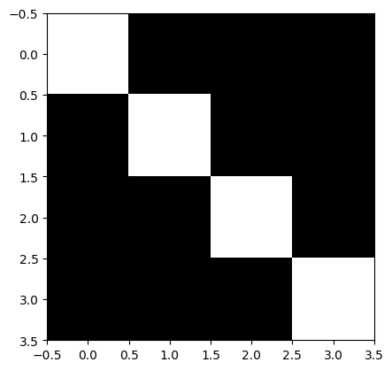

# 量子神经网络（QNN）

本教程旨在介绍如何使用 QuICT 中内置的 FRQI 量子图像编码方式和量子神经网络模块构建一个用于分类 MNIST 手写数据集的量子神经网络（Quantum Neural Network, QNN）。

## 导入运行库

首先，导入必要的运行库及相关依赖：

``` python
import collections
import yaml
import time
import tqdm
import matplotlib.pyplot as plt
from torchvision import datasets, transforms

from QuICT.algorithm.quantum_machine_learning.ansatz_library import BasicQNN
from QuICT.algorithm.quantum_machine_learning.encoding import FRQI
from QuICT.algorithm.quantum_machine_learning.model.QNN import QuantumNet
from QuICT.algorithm.quantum_machine_learning.optimizer.optimizer import Adam
from QuICT.algorithm.quantum_machine_learning.utils.data import Dataset, DataLoader
from QuICT.algorithm.quantum_machine_learning.utils.loss import MSELoss
from QuICT.algorithm.quantum_machine_learning.utils.ml_utils import *
```

## 加载和预处理 MNIST 数据

在本教程中，我们将对数字3和6进行分类，并使用 FRQI [<sup>[2]</sup>](#refer2) 编码方式对将灰度图像编码为量子电路。对MNIST数据集的预处理主要目的是
使图片能够在尽量保留较多信息的情况下成功被编码为量子电路。

### 1. 加载原始 MNIST 数据

Pytorch 的 torchvision 库中的 datasets 能够自动下载 MNIST 手写数据集：

``` python
train_data = datasets.MNIST(root="./data/", train=True, download=True)
test_data = datasets.MNIST(root="./data/", train=False, download=True)
train_X = train_data.data
train_Y = train_data.targets
test_X = test_data.data
test_Y = test_data.targets
print("Training examples: ", len(train_Y))
print("Testing examples: ", len(test_Y))
```

```
Training examples:  60000
Testing examples:  10000
```

### 2. 筛选数据集使其仅包含数字3和6

为了实现对数字3和6的二分类，我们需要删除其他数字，只保留标签为3和6的数据。并且定义标签 `y = 6` 为正类， `y = 3` 为负类：

``` python
def filter_targets(X, Y, class0=3, class1=6):
    idx = (Y == class0) | (Y == class1)
    X, Y = (X[idx], Y[idx])
    Y = Y == class1
    return X, Y
```

``` python
train_X, train_Y = filter_targets(train_X, train_Y)
test_X, test_Y = filter_targets(test_X, test_Y)
print("Filtered training examples: ", len(train_Y))
print("Filtered testing examples: ", len(test_Y))
```

```
Filtered training examples:  12049
Filtered testing examples:  1968
```

随机选择一个数据并显示：

``` python
print("Label: ", train_Y[200])
plt.imshow(train_X[200], cmap="gray")
```

```
Label:  tensor(False)
```

<figure markdown>
{:width="400px"}
</figure>

### 3. 缩小图像

原始的 MNIST 数据集图片尺寸是28x28，而 FRQI 编码只适用于分辨率为 $2^n \times 2^n$ 的图像，因此需要将其缩小到16x16：

``` python
def downscale(X, resize):
    transform = transforms.Resize(size=resize)
    X = transform(X) / 255.0
    return X
```

``` python
RESIZE = (16, 16)
resized_train_X = downscale(train_X, RESIZE)
resized_test_X = downscale(test_X, RESIZE)
```

同样地，显示序号为200的图像：

``` python
plt.imshow(resized_train_X[200], cmap="gray")
```

<figure markdown>
{:width="400px"}
</figure>


### 4. 去除冲突数据

在经过向下采样后，可能会产生部分重复图片，并且这些重复图片可能会同时被标记为正类和负类。为了避免这对分类结果造成影响，需要去除同一图片被同时标记为3和6的样本：

``` python
def remove_conflict(X, Y, resize):
    x_dict = collections.defaultdict(set)
    for x, y in zip(X, Y):
        x_dict[tuple(x.numpy().flatten())].add(y.item())
    X_rmcon = []
    Y_rmcon = []
    for x in x_dict.keys():
        if len(x_dict[x]) == 1:
            X_rmcon.append(np.array(x).reshape(resize))
            Y_rmcon.append(list(x_dict[x])[0])
    X = np.array(X_rmcon)
    Y = np.array(Y_rmcon)
    return X, Y
```

``` python
train_X, train_Y = remove_conflict(resized_train_X, train_Y, RESIZE)
test_X, test_Y = remove_conflict(resized_test_X, test_Y, RESIZE)
print("Remaining training examples: ", len(train_Y))
print("Remaining testing examples: ", len(test_Y))
```

```
Filtered training examples:  12049
Filtered testing examples:  1968
```

## 将图像数据编码为量子电路

本教程将使用 FRQI 编码（Flexible Representation of Quantum Images）将图片数据转换为量子电路。

每个像素对应一个量子比特，像素值为0对应量子态 $\left | 0 \right \rangle$ ，像素值为1对应量子态 $\left | 1 \right \rangle$ 。为了达成这一目的，值为1的像素所对应的量子比特上会被施加一个 X 门使量子态由 $\left | 0 \right \rangle$ 转为 $\left | 1 \right \rangle$ 。

QuICT 的 `encoding`库内置了 FRQI 编码方式，以这样一张 4x4 的图片为例:

``` python
img = np.array([[1, 0, 0, 0], [0, 1, 0, 0], [0, 0, 1, 0], [0, 0, 0, 1]])
plt.imshow(img, cmap="gray")
```

<figure markdown>
{:width="400px"}
</figure>

``` python
frqi = FRQI(grayscale=2)
cir = frqi(img)
cir.gate_decomposition(decomposition=False)
cir.draw()
```

<figure markdown>
{:width="600px"}
</figure>

此处，我们可以批量化的将图像进行编码：

``` python
def encoding_img(X, encoding):
    data_circuits = []
    for i in tqdm.tqdm(range(len(X))):
        data_circuit = encoding(X[i])
        data_circuits.append(data_circuit)
    return data_circuits
```

``` python
frqi = FRQI(grayscale=256)
train_X = encoding_img(train_X, frqi)
test_X = encoding_img(test_X, frqi)
```

```
100%|██████████| 12049/12049 [00:13<00:00, 909.78it/s] 
100%|██████████| 1968/1968 [00:02<00:00, 788.43it/s]
```

## 量子神经网络

本教程根据 Farhi et al.[<sup>[1]</sup>](#refer1) 使用的方法进行简化构建模型量子电路，主要用始终作用于读出量子比特的双比特门进行电路构建。

### 1. 构建模型电路

模型电路除了数据量子比特之外，还额外有一个读出量子比特，用于存储预测的分类结果，根据 Measure 门的测量结果是 $\left | 1 \right \rangle$ 和 $\left | 0 \right \rangle$ 判定输入图片属于正类还是负类。 Farhi et al.[<sup>[1]</sup>](#refer1) 使用的模型量子电路，是用双比特门（通常是 RXX，RYY，RZZ 和 RZX 门）始终作用在读出量子比特，和全部数据量子比特上构建的。 QuICT 内置了这样的 QNN 模型电路，我们规定前9个量子比特是数据量子比特，最后一个量子比特是读出量子比特比特：

以含4个数据量子比特的情况为例，单层 RXX 的 QNN 模型电路应为：

``` python
basic_qnn = BasicQNN(5, ["ZZ", "ZX"])
basic_qnn_cir = basic_qnn.init_circuit()
basic_qnn_cir.draw()
```

<figure markdown>
{:width="400px"}
</figure>

本教程中将使用两层网络，分别是 RXX 层和 RZZ 层，可训练参数的数量即为数字比特数 * 网络层数：

``` python
n_qubits = int(np.log2(RESIZE[0] * RESIZE[1])) + 2
ansatz = BasicQNN(n_qubits, ["YY", "ZZ", "ZX"])
```

接下来只需要将数据电路与模型电路连接即可开始训练。

### 2. 用 QuICT 内置的 QuantumNet 进行训练

以上对图片进行编码和构建模型电路的过程可以认为是构建 QNN 模型， QuICT 的 QuantumNet 集成了这些步骤，只需定义网络之后按照经典神经网络的训练过程进行训练即可。

首先，设置机器学习相关参数：

``` python
EPOCH = 10       # 训练总轮数
BATCH_SIZE = 32  # 一次迭代使用的样本数
LR = 0.001       # 梯度下降的学习率
SEED = 0         # 随机数种子0
ep_start = 0
it_start = 0
set_seed(SEED)
```

然后将预处理后的 MNIST 图像数据集装入 DataLoader ：

``` python
train_dataset = Dataset(train_X, train_Y)
test_dataset = Dataset(test_X, test_Y)
train_loader = DataLoader(
    dataset=train_dataset, batch_size=BATCH_SIZE, shuffle=True, drop_last=True
)
test_loader = DataLoader(
    dataset=test_dataset, batch_size=BATCH_SIZE, shuffle=True, drop_last=True
)
```

定义待训练的 QNN 网络，损失函数和经典优化器：

``` python
loss_fun = MSELoss()
optimizer = Adam(lr=LR)
net = QuantumNet(
    n_qubits=n_qubits,
    ansatz=ansatz,
    optimizer=optimizer,
    device="CPU",
)
```

开始训练：

``` python
for ep in range(EPOCH):
    # Train
    loader = tqdm.tqdm(
        train_loader, desc="Training epoch {}".format(ep + 1), leave=True
    )
    for it, (x_train, y_train) in enumerate(loader):
        if it < it_start:
            continue
        it_start = 0
        expectations = net.forward(x_train)  # (32, 1)
        y_true = (2 * y_train - 1.0).reshape(expectations.shape)
        y_pred = -expectations
        loss = loss_fun(y_pred, y_true)
        # optimize
        net.backward(loss)
        # update
        net.update()

        correct = np.where(y_true * y_pred.pargs > 0)[0].shape[0]
        accuracy = correct / len(y_train)
        loader.set_postfix(
            it=it, loss="{:.3f}".format(loss.item), accuracy="{:.3f}".format(accuracy)
        )
    
    # Validation
    loader_val = tqdm.tqdm(
        test_loader, desc="Validating epoch {}".format(ep + 1), leave=True
    )
    loss_val_list = []
    total_correct = 0
    for it, (x_test, y_test) in enumerate(loader_val):
        expectations_val = net.forward(x_test, train=False)
        y_true_val = (2 * y_test - 1.0).reshape(expectations_val.shape)
        y_pred_val = -expectations_val

        loss_val = loss_fun(y_pred_val, y_true_val)
        loss_val_list.append(loss_val.item)
        correct_val = np.where(y_true_val * y_pred_val.pargs > 0)[0].shape[0]

        total_correct += correct_val
        accuracy_val = correct_val / len(y_test)
        loader_val.set_postfix(
            it=it,
            loss="{:.3f}".format(loss_val.item),
            accuracy="{:.3f}".format(accuracy_val),
        )
    avg_loss = np.mean(loss_val_list)
    avg_acc = total_correct / (len(loader_val) * BATCH_SIZE)
    print("Validation Average Loss: {}, Accuracy: {}".format(avg_loss, avg_acc))
```

```
Training epoch 1: 100%|██████████| 376/376 [02:41<00:00,  2.32it/s, accuracy=0.906, it=375, loss=0.935]
Validating epoch 1: 100%|██████████| 61/61 [00:18<00:00,  3.34it/s, accuracy=0.938, it=60, loss=0.938]
Validation Average Loss: 0.9394127107271177, Accuracy: 0.8837090163934426
Training epoch 2: 100%|██████████| 376/376 [02:41<00:00,  2.32it/s, accuracy=0.844, it=375, loss=0.934]
Validating epoch 2: 100%|██████████| 61/61 [00:18<00:00,  3.35it/s, accuracy=0.844, it=60, loss=0.907]
Validation Average Loss: 0.9182945990390312, Accuracy: 0.9118852459016393
Training epoch 3: 100%|██████████| 376/376 [02:42<00:00,  2.32it/s, accuracy=0.906, it=375, loss=0.883]
Validating epoch 3: 100%|██████████| 61/61 [00:18<00:00,  3.35it/s, accuracy=0.938, it=60, loss=0.874]
Validation Average Loss: 0.8638879795421284, Accuracy: 0.9252049180327869
Training epoch 4: 100%|██████████| 376/376 [02:41<00:00,  2.32it/s, accuracy=0.969, it=375, loss=0.823]
Validating epoch 4: 100%|██████████| 61/61 [00:18<00:00,  3.33it/s, accuracy=0.906, it=60, loss=0.804]
Validation Average Loss: 0.7808000876160641, Accuracy: 0.9646516393442623
Training epoch 5: 100%|██████████| 376/376 [02:41<00:00,  2.32it/s, accuracy=0.938, it=375, loss=0.760]
Validating epoch 5: 100%|██████████| 61/61 [00:18<00:00,  3.35it/s, accuracy=0.969, it=60, loss=0.755]
Validation Average Loss: 0.7496410566096504, Accuracy: 0.9605532786885246
Training epoch 6: 100%|██████████| 376/376 [02:42<00:00,  2.32it/s, accuracy=0.938, it=375, loss=0.728]
Validating epoch 6: 100%|██████████| 61/61 [00:18<00:00,  3.37it/s, accuracy=0.906, it=60, loss=0.742]
Validation Average Loss: 0.7384923100156554, Accuracy: 0.9600409836065574
Training epoch 7: 100%|██████████| 376/376 [02:41<00:00,  2.32it/s, accuracy=1.000, it=375, loss=0.716]
Validating epoch 7: 100%|██████████| 61/61 [00:18<00:00,  3.35it/s, accuracy=0.938, it=60, loss=0.740]
Validation Average Loss: 0.7300563092932201, Accuracy: 0.9646516393442623
Training epoch 8: 100%|██████████| 376/376 [02:42<00:00,  2.31it/s, accuracy=1.000, it=375, loss=0.716]
Validating epoch 8: 100%|██████████| 61/61 [00:18<00:00,  3.36it/s, accuracy=1.000, it=60, loss=0.688]
Validation Average Loss: 0.724440254241452, Accuracy: 0.9697745901639344
Training epoch 9: 100%|██████████| 376/376 [02:43<00:00,  2.31it/s, accuracy=1.000, it=375, loss=0.713]
Validating epoch 9: 100%|██████████| 61/61 [00:18<00:00,  3.36it/s, accuracy=1.000, it=60, loss=0.732]
Validation Average Loss: 0.7224605226930816, Accuracy: 0.9707991803278688
Training epoch 10: 100%|██████████| 376/376 [02:42<00:00,  2.32it/s, accuracy=1.000, it=375, loss=0.703]
Validating epoch 10: 100%|██████████| 61/61 [00:17<00:00,  3.42it/s, accuracy=0.969, it=60, loss=0.722]
Validation Average Loss: 0.7216466591301091, Accuracy: 0.9702868852459017
```

### 3. 用 QuICT 提供的模型进行测试

QuICT 提供了一个已经训练好的模型，并内置了保存和加载模型的函数，可以用来测试 QNN 分类效果。

``` python
# Restore checkpoint
model_path = "QuICT/algorithm/quantum_machine_learning/trained_models/QNN_MNIST.ckpt"
restore_checkpoint(net, optim, model_path, device, resume=True)
net.eval()
loader = tqdm.tqdm(test_loader, desc="Testing", leave=True)
total_correct = 0

# Start testing
for it, (x_test, y_test) in enumerate(loader):
    y_pred = net(x_test)
    loss, correct = loss_func(y_test, y_pred)
    total_correct += correct
    loader.set_postfix(
        it=it,
        loss="{:.3f}".format(loss),
        correct="{0}".format(bool(correct)),
    )
qnn_avg_acc = total_correct / (len(loader) * BATCH_SIZE)
print("Testing Average Accuracy: {}".format(qnn_avg_acc))
```

```
Testing: 100%|██████████| 56/56 [05:39<00:00,  6.07s/it, correct=True, it=55, loss=0.310]
Testing Average Accuracy: 0.8364955357142857
```

## 与经典卷积神经网络对比

接下来我们将构建经典 CNN ，并在相同的条件下（相同的预处理数据，优化器和损失函数）进行对比测试。

首先，针对4x4图片构建经典 CNN ：

``` python
class ClassicalNet(nn.Module):
    def __init__(self):
        super(ClassicalNet, self).__init__()
        self.fc1 = torch.nn.Sequential(torch.nn.Linear(16, 4), torch.nn.ReLU())
        self.fc2 = torch.nn.Linear(4, 1)

    def forward(self, x):
        x = x.type(torch.float)
        x = x.view(32, -1)
        x = self.fc1(x)
        x = self.fc2(x)
        x = x.flatten()
        return x
```

对于 CNN 来说任务简单，网络参数较少，为了避免过拟合，训练轮数将缩减为1：

``` python
EPOCH = 1
classical_net = ClassicalNet().to(device)
classical_optim = torch.optim.Adam([dict(params=classical_net.parameters(), lr=LR)])
```

``` python
# train epoch
for ep in range(EPOCH):
    classical_net.train()
    loader = tqdm.tqdm(
        train_loader, desc="Training epoch {}".format(ep + 1), leave=True
    )
    # train iteration
    for it, (x_train, y_train) in enumerate(loader):
        correct = 0
        classical_optim.zero_grad()
        y_pred = classical_net(x_train)
        y_train = 2 * y_train - 1.0
        loss, correct = loss_func(y_train, y_pred)
        accuracy = correct / len(y_train)
        loss.backward()
        classical_optim.step()
        loader.set_postfix(
            it=it,
            loss="{:.3f}".format(loss),
            accuracy="{:.3f}".format(accuracy),
        )

    # Validation
    classical_net.eval()
    loader_val = tqdm.tqdm(
        test_loader, desc="Validating epoch {}".format(ep + 1), leave=True
    )
    loss_val_list = []
    total_correct = 0
    for it, (x_test, y_test) in enumerate(loader_val):
        correct = 0
        y_pred = classical_net(x_train)
        y_test = 2 * y_train - 1.0
        loss_val, correct = loss_func(y_train, y_pred)
        loss_val_list.append(loss_val.cpu().detach().numpy())
        total_correct += correct
        accuracy_val = correct / len(y_test)
        loader_val.set_postfix(
            it=it,
            loss="{:.3f}".format(loss_val),
            accuracy="{:.3f}".format(accuracy_val),
        )
    avg_loss = np.mean(loss_val_list)
    classical_avg_acc = total_correct / (len(loader_val) * BATCH_SIZE)
    print("Validation Average Loss: {}, Accuracy: {}".format(avg_loss, classical_avg_acc))
```

```
Training epoch 1: 100%|██████████| 323/323 [00:00<00:00, 675.06it/s, accuracy=0.938, it=322, loss=0.217]
Validating epoch 1: 100%|██████████| 56/56 [00:00<00:00, 1245.82it/s, accuracy=0.938, it=55, loss=0.216]
Validation Average Loss: 0.21558025479316711, Accuracy: 0.9375
```

QNN 与 CNN 对 MNIST 手写数据集数字3和6分类的准确率对比：

``` python
ax = sns.barplot(x=["QNN", "CNN"], y=[qnn_avg_acc, classical_avg_acc])
ax.set_yticks(ticks=[0, 0.2, 0.4, 0.6, 0.8, 1.0])
```

<figure markdown>
{:width="500px"}
</figure>

---

## 参考文献

<div id="refer1"></div>
<font size=3>
[1] Edward F, Hartmut N. Classification with Quantum Neural Networks on Near Term Processors. [arXiv:1802.06002 (2018)](https://arxiv.org/abs/1802.06002)
</font>

---
