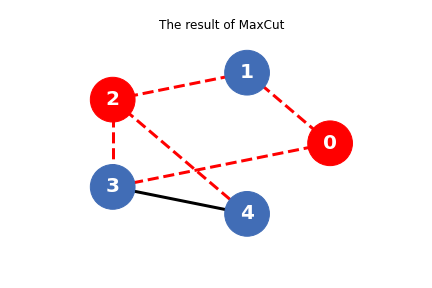

# 量子近似优化算法（QAOA）

本教程旨在介绍如何使用经典机器学习库Pytorch和QuICT中内置的量子近似优化算法模块（Quantum Approximate Optimization Algorithm, QAOA）进行通用的组合优化问题的求解，并以最大割问题（Max-Cut Problem）为例具体阐述QAOA。

## 组合优化问题

## 编码组合优化问题

## QuICT实现QAOA求解最大割问题

### 1. 创建最大割问题的图

首先，导入运行库：

```python
import torch
import tqdm

from QuICT.algorithm.quantum_machine_learning.utils import Hamiltonian
from QuICT.algorithm.quantum_machine_learning.utils.ml_utils import *
from QuICT.algorithm.quantum_machine_learning.model.VQA import QAOANet
from QuICT.algorithm.tools.drawer.graph_drawer import *
from QuICT.simulation.state_vector import ConstantStateVectorSimulator
```

接下来，生成最大割问题的图 $G$ ，其中 $n$ 为图 $G$ 的顶点数：

```python
n = 5
nodes = list(range(n))
edges = [[0, 1], [1, 2], [2, 3], [3, 4], [0, 3], [2, 4]]
# 内置的画图函数可以打印生成的图G
draw_graph(nodes, edges)
```

<figure markdown>
{:width="500px"}
</figure>

### 2. 根据图编码哈密顿量

为了将最大割问题转化为量子问题，应使 $G$ 的 $n$ 个顶点分别一一对应到 $n$ 个量子比特，一个量子比特处于 $\left | 0 \right \rangle$ 或 $\left | 1 \right \rangle$ 态分别代表其对应顶点属于不同的集合 $S_0$ 和 $S_1$ 。对于图 $G$ 中的任意一条边 $(u, v)$ ，当 $u$ 和 $v$ 分别属于不同集合时，意味着这条边被割开。

而量子态 $\left | 0 \right \rangle$ 和 $\left | 1 \right \rangle$ 是泡利 $Z$ 门的两个本征态，对应的本征值分别为 $1$ 和 $-1$ 。因此最大割问题的哈密顿量 $H$ 可以通过泡利 $Z$ 门构建：

```python
def maxcut_hamiltonian(edges):
    pauli_list = []
    for edge in edges:
        pauli_list.append([-1.0, "Z" + str(edge[0]), "Z" + str(edge[1])])
    hamiltonian = Hamiltonian(pauli_list)

    return hamiltonian

H = maxcut_hamiltonian(edges)
```

QuICT中的哈密顿量以`list`形式的泡利字符串作为输入，并构建哈密顿类，同时，也可以查看哈密顿类的泡利字符串：

```python
H.pauli_str
```

```
[[-1.0, 'Z0', 'Z1'],
 [-1.0, 'Z1', 'Z2'],
 [-1.0, 'Z2', 'Z3'],
 [-1.0, 'Z3', 'Z4'],
 [-1.0, 'Z0', 'Z3'],
 [-1.0, 'Z2', 'Z4']]
```

### 3. 构建含参的QAOA电路

为了求解最大割问题，需要找到量子态 $\left | \psi \right \rangle$ ，使上一节中哈密顿量的期望 $\left \langle \psi \right | H \left | \psi \right \rangle$ 最大

在QuICT中，可以直接调用`QAOANet`根据哈密顿量初始化QAOA量子神经网络实例：

```python
qaoa_net_sample = QAOANet(n_qubits=n, p=1, hamiltonian=H)
```

`QAOANet`继承自`torch.nn.Module`，定义了待训练的参数；前向传播函数`forward()`，用于计算运行量子电路后得到的输出态 $\left | \psi \right \rangle$ ；以及损失函数`loss_func()`，用于计算负期望 $-\left \langle \psi \right | H \left | \psi \right \rangle$。

另外，可以通过`construct_circuit()`函数获取构建的QAOA电路：

```python
qaoa_cir_sample = qaoa_net_sample.construct_circuit()
qaoa_cir_sample.draw()
```

<figure markdown>

</figure>

### 4. 利用Pytorch的经典优化器进行训练

初始化训练相关的参数：

```python
p = 4           # 量子电路层数
MAX_ITERS = 150 # 最大迭代次数
LR = 0.1        # 梯度下降的学习率
SEED = 17       # 随机数种子

set_seed(SEED)  # 设置全局随机种子
```

初始化QAOA网络和经典优化器，并开始迭代训练：

```python
qaoa_net = QAOANet(n_qubits=n, p=p, hamiltonian=H)
optim = torch.optim.Adam([dict(params=qaoa_net.parameters(), lr=LR)])

# 开始训练
qaoa_net.train()
loader = tqdm.trange(MAX_ITERS, desc="Training", leave=True)
for it in loader:
    optim.zero_grad()
    state = qaoa_net()
    loss = qaoa_net.loss_func(state)
    loss.backward()
    optim.step()
    loader.set_postfix(loss=loss.item())
```

```
Training: 100%|██████████| 150/150 [00:53<00:00,  2.81it/s, loss=-3.74]
```

### 5. 利用输出的量子态解码最大割问题的解

通过量子测量对最终获得的量子态进行多次采样，并统计出现的比特串的概率分布：

```python
# 进行1000次模拟测量
shots = 1000
qaoa_ansatz = qaoa_net.construct_ansatz()
prob = qaoa_ansatz.sample(shots)

plt.figure()
plt.xlabel("Qubit States")
plt.ylabel("Probabilities")
plt.bar(range(len(prob)), np.array(prob) / shots)
plt.show()
```

<figure markdown>
{:width="500px"}
</figure>

测量中出现概率最高的比特串最有可能是此Max-Cut问题的最优解：

```python
solution = prob.index(max(prob))
solution_bit = ("{:0" + str(n) + "b}").format(solution)
solution_bit
```

```
'10100'
```

这个比特串中取值为 $0$ 的量子比特意味着其对应的顶点属于集合 $S_0$，取值为1的对应顶点属于集合 $S_1$。

最后，利用内置函数对属于不同集合的顶点分别涂色，并画出图 $G$ 的最大割结果图：

```python
draw_maxcut_result(nodes, edges, solution_bit)
```

<figure markdown>
{:width="500px"}
</figure>

---

## 参考文献

<div id="refer1"></div>
<font size=3>
[1] Farhi, E., Goldstone, J. & Gutmann, S. A Quantum Approximate Optimization Algorithm. [arXiv:1411.4028 (2014)](https://arxiv.org/abs/1411.4028)
</font>
---