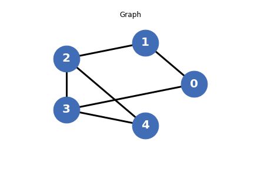
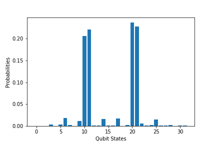

# 量子近似优化算法（QAOA）

!!! note

    本教程额外依赖 quict-ml 库

本教程旨在介绍如何使用经典机器学习库 Pytorch 和 QuICT 中内置的量子近似优化算法模块（Quantum Approximate Optimization Algorithm, QAOA）进行通用的组合优化问题的求解，并以最大割问题（Max-Cut Problem）为例具体阐述 QAOA 。

## 组合优化问题

组合优化问题是在有限个可行解的集合中找出最优解的一类优化问题。通常，一个组合优化问题可以用二元组 $(F, C)$ 表示，其中 $F$ 表示可行解的有限集， $F$ 中的任意元素 $f$ 都称为该组合优化问题的可行解， $C$ 表示目标函数，组合优化问题就是要找到一个取值 $f^*$ 使目标函数 $C$ 最大，即：

$$C(f^*)=max\left \{C(f)|f \in F\right \}$$

$f^*$ 即为该问题的最优解。

## 使用 QAOA 求解组合优化问题

实际应用中的大多数组合优化问题都是NP完全甚至NP困难问题，求解最优解非常困难，因此转而求解近似最优解是一种更高效的替代方案。 QAOA 就是一种用于求解组合优化问题近似最优解的多项式时间量子算法。

### 编码组合优化问题

为了在量子比特系统上求解组合优化问题，需要对其进行编码，为此，我们将换一种方式对组合优化问题进行描述：将目标函数 $C$ 拆分为 $m$ 个子句，每个子句都可以由 $n$ 个量子比特组成的量子比特串 $z$ 进行描述，即每个子句都是对部分量子比特的一个限制条件，对于第 $i$ 个子句 $C_i$ ：

$$
C_i(z)=
\begin{cases}
0, \quad if \quad z不满足 C_i 表示的条件
\\
1, \quad if \quad z满足 C_i 表示的条件
\end{cases}
$$

因此，组合优化问题的目标函数 $C$ 可以记为：

$$C(z)=\sum_{i=1}^{m} w_iC_i(z)$$

其中 $w_i$ 表示第 $i$ 个子句的权重。求解组合优化问题即找到一个 $z$ 的取值使目标函数 $C(z)$ 最大：

$$\mathop{\arg\max}\limits_{z}C(z)$$

这样能够更为简单地将上述问题编码到量子比特系统中，对于 $n$ 个量子比特系统，每个计算基态 $\left | z \right \rangle \in \left \{0, 1\right \}^n$ 都对应着上述 $z$ 的一种取值，对于第 $i$ 个子句 $C_i$ ，定义一个哈密顿量 $H_{C_i}$ ：

$$H_{C_i}=\sum_{z \in \left \{0, 1\right \}^n}^{} C_i|z⟩⟨z|$$

使其满足：

$$H_{C_i}|z⟩=C_i(z)|z⟩$$

由此，目标函数 $C$ 可以被编码为 $n$ 量子比特系统上的哈密顿量：

$$H_C=\sum_{i=1}^{m}w_iH_{C_i}$$

因此最优解 $|z_{opt}⟩$ 满足：

$$⟨z_{opt}|H_C|z_{opt}⟩=⟨z_{opt}|C_{opt}|z_{opt}⟩=C_{opt}$$

因此组合优化问题的最优解是哈密顿量 $H_C$ 的最大本征值对应的本征态，即找到一个量子态 $|\psi⟩$ 满足：

$$H_C|\psi⟩=C(z_{opt})|\psi⟩$$

也就是找到一个量子态 $|\psi⟩$ 使 $H_C$ 在 $|\psi⟩$ 上的期望最大，即对于任意量子态 $|z⟩$ 满足：

$$⟨z|H_C|z⟩ \le ⟨\psi|H_C|\psi⟩$$

### 寻找近似最优解

求解量子态 $|\psi⟩$ 需要引入另一个哈密顿量 $H_B$ ：

$$H_B=\sum_{i=1}^{n}X_i$$

由于泡利 $X$ 门的两个本征态分别是 $|+⟩$ 和 $|-⟩$ ，对应的本征值分别是 $1$ 和 $-1$ ，因此 $H_B$ 的最大本征态 $|s⟩$ 为：

$$|s⟩=|+⟩^{\otimes n}$$

QAOA 使用 $|s⟩$ 作为算法的初态。之后根据哈密顿量 $H_B$ 和 $H_C$ 定义酉变换：

$$U_B(\beta)=e^{-i\beta H_B}$$

$$U_C(\gamma)=e^{-i\gamma H_C}$$

其中 $\beta$ 和 $\gamma$ 为可训练的实参数。在初态 $|s⟩$ 上交替地作用酉变换 $U_C$ 和 $U_B$ $p$ 次，即可获得量子态 $|\overrightarrow{\gamma}, \overrightarrow{\beta}⟩$ ：

$$|\overrightarrow{\gamma}, \overrightarrow{\beta}⟩=U_B(\beta _p)U_C(\gamma _p) \cdots U_B(\beta _1)U_C(\gamma _1) |s⟩$$

哈密顿量 $H_C$ 在量子态 $|\overrightarrow{\gamma}, \overrightarrow{\beta}⟩$ 上的期望值 $E_p$ 为：

$$E_p(\overrightarrow{\gamma}, \overrightarrow{\beta})=⟨\overrightarrow{\gamma}, \overrightarrow{\beta}|H_C|\overrightarrow{\gamma}, \overrightarrow{\beta}⟩$$

根据上一节中的结论，调整可训练参数 $\beta$ 和 $\gamma$ 以最大化期望值 $E_P$ 即可获得层数 $p$ 下的近似最优解 $M_p$ ：

$$M_p=\mathop{\arg\max}\limits_{\overrightarrow{\gamma}, \overrightarrow{\beta}} E_p(\overrightarrow{\gamma}, \overrightarrow{\beta})$$

事实上，只要层数 $p$ 足够大，近似最优解 $M_p$ 可以无限逼近最优解：

$$\lim_{p \to \infty}M_p=C(z_{opt})$$

## QuICT 实现 QAOA 求解最大割问题

### 1. 创建最大割问题的图

首先，导入运行库：

```python
import torch
import tqdm

from QuICT_ml.utils import Hamiltonian
from QuICT_ml.utils.ml_utils import *
from QuICT_ml.model.VQA import QAOANet
from QuICT.algorithm.tools.drawer.graph_drawer import *
```

接下来，生成最大割问题的图 $G$ ，其中 $n$ 为图 $G$ 的顶点数：

```python
n = 5
nodes = list(range(n))
edges = [[0, 1], [1, 2], [2, 3], [3, 4], [0, 3], [2, 4]]
# 内置的画图函数可以打印生成的图G
draw_graph(nodes, edges)
```

<figure markdown>
{:width="500px"}
</figure>

### 2. 根据图编码哈密顿量

为了将最大割问题转化为量子问题，应使 $G$ 的 $n$ 个顶点分别一一对应到 $n$ 个量子比特，一个量子比特处于 $\left | 0 \right \rangle$ 或 $\left | 1 \right \rangle$ 态分别代表其对应顶点属于不同的集合 $S_0$ 和 $S_1$ 。对于图 $G$ 中的任意一条边 $(u, v)$ ，当 $u$ 和 $v$ 分别属于不同集合时，意味着这条边被割开。

而量子态 $\left | 0 \right \rangle$ 和 $\left | 1 \right \rangle$ 是泡利 $Z$ 门的两个本征态，对应的本征值分别为 $1$ 和 $-1$ 。因此最大割问题的哈密顿量 $H$ 可以通过泡利 $Z$ 门构建：

```python
def maxcut_hamiltonian(edges):
    pauli_list = []
    for edge in edges:
        pauli_list.append([-1.0, "Z" + str(edge[0]), "Z" + str(edge[1])])
    hamiltonian = Hamiltonian(pauli_list)

    return hamiltonian

H = maxcut_hamiltonian(edges)
```

QuICT中的哈密顿量以`list`形式的泡利字符串作为输入，并构建哈密顿类，同时，也可以查看哈密顿类的泡利字符串：

```python
H.pauli_str
```

```
[[-1.0, 'Z0', 'Z1'],
 [-1.0, 'Z1', 'Z2'],
 [-1.0, 'Z2', 'Z3'],
 [-1.0, 'Z3', 'Z4'],
 [-1.0, 'Z0', 'Z3'],
 [-1.0, 'Z2', 'Z4']]
```

### 3. 构建含参的 QAOA 电路

为了求解最大割问题，需要找到量子态 $\left | \psi \right \rangle$ ，使上一节中哈密顿量的期望 $\left \langle \psi \right | H \left | \psi \right \rangle$ 最大

在 QuICT 中，可以直接调用 `QAOANet` 根据哈密顿量初始化 QAOA 量子神经网络实例：

```python
qaoa_net_sample = QAOANet(n_qubits=n, p=1, hamiltonian=H)
```

`QAOANet` 继承自 `torch.nn.Module` ，定义了待训练的参数；前向传播函数 `forward()` ，用于计算运行量子电路后得到的输出态 $\left | \psi \right \rangle$ ；以及损失函数 `loss_func()` ，用于计算负期望 $-\left \langle \psi \right | H \left | \psi \right \rangle$ 。

另外，可以通过 `construct_circuit()` 函数获取构建的 QAOA 电路：

```python
qaoa_cir_sample = qaoa_net_sample.construct_circuit()
qaoa_cir_sample.draw()
```

<figure markdown>

</figure>

### 4. 利用 Pytorch 的经典优化器进行训练

初始化训练相关的参数：

```python
p = 4           # 量子电路层数
MAX_ITERS = 150 # 最大迭代次数
LR = 0.1        # 梯度下降的学习率
SEED = 17       # 随机数种子

set_seed(SEED)  # 设置全局随机种子
```

初始化 QAOA 网络和经典优化器，并开始迭代训练：

```python
qaoa_net = QAOANet(n_qubits=n, p=p, hamiltonian=H)
optim = torch.optim.Adam([dict(params=qaoa_net.parameters(), lr=LR)])

# 开始训练
qaoa_net.train()
loader = tqdm.trange(MAX_ITERS, desc="Training", leave=True)
for it in loader:
    optim.zero_grad()
    state = qaoa_net()
    loss = qaoa_net.loss_func(state)
    loss.backward()
    optim.step()
    loader.set_postfix(loss=loss.item())
```

```
Training: 100%|██████████| 150/150 [00:53<00:00,  2.81it/s, loss=-3.74]
```

### 5. 利用输出的量子态解码最大割问题的解

通过量子测量对最终获得的量子态进行多次采样，并统计出现的比特串的概率分布：

```python
# 进行1000次模拟测量
shots = 1000
qaoa_ansatz = qaoa_net.construct_ansatz()
prob = qaoa_ansatz.sample(shots)

plt.figure()
plt.xlabel("Qubit States")
plt.ylabel("Probabilities")
plt.bar(range(len(prob)), np.array(prob) / shots)
plt.show()
```

<figure markdown>
{:width="500px"}
</figure>

测量中出现概率最高的比特串最有可能是此 Max-Cut 问题的最优解：

```python
solution = prob.index(max(prob))
solution_bit = ("{:0" + str(n) + "b}").format(solution)
solution_bit
```

```
'10100'
```

这个比特串中取值为 $0$ 的量子比特意味着其对应的顶点属于集合 $S_0$，取值为1的对应顶点属于集合 $S_1$ 。

最后，利用内置函数对属于不同集合的顶点分别涂色，并画出图 $G$ 的最大割结果图：

```python
draw_maxcut_result(nodes, edges, solution_bit)
```

<figure markdown>
{:width="500px"}
</figure>

---

## 参考文献

<div id="refer1"></div>
<font size=3>
[1] Farhi, E., Goldstone, J. & Gutmann, S. A Quantum Approximate Optimization Algorithm. [arXiv:1411.4028 (2014)](https://arxiv.org/abs/1411.4028)
</font>
---