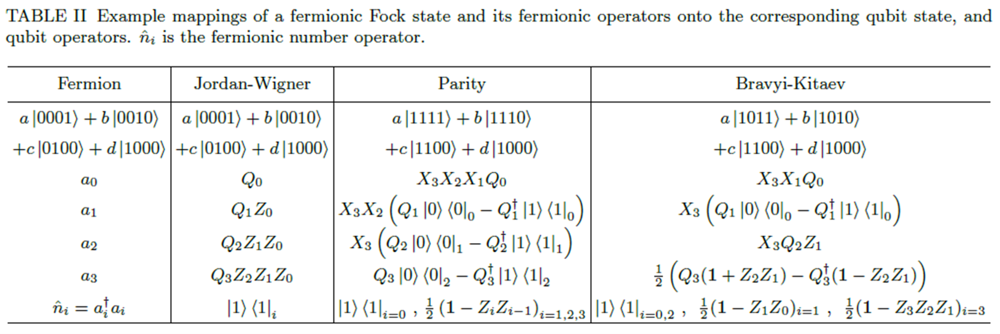
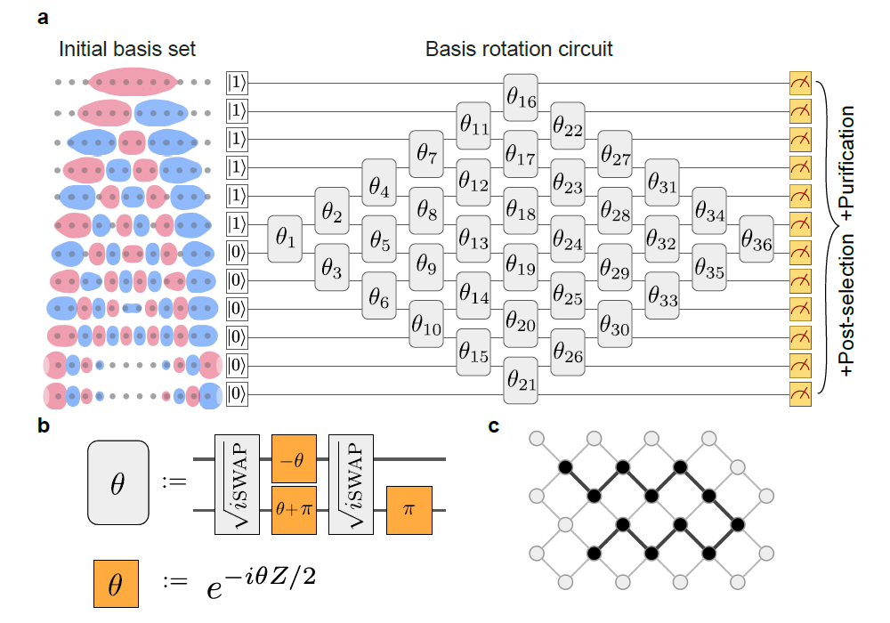

# 量子变分本征值求解器

!!! note

    本教程额外依赖 quict-ml 库

量子变分本征值求解器 (Variational Quantum Eigensolver, VQE) 是一个利用量子变分算法 (Variational Quantum Algorithm, VQA) 求解某一 Hermitian 矩阵最小本征值的方法。此方法常用于求解如指定分子基态能量等问题。由于这类问题本身基于量子力学提出，经典模拟较为困难，同样基于量子力学的量子模拟常被认为是一种有前景的量子优越性实现方案。

本教程旨在给出一个例子，利用经典机器学习库 Pytorch 和 QuICT 中内置的量子近似优化算法模块求解 $H_6$ 链分子的基态能量。

## 算法原理

此方法总体流程概述如下：

1. 通过经典方法获取分子在给定基下哈密顿量的二次量子化形式
2. 通过 Jordan-Wigner 等编码方法将哈密顿量转化为量子模拟所需的形式
3. 构建 Ansatz 电路并用 VQE 方法优化得到分子基态

### 哈密顿量的二次量子化形式与 FermionOperator

全同粒子的哈密顿量形式为

$$
H = \sum_{ij} h_{ij} a_i^\dagger a_j + \sum_{ijkl} V_{ijkl} a_i^\dagger a_j^\dagger a_k a_l
$$

其中 $h_{ij}, V_{ijkl}$ 是系数，需要通过数值积分等方法计算得到， $a_i^\dagger, a_i$ 是一系列产生湮灭算符，其满足反对易条件：

$$
\{a_i, a_j^\dagger\} = \delta_{ij}, 
\{a_i, a_j\} = \{a_i^\dagger, a_j^\dagger\} = 0
$$

在 QuICT 中，这种形式对应于 `FermionOperator` ，以下是一个使用案例：

``` python
import itertools as it

from QuICT_ml.model.VQE.operators.fermion_operator import FermionOperator

n_qubits = obi.shape[0]
fermion_operator = FermionOperator([], nuclear_repulsion)
for index in it.product(range(n_qubits), repeat=2):
    fermion_operator += FermionOperator(list(zip(index, (1, 0))), obi[index])
for index in it.product(range(n_qubits), repeat=4):
    fermion_operator += FermionOperator(list(zip(index, (1, 1, 0, 0))), tbi[index])
```

其中 `nuclear_repulsion` 表示哈密顿量中的常数项，在这里指原子核之间的排斥作用， `obi` 与 `tbi` 分别为哈密顿量中的系数 $h_{ij}, V_{ijkl}$ 。

### QubitOperator 与编码

`FermionOperator` 可以从物理数据直接获得，但同时也面临一个问题，即反对易关系在量子计算模拟的过程中无法直接体现，因此有必要通过某种编码方法将其转化为可以直接对应于模拟过程的形式。常用的编码方法有 Jordan-Wigner 、 parity 、 Bravyi-Kitaev 三种，下图给出了一些转化例子：

<figure markdown>
{:width="800px"}
<p markdown="1" style="font-size:12px;"> 图片引用自*Quantum computational chemistry* [<sup>[1]</sup>](#refer1)
</figure>

其中

$$
Q^\dagger = |1⟩⟨0| = \frac{1}{2} (X - iY) \\
Q = |0⟩⟨1| = \frac{1}{2} (X + iY)
$$

本教程采用比较直接的 Jordan-Wigner 编码，其规则如下：

$$
|f_{n-1} \cdots f_0⟩ = |q_{n-1} \cdots q_0⟩, f_i = q_i
$$

$$
a_i^\dagger = Q_i^\dagger \otimes Z_{i-1} \otimes \cdots \otimes Z_0
$$

$$
a_i = Q_i \otimes Z_{i-1} \otimes \cdots \otimes Z_0
$$

其中 $f_i$ 表示在费米子二次量子化表述中的占据 ($1$) 与否 ($0$)，而 $q_i$ 则对应表示qubit的 $1, 0$ 。显然在这样的转化下， `FermionOperator` 将被转化为 Pauli 算符线性组合的形式，即 `QubitOperator` 。由此获取 `QubitOperator` 并将其转化为优化过程所需 `Hamiltonian` 的代码示例如下：

``` python
from QuICT_ml.model.VQE.operators.encoder import JordanWigner
from QuICT_ml.utils import Hamiltonian

qubit_op = JordanWigner(orbitals).encode(fermi_op)
hamiltonian = Hamiltonian(qubit_op.to_hamiltonian())
```

其中 `fermi_op` 为 `FermionOperator` ， `orbitals` 为轨道数（对 Jordan-Wigner 变换这不是必需的，但另两种变换依赖于这一参数）， `qubit_op` 为 `QubitOperator` ，最终转化为 `Hamiltonian` 。

### Ansatz 构建与 VQE 方法

Ansatz (拟设电路) 是 VQE 方法中较为灵活的一个部分，其目的是令电路的终态可以充分遍历优化的目标空间，通过改变电路参数即可实现对目标函数的优化，从而得以求解最小特征值。容易看出，这样的电路及其初始参数的选择直接关系到求解的难度与效率，本教程按照 Google 的 Hartree-Fock VQE 实验的设置[<sup>[2]</sup>](#refer2)，选取 Thouless 提出的 ansatz[<sup>[3]</sup>](#refer3)[<sup>[4]</sup>](#refer4) 进行求解。

<figure markdown>
{:width="800px"}
<p markdown="1" style="font-size:12px;"> 图片引用自*Hartree-Fock on a superconducting qubit quantum computer.* [<sup>[2]</sup>](#refer2)
</figure>

Thouless ansatz 的结构如上图所示，随着目标分子不同，菱形电路的形状也会随之变化。通过调整 $\theta$ 参数 (如图中的 $\theta_1, \dots, \theta_{36}$ ) 即可利用经典优化器进行优化，从而求解得到基态能量。

## 代码实例

本教程所需数据请参见 QuICT-ml 的 /example/molecular_data 文件夹， /example/hartree_fock_demo.ipynb 给出了可以直接运行的代码样例，可供参考。

### 获取哈密顿量

请注意，这一部分代码基于本教程使用的数据格式，用户通常应当根据自己获取数据的方法与格式自行编写相关函数，获取分子哈密顿量的 FermionOperator 形式后，再行执行后续步骤。

``` python
import numpy as np
import scipy as sp

from molecular_data import MolecularData, obi_basis_rotation, tbi_basis_rotation, generate_hamiltonian
from QuICT_ml.model.VQE.operators.encoder import JordanWigner
from QuICT_ml.utils import Hamiltonian

# 读取数据
moldir = "./molecular_data"
molfile = moldir + "/H6_sto-3g_singlet_linear_r-1.3.hdf5"
moldata = MolecularData(molfile)

overlap = np.load(moldir + "/overlap.npy")
Hcore = np.load(moldir + "/h_core.npy")
two_electron_integral = np.einsum("psqr", np.load(moldir + "/tei.npy"))  # (1, 1, 0, 0)

_, X = sp.linalg.eigh(Hcore, overlap)
obi = obi_basis_rotation(Hcore, X)
tbi = tbi_basis_rotation(two_electron_integral, X)
molecular_hamiltonian = generate_hamiltonian(moldata.nuclear_repulsion, obi, tbi)

# 转化形式
fermi_op = molecular_hamiltonian.get_fermion_operator()
orbitals = 2 * moldata.n_orbitals
electrons = moldata.n_electrons
qubit_op = JordanWigner(orbitals).encode(fermi_op)
hamiltonian = Hamiltonian(qubit_op.to_hamiltonian())
```

这一部分最终获得的 `fermi_op` 即 $H_6$ 分子哈密顿量的 FermionOperator 形式， `qubit_op` 为对应的 QubitOperator 形式， `hamiltonian` 则是优化模块所需的哈密顿量。

### 计算基态能量

设定优化相关参数之后即可开始进行基态能量计算

``` python
MAX_ITERS = 1000
LR = 0.1
```

初始化网络、经典优化器以及学习率更新

``` python
import torch

from QuICT_ml.model.VQE import HartreeFockVQENet

hfvqe_net = HartreeFockVQENet(orbitals, electrons, hamiltonian)
optim = torch.optim.Adam([dict(params=hfvqe_net.parameters(), lr=LR)])
scheduler = torch.optim.lr_scheduler.StepLR(optim, step_size=500, gamma=0.1)
```

开始进行训练

``` python
import tqdm

hfvqe_net.train()
loader = tqdm.trange(MAX_ITERS, desc="Training", leave=True)
for it in loader:
    optim.zero_grad()
    state = hfvqe_net()
    loss = hfvqe_net.loss_func(state)
    loss.backward()
    optim.step()
    scheduler.step()
    loader.set_postfix(loss=loss.item())
```

所得 `loss` 数值即所求基态能量。

---

## 参考文献

<div id="refer1"></div>
<font size=3>
[1] McArdle, S., Endo, S., Aspuru-Guzik, A., Benjamin, S.C., & Yuan, X. (2018). Quantum computational chemistry. Reviews of Modern Physics. [https://arxiv.org/abs/1808.10402](https://arxiv.org/abs/1808.10402)
</font>

<div id="refer2"></div>
<font size=3>
[2] Arute, Frank et al. Hartree-Fock on a superconducting qubit quantum computer. Science 369 (2020): 1084 - 1089. [https://arxiv.org/abs/2004.04174](https://arxiv.org/abs/2004.04174)
</font>

<div id="refer3"></div>
<font size=3>
[3] Thouless, D.J. (1960). Stability conditions and nuclear rotations in the Hartree-Fock theory. Nuclear Physics, 21, 225-232. [https://www.sciencedirect.com/science/article/abs/pii/0029558260900481](https://www.sciencedirect.com/science/article/abs/pii/0029558260900481)
</font>

<div id="refer4"></div>
<font size=3>
[4] Kivlichan, I.D., McClean, J.R., Wiebe, N., Gidney, C., Aspuru-Guzik, A., Chan, G.K., & Babbush, R. (2017). Quantum Simulation of Electronic Structure with Linear Depth and Connectivity. Physical review letters, 120 11, 110501 . [https://arxiv.org/abs/1711.04789](https://arxiv.org/abs/1711.04789)
</font>

---