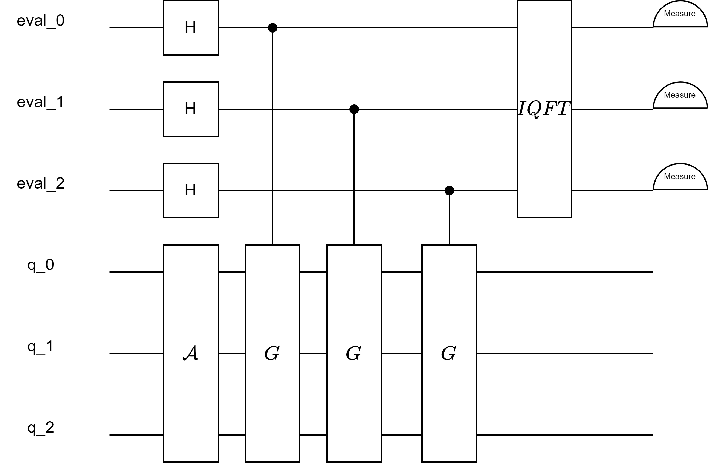
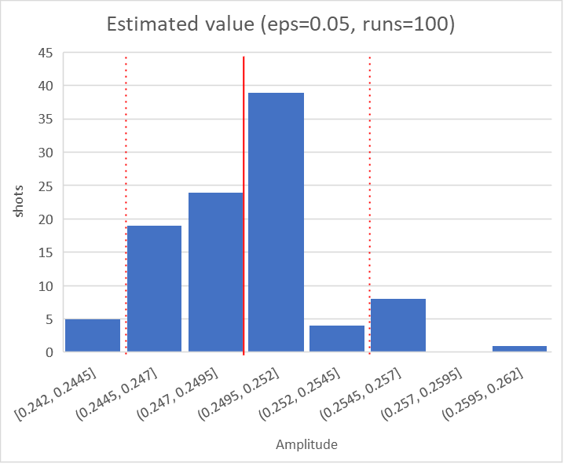

# 量子振幅估计算法

量子振幅估计算法（Quantum Amplitude Estimation, QAE）用于计算一个量子态在目标空间上的振幅，常作为其他算法的组件，例如用于量子蒙特卡洛方法[<sup>[4]</sup>](#refer4)中。本教程旨在介绍如何使用QuICT中的QAE模块，并结合代码实例进一步阐述此算法。

## 算法原理 

!!! Failure "改"
    不要完全照抄qiskit，多少改改句子表达方式，或者抄书

QAE算法的输入是期望精度 $\epsilon$ ，oracle电路 $S_\chi$（与Grover算法中的输入相同），以及状态制备电路 $\mathcal{A}$ ；以高概率输出振幅估计 $\tilde a$，满足：

$$|a-\tilde a|<\epsilon$$

给出一个算子 $\mathcal{A}$ 作为归一化的解空间向量，满足：

$$\mathcal{A}|0\rangle = \sqrt{1 - a}|\Psi_0\rangle + \sqrt{a}|\Psi_1\rangle$$

量子振幅估计（QAE）的目标是为 $\mathcal{A} | 0\rangle$ 在状态 $|\Psi_1\rangle$ 张成的空间上的振幅 $a$ 寻找一个估计：

$$a = |\langle\Psi_1 | \mathcal{A} | 0\rangle|^2。$$

Brassard等人[<sup>[1]</sup>](#refer1)在2000年首次研究了这项任务，他们的算法使用了两个技术：

- 一是振幅放大，使用了Grover算子的组合：

    $$\mathcal{Q} = \mathcal{A}\mathcal{S}_0\mathcal{A}^\dagger\mathcal{S}_{\chi}$$

    其中：

    $$\mathcal{S}_0=I-2|0⟩⟨0|0⟩, \quad \mathcal{S}_{\chi}=I-2|\Psi_1⟩⟨\Psi_1|\Psi_1⟩$$

    分别是关于 $|0\rangle$ 和 $|\Psi_1\rangle$ 状态的反映。

- 二是相位估计，观察到 $\mathcal{Q}$ 的两个本征值是 $e^{-i2\arcsin {\sqrt{a}}}$ ，从其相位的估计就直接得到了振幅的估计。然而该算法需要带有受控位的Grover算子电路，计算成本很高。因此，人们提出了QAE的其他变体。参考Qiskit中的设置，接下来的教程中以一个简单的例子来展示这些变体。

在我们的例子中，

$$\mathcal{A}=H^{\otimes n}, \quad S_\chi=CZ \otimes I_{n-2}$$

对应的概率是随机选取长度为 $n$ 的比特串而开始两位均为$1$的概率。$S_0$ 的核心是多控Toffoli门。

!!! Failure "改"
    这段是在干什么？代码部分往后放


    QuICT内置了若干实现。由此我们可以构造出Grover算子。此时想要估计的概率固定为 $p = 0.25$ 。现在我们可以为 $\mathcal{A}$ 和 $\mathcal{Q}$ 定义电路。

    ``` python
    def example_oracle(n):
        def S_chi(n, controlled=False):
            # phase-flip on target
            cgate = CompositeGate()
            if controlled: # controlled version is for canonical QAE
                H | cgate(2)
                CCX | cgate([0, 1, 2])
                H | cgate(2)
            else:
                CZ | cgate([0, 1])
            return cgate

        def is_good_state(state_string):
            return state_string[:2] == "11"

        return OracleInfo(n=n, n_ancilla=0, S_chi=S_chi, is_good_state=is_good_state)

    ```

## 三种QAE算法

QuICT中实现了三种振幅估计问题的算法：Canonical QAE[<sup>[1]</sup>](#refer1)、MLAE[<sup>[2]</sup>](#refer2)、FQAE[<sup>[3]</sup>](#refer3)。查询复杂度上第一个算法最优；而电路宽度上第二个算法最优；第三个算法在电路宽度与第二个算法基本一致（常数差距）的同时有更小的查询复杂度，而且在实际应用中表现较好。

!!! failure "改"
    在这里放三种算法的相关对比表（我记得有过）

### Canonical QAE

!!! failure "改"
    简介Canonical QAE特点

canonical QAE的电路图如下：

!!! failure "改"
    图哪来的？加引用

<figure markdown>
{:width="500px"}
</figure>

### MLAE

Maximum Likelihood Amplitude Estimation

!!! failure "改"
    简介MLAE特点

!!! failure "改"
    把下面这段拆成两部分作为两种算法的简介

    MLAE与FQAE的原理稍有不同：两者不使用相位估计。前者使用最大似然估计，后者通过迭代缩小致信域，来给出振幅估计。其算法的量子部分均为一层状态制备电路加上若干Grover算子。

MLAE的实验结果如图：

!!! failure "改"
    这实验结果哪来的？代码跑出来的就做成demo放代码实例部分；不是的话放这里又没有任何说明，是否有保留的必要？

<figure markdown>
{:width="500px"}
</figure>

### FQAE

Faster Amplitude Estimation

!!! failure "改"
    简介FQAE特点

## 代码实例

QuICT中实现了以上三种QAE算法，用户可通过指定初始化参数`mode`来选择。`run`将执行所有的流程，输入包含在`OracleInfo`和`StatePreparationInfo`对象中，返回的输出值即为振幅的估计值。由于所有的QAE变体都遵循相同的接口，我们可以用它们来解决同一个问题实例。

接下来，我们将运行所有不同的QAE算法。

!!! failure "改"
    三种算法针对同一问题的运行结果有没有区别？没区别放一个就行，有区别放个对比
    结果不要放成功率，能不能放类似这种图？能够说明结果意义的结果

    <figure markdown>
    {:width="500px"}
    </figure>

`QAE`类位于`QuICT.algorithm.quantum_algorithm.amplitude_estimate`。初始化参数包括：

1. `mode`：字符串，可以是`canonical`，`fast`，`max_likely`中的一个
2. `eps`：输出的期望精度。默认为0.1
3. `simulator`：模拟器。默认值`StateVectorSimulator()`

`circuit`方法用于输出电路（只在`canonical`模式可用）；`run`方法用于直接执行算法。为了准备算法所需的输入，需要构造`OracleInfo`对象和`StatePreparationInfo`对象（可选，默认为一层H门）。

以下代码中，目标空间为最后两位为11的状态，状态制备电路为 $H^{\otimes n}$ ，振幅 $a=1/4$ 。

``` python
from QuICT.algorithm.quantum_algorithm import QAE, StatePreparationInfo, OracleInfo
from QuICT.core.gate import *
from QuICT.simulation.state_vector import StateVectorSimulator


def example_oracle(n):
    def S_chi(n, controlled=False):
        # phase-flip on target
        cgate = CompositeGate()
        if controlled:
            H | cgate(2)
            CCX | cgate([0, 1, 2])
            H | cgate(2)
        else:
            CZ | cgate([0, 1])
        return cgate

    def is_good_state(state_string):
        return state_string[:2] == "11"

    return OracleInfo(n=n, n_ancilla=0, S_chi=S_chi, is_good_state=is_good_state)


n = 3
eps = 0.05
oracle = example_oracle(n)
pr_function_good = 0
for i in range(1 << n):
    if oracle.is_good_state(bin(i)[2:].rjust(n, "0")):
        pr_function_good += 1
pr_function_good /= 1 << n
pr_success = 0
n_sample = 100
for i in range(n_sample):
    pr_quantum_good = QAE(
        mode="max_likely", # specify QAE variant to be used
        eps=eps            # allowed error
    ).run(
        oracle=oracle      # wrapper for $S_\chi$ information
    )
    print(f"{pr_quantum_good:.3f} from {pr_function_good:.3f}")
    if np.abs(pr_function_good - pr_quantum_good) < eps:
        pr_success += 1
pr_success /= n_sample
print(f"success rate {pr_success:.2f} with {n_sample:4} samples")
```
```
0.248 from 0.250
...
0.241 from 0.250
0.251 from 0.250
0.253 from 0.250
0.248 from 0.250
success rate 1.00 with  100 samples
```


## 参考文献

<div id="refer1"></div>
<font size=3>
[1] Brassard, G., Høyer, P., Mosca, M., Montreal, A., Aarhus, B.U., & Waterloo, C.U. (2000). Quantum Amplitude Amplification and Estimation. [arXiv:quant-ph/0005055](https://arxiv.org/abs/quant-ph/0005055)
</font>

<div id="refer2"></div>
<font size=3>
[2] Suzuki, Y., Uno, S., Putra, R.H., Tanaka, T., Onodera, T., & Yamamoto, N. (2019). Amplitude estimation without phase estimation. Quantum Information Processing, 19, 1-17. [arXiv:1904.10246](https://arxiv.org/abs/1904.10246)
</font>

<div id="refer3"></div>
<font size=3>
[3] Nakaji, K. (2020). Faster amplitude estimation. Quantum Inf. Comput., 20, 1109-1122. [arXiv:2003.02417](https://arxiv.org/abs/2003.02417)
</font>

<div id="refer4"></div>
<font size=3>
[4] Montanaro, A. (2015). Quantum speedup of Monte Carlo methods. Proceedings. Mathematical, Physical, and Engineering Sciences / The Royal Society, 471.
</font>