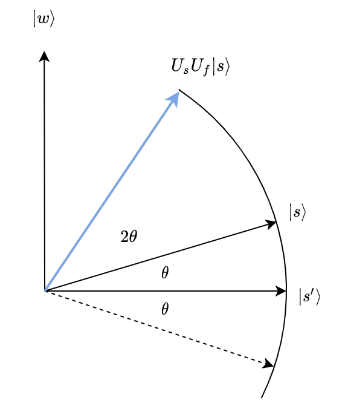
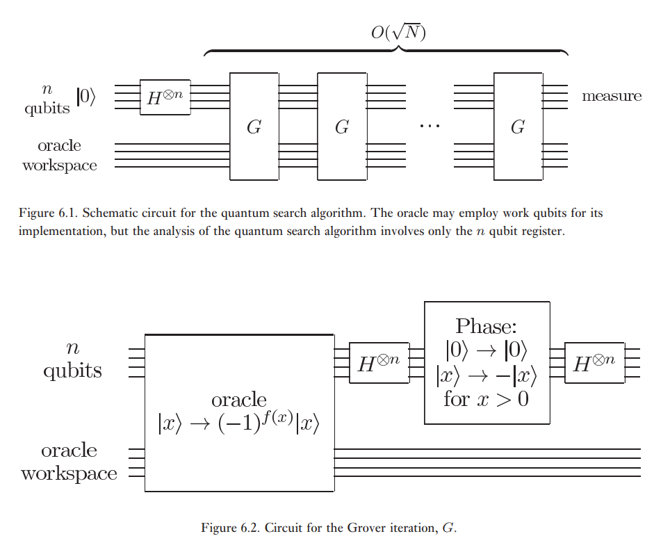
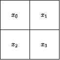
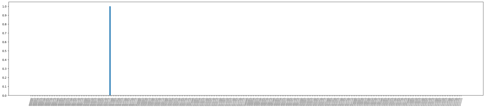
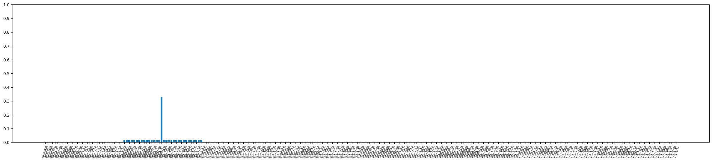

# Grover搜索算法

Grover搜索算法是一种无结构量子搜索算法，对于单个目标的情况，其查询复杂度是 $O(\sqrt{N})$ ，其中 $N$ 是状态空间大小。其实际运行时间取决于谕示（oracle）电路的复杂程度。对于20个变量，解数目比例为 $2.2\times10^{-3}$ 的SAT问题，算法在单块GPU上可以在一小时内完成。本教程旨在介绍如何使用QuICT中的Grover模块，并结合代码实例进一步阐述此算法。

本教程主要针对教科书版本[<sup>[1]</sup>](#refer1)的Grover算子，此外还支持多解情况，支持bit-flip和phase-flip oracle（前者是$O|x\rangle|y\rangle=|x\rangle|f(x)\oplus y\rangle$，后者是$O|x\rangle=(-1)^{f(x)}|x\rangle$）。当解的数目所占比例较大（超过一半）时，Grover迭代次数为0，算法退化为均匀随机采样。

Grover搜索算法的实际运行时间取决于谕示（oracle）电路的复杂程度。对于20个变量，解数目比例为 $2.2\times10^{-3}$ 的SAT问题，算法在单块GPU上可以在一小时内完成。

## 算法设置

量子计算机的无结构搜索问题的二次加速是其最著名的优势之一。这种能力由Grover算法展示，它不仅可以二次加速非结构化搜索问题，还可以用作一般技巧或子例程，以获得各种其他算法的二次加速。这种技巧通常被称为振幅放大（Amplitude Estimation）。

### 无结构搜索问题

无结构搜索问题是指在没有关于搜索对象的任何先验知识的情况下，需要在给定的数据集或数据库中搜索目标对象的问题。在这种情况下，通常需要对数据集中的每个元素进行逐一比较，以找到目标对象，其时间复杂度是线性的。Grover算法是一种在量子计算机上实现无结构搜索问题的算法，可以实现二次加速。虽然不比指数加速，但二次加速对依然是一个可观的时间节省。此外，该算法不对列表的内部结构做任何假设，这使得它为许多经典问题立即提供了二次量子化的加速。

## 算法原理

### 谕示电路的构造

考虑这样的例子，我们的搜索空间是由我们的量子比特可能处于的所有计算基状态组成的，而我们的搜索目标是$\omega = \text{011}$。Grover算法需要的谕示电路输入翻转了标记状态的相位。也就是说，对于计算基中的任何状态 $|x\rangle$ ，有：

$$
U_\omega|x\rangle = \bigg\{
\begin{aligned}
\phantom{-}|x\rangle \quad \text{if} \; x \neq \omega \\
-|x\rangle \quad \text{if} \; x = \omega \\
\end{aligned}
$$

谕示电路对应的酉矩阵是对角的，其中对应于被标记项目的条目有一个相位翻转，如下所示：

$$
U_\omega = 
\begin{bmatrix}
1 & 0 & 0 & 0 & 0 & 0 & 0 & 0 \\
0 & 1 & 0 & 0 & 0 & 0 & 0 & 0 \\
0 & 0 & 1 & 0 & 0 & 0 & 0 & 0 \\
0 & 0 & 0 & -1 & 0 & 0 & 0 & 0 \\
0 & 0 & 0 & 0 & 1 & 0 & 0 & 0 \\
0 & 0 & 0 & 0 & 0 & 1 & 0 & 0 \\
0 & 0 & 0 & 0 & 0 & 0 & 1 & 0 \\
0 & 0 & 0 & 0 & 0 & 0 & 0 & 1 \\
\end{bmatrix}
\begin{aligned}
\\
\\
\\
\\
\leftarrow \omega = \text{011}\\
\\
\\
\\
\\
\\
\end{aligned}
$$

Grover算法的强大之处在于，它很容易将一个问题转换为这种形式的谕示电路。这样的谕示电路本质上只是*验证*一个解决方案而非*找到*一个解决方案，使得构建谕示电路的难度大大下降。例如，我们可以通过检查所有的规则是否被满足来轻松验证[数独](https://en.wikipedia.org/wiki/Sudoku)的解决方案。对于这些问题，我们可以创建一个函数 $f$ ，它接收一个解决方案 $x$ ，如果 $x$ 不是一个解决方案（ $x\neq\omega$ ），则返回 $f(x)=0$ ，如果是一个有效的解决方案（ $x=\omega$ ），则返回 $f(x)=1$ 。那么我们的谕示电路对应的酉矩阵可以描述为

$$
U_\omega|x\rangle = (-1)^{f(x)}|x\rangle
$$

其矩阵形式为：

$$
U_\omega = 
\begin{bmatrix}
(-1)^{f(0)} &   0         & \cdots &   0         \\
0           & (-1)^{f(1)} & \cdots &   0         \\
\vdots      &   0         & \ddots & \vdots      \\
0           &   0         & \cdots & (-1)^{f(2^n-1)} \\
\end{bmatrix}
$$

### Grover算子

考虑这样的一个电路：

$$
\mathcal{G}=U_s U_f, \quad U_s = I-2|s⟩⟨s|, \quad U_f = I-2|\omega⟩⟨\omega|
$$

其中 $|s⟩$ 是均匀叠加态而 $|\omega⟩$ 是标记状态。在 $|\omega⟩$ 与 $|s'⟩=\frac{1}{N-1}\sum_{x\neq\omega}|x⟩$ 构成的平面上，这个电路将状态做了一个逆时针旋转：

<figure markdown>

</figure>


在这个平面上，$U_s$是对状态$\ket{s}$的反转，$U_f$是对状态$\ket{w}$的反转，两者总是对应于一个旋转。Grover算子使初始状态 $|s\rangle$ 向标记状态 $|w\rangle$ 旋转。这个过程将重复数次，以锁定标记状态。经过 $t$ 步，我们将处于 $|\psi_t\rangle$ 状态，其中 $| \psi_t \rangle = (U_s U_f)^t | s \rangle$ 。可以证明约 $\sqrt{N}$ 的旋转是足够的。观察 $\|\langle w|\psi_t\rangle\|$ ，它随着Grover算子的使用次数而增长，并且在旋转到$|w\rangle$时达到最大。我们可以写出旋转角度的表达式：
$$
\sin\theta = \frac{\|w\cdot s\|}{\| w \|\cdot\| s \|}=\sqrt{1/N}
$$
于是在$\frac{\pi/2}{\theta}\sim N^{1/2}$次旋转后，我们可以找到目标状态，以小于$\sin^2\theta\sim N^{-1}$的失败率。这实现了查询复杂度上的二次加速。在有多个解决方案的情况下，可以证明大约 $\sqrt{(N/M)}$ 的旋转就足够了，其中 $M$ 是解的数目。

### 算法流程

具体而言，算法使用$\lceil\frac{\pi}{4}\sqrt{N}\rceil$次谕示电路，其整体结构与Grover算子的构造如图所示：

<figure markdown>

<p markdown="1" style="font-size:15px;"> 图片引用自*Quantum computation and quantum information*. [<sup>[1]</sup>](#refer1)
</figure>

$U_s$门可以由$O(n)=O(\log N)$基础门实现，该实现已包含在QuICT的qcda部分中。

## 代码示例

### 基本用法

`Grover`类位于`QuICT.algorithm.quantum_algorithm.grover`，`circuit`/`run`的参数包括：

1. `n`：oracle状态空间向量的位数
1. `n_ancilla`：oracle辅助比特的位数
1. `oracle`：所使用的oracle电路
1. `n_solution`：解的数量，解数目未知时传入`None`。默认为`1`
1. `measure`：最终的电路是否包含测量。默认为`True`

用户的oracle可以自行构建，也可以使用框架中已有的oracle（MCT oracle、CNF oracle）。随后用户实例化一个`Grover`对象，然后调用`circuit`方法得到电路或者调用`run`方法运行Grover搜索算法得到搜索结果。

### 单个解的搜索

在4位的MCT oracle上执行搜索。

```python
from QuICT.core import Circuit
from QuICT.core.gate import *
from QuICT.simulation.state_vector import StateVectorSimulator
from QuICT.core.gate.backend import MCTOneAux

def main_oracle(n, f):
    result_q = [n]
    cgate = CompositeGate()
    target_binary = bin(f[0])[2:].rjust(n, "0")
    with cgate:
        X & result_q[0]
        H & result_q[0]
        for i in range(n):
            if target_binary[i] == "0":
                X & i
    MCTOneAux().execute(n + 2) | cgate
    with cgate:
        for i in range(n):
            if target_binary[i] == "0":
                X & i
        H & result_q[0]
        X & result_q[0]
    return 2, cgate

n = 4
target = 0b0110
f = [target]
k, oracle = main_oracle(n, f)
grover = Grover(simulator=StateVectorSimulator())
result = grover.run(n, k, oracle)
print(result)
```


```python
from QuICT.core import Circuit
from QuICT.core.gate import *
from QuICT.core.gate.backend import MCTOneAux
from QuICT.simulation.state_vector import ConstantStateVectorSimulator, CircuitSimulator
```

### 二进制数独的求解[<sup>[2]</sup>](#refer2)

考虑2×2的二进制数独，要求：

- 每一列不能出现相同值
- 每一行不能出现相同值

<center>

</center>

也就是

$$f(x)=[(x_0\oplus x_1) \& (x_2\oplus x_3) \& (x_0\oplus x_2) \& (x_1\oplus x_3)]$$

首先我们需要构造谕示电路$O|x\rangle=(-1)^{f(x)}|x\rangle$:


```python
from QuICT.algorithm.quantum_algorithm.grover import Grover,PartialGrover

def sudoku_oracle():
    clauses_list = [[0,1],[2,3],[0,2],[1,3]]
    reg_q = list(range(4))
    clause_q = list(range(4,8))
    result_q = [8]
    ancilla_q = [9]
    cgate = CompositeGate()
    with cgate:
        # |-> in result_q
        X & result_q[0]
        H & result_q[0]
        # sentence
        for i in range(len(clauses_list)):
            CX & [reg_q[clauses_list[i][0]],clause_q[i]]
            CX & [reg_q[clauses_list[i][1]],clause_q[i]]
        MCTOneAux().execute(5+1) & (clause_q+result_q+ancilla_q)
        # un-compute
        for i in range(len(clauses_list)):
            CX & [reg_q[clauses_list[i][0]],clause_q[i]]
            CX & [reg_q[clauses_list[i][1]],clause_q[i]]
        H & result_q[0]
        X & result_q[0]
    return 6, cgate
```
谕示电路如图所示：


```python
k,cgate = sudoku_oracle()
circ = Circuit(10)
cgate | circ
circ.draw()
```
```
    2023-02-06 10:10:25 | circuit | INFO | Initial Quantum Circuit circuit_6b80df2ca5c311ed91250242ac110007 with 10 qubits.
    
    <Figure size 3416.11x2556.11 with 1 Axes>
```

运行Grover算法：


```python
n = 4
k, oracle = sudoku_oracle()
circ = Grover(CircuitSimulator()).circuit(n, k, oracle, n_solution=2)

amp = CircuitSimulator().run(circ)
x = bin(int(circ[list(range(n))]))[2:].rjust(4,'0')[::-1]
print(f'{x[0]}|{x[1]}\n-+-\n{x[2]}|{x[3]}')
```
```
    2023-02-06 10:10:26 | circuit | INFO | Initial Quantum Circuit circuit_6bb0fad6a5c311ed91250242ac110007 with 10 qubits.
    2023-02-06 10:10:26 | Grover | INFO | 
    circuit width          =   10
    oracle  calls          =    2
    other circuit size     =   64

    1|0
    -+-
    0|1
```

### Grover模块和PartialGrover模块的比较

为了比较Grover模块和PartialGrover模块，我们考虑只有一个解的情况。

有四个命题$x_i:\sum_j (1-[x_j])=i, i=1,2,3,4$，我们想要判断每一个命题的真假。请注意，这些命题相互矛盾，因此最多只有一个是正确的，那么很容易看出只有第三个命题为真。

更确切地说，$f(x)=\land_{i=1,2,3,4}((\neg x_i\land\sum_{j\neq i}(1-[x_j])\neq i) \lor (x_i\land\sum_{j\neq i}(1-[x_j])=i))$。但实际上我们用$f_a(x)=f(x)\land(\land_{i=4+1...4+a} x_i)$来区分Grover和Partial Grover模块。

同样，我们可以用Grover模块构建神谕并找到解决方案。


```python
def sentence(control_q:int,local_var_q,clause_q:int,ancilla_q):
    assert len(local_var_q)==3 and len(ancilla_q)==2
    cgate = CompositeGate()
    with cgate:
        CX & [local_var_q[0],clause_q]
        CX & [local_var_q[1],clause_q]
        CX & [local_var_q[2],clause_q]
        CCX & [local_var_q[1],local_var_q[2],ancilla_q[0]]
        X & ancilla_q[0]
        CCX & [clause_q,ancilla_q[0],ancilla_q[1]]
        X & ancilla_q[0]
        #uncompute clause_q
        CX & [local_var_q[0],clause_q]
        CX & [local_var_q[1],clause_q]
        CX & [local_var_q[2],clause_q]

        X & ancilla_q[1]
        CCX & [control_q,ancilla_q[1],clause_q]
        X & ancilla_q[1]
        X & clause_q

        #uncompute ancilla_q
        X & ancilla_q[0]
        CCX & [local_var_q[0],ancilla_q[0],ancilla_q[1]]
        CCX & [local_var_q[1],ancilla_q[0],ancilla_q[1]]
        CCX & [local_var_q[2],ancilla_q[0],ancilla_q[1]]
        X & ancilla_q[0]
        CCX & [local_var_q[1],local_var_q[2],ancilla_q[0]]
    return cgate

def sentence_adjoint(control_q:int,local_var_q,clause_q:int,ancilla_q):
    assert len(local_var_q)==3 and len(ancilla_q)==2
    cgate = CompositeGate()
    with cgate:
        #uncompute ancilla_q
        CCX & [local_var_q[1],local_var_q[2],ancilla_q[0]]
        X & ancilla_q[0]
        CCX & [local_var_q[2],ancilla_q[0],ancilla_q[1]]
        CCX & [local_var_q[1],ancilla_q[0],ancilla_q[1]]
        CCX & [local_var_q[0],ancilla_q[0],ancilla_q[1]]
        X & ancilla_q[0]

        X & clause_q
        X & ancilla_q[1]
        CCX & [control_q,ancilla_q[1],clause_q]
        X & ancilla_q[1]

        CX & [local_var_q[2],clause_q]
        CX & [local_var_q[1],clause_q]
        CX & [local_var_q[0],clause_q]
        X & ancilla_q[0]
        CCX & [clause_q,ancilla_q[0],ancilla_q[1]]
        X & ancilla_q[0]
        CCX & [local_var_q[1],local_var_q[2],ancilla_q[0]]
        CX & [local_var_q[2],clause_q]
        CX & [local_var_q[1],clause_q]
        CX & [local_var_q[0],clause_q]
    return cgate

def CCCX(reg_q):
    assert len(reg_q)==5
    cgate = CompositeGate()
    with cgate:
        CCX & [reg_q[0],reg_q[1],reg_q[4]]
        H & [reg_q[3]]
        S & [reg_q[4]]
        CCX & [reg_q[2],reg_q[3],reg_q[4]]
        S_dagger & [reg_q[4]]
        CCX & [reg_q[0],reg_q[1],reg_q[4]]
        S & [reg_q[4]]
        CCX & [reg_q[2],reg_q[3],reg_q[4]]
        H & [reg_q[3]]
        S_dagger & [reg_q[4]]
    return cgate

def puzzle_oracle():
    n_true_var = 4
    n_var = 8
    n_clause = 4
    var_q = list(range(n_var))
    clause_q = list(range(n_var,n_var+n_clause))
    result_q = [n_var+n_clause]
    ancilla_q = [n_var+n_clause+1,n_var+n_clause+2]
    cgate = CompositeGate()
    with cgate:
        # # |-> in result_q
        X & result_q[0]
        H & result_q[0]
        # sentence1
        for i in [1,2,3]:
            X & i
        sentence(0,[1,2,3],clause_q[0],ancilla_q) | cgate
        for i in [1,2,3]:
            X & i
        # sentence2
        sentence(1,[0,2,3],clause_q[1],ancilla_q) | cgate
        # sentence3
        for i in [0,1,3]:
            X & i
        CCCX([0,1,3,clause_q[2],ancilla_q[1]]) | cgate
        X & clause_q[2]
        CCX & [2,clause_q[2],ancilla_q[0]]
        X & clause_q[2]
        CCCX([0,1,3,clause_q[2],ancilla_q[1]]) | cgate
        for i in [0,1,3]:
            X & i
        CX & [ancilla_q[0],clause_q[2]]
        CX & [clause_q[2],ancilla_q[0]]
        X & clause_q[2]
        # sentence4
        for i in [0,1,2,3]:
            X & i
        CCCX([0,1,2,ancilla_q[0],ancilla_q[1]]) | cgate
        X & ancilla_q[0]
        CCX & [3,ancilla_q[0],clause_q[3]]
        X & ancilla_q[0]
        CCCX([0,1,2,ancilla_q[0],ancilla_q[1]]) | cgate
        for i in [0,1,2,3]:
            X & i
        # MCT
        MCTOneAux().execute(n_var-n_true_var+len(clause_q)+2) & (var_q[n_true_var:n_var]+clause_q+result_q+[ancilla_q[0]])
        #uncompute clauses
        # |-> in result_q
        H & result_q[0]
        X & result_q[0]
        # sentence1
        for i in [1,2,3]:
            X & i
        sentence_adjoint(0,[1,2,3],clause_q[0],ancilla_q) | cgate
        for i in [1,2,3]:
            X & i
        # sentence2
        sentence_adjoint(1,[0,2,3],clause_q[1],ancilla_q) | cgate
        # sentence3
        X & clause_q[2]
        CX & [clause_q[2],ancilla_q[0]]
        CX & [ancilla_q[0],clause_q[2]]
        for i in [0,1,3]:
            X & i
        CCCX([0,1,3,clause_q[2],ancilla_q[1]]) | cgate
        X & clause_q[2]
        CCX & [2,clause_q[2],ancilla_q[0]]
        X & clause_q[2]
        CCCX([0,1,3,clause_q[2],ancilla_q[1]]) | cgate
        for i in [0,1,3]:
            X & i
        # sentence4
        for i in [0,1,2,3]:
            X & i
        CCCX([0,1,2,ancilla_q[0],ancilla_q[1]]) | cgate
        X & ancilla_q[0]
        CCX & [3,ancilla_q[0],clause_q[3]]
        X & ancilla_q[0]
        CCCX([0,1,2,ancilla_q[0],ancilla_q[1]]) | cgate
        for i in [0,1,2,3]:
            X & i
    return 7, cgate
```


```python
import cupy as cp

def trace_prob(amp, c):
    """diag(partial_trace(|amp><amp|))

    Args:
        amp (cupy.ndarray): amplitude
        c (list<int>): qubits preserved

    Returns:
        numpy.ndarray: probability distribution for subspace on qubits preserved
    """
    from math import log2

    amp = cp.asnumpy(amp)
    n = int(log2(len(amp)))
    m = len(c)
    c_ortho = list(set(list(range(n))) - set(c))
    assert (1 << n) == len(amp)

    prob = np.power(np.abs(amp), 2)
    new_prob = np.sum(np.reshape(prob, tuple([2 for i in range(n)])), tuple(c_ortho))
    return np.reshape(new_prob, (1 << m,))

```


```python
n = 8
k, oracle = puzzle_oracle()
circ = Grover(CircuitSimulator()).circuit(n, k, oracle, measure=False)

amp = CircuitSimulator().run(circ)
names = [bin(i)[2:].rjust(n,'0') for i in range(1<<n)]
values = trace_prob(amp,list(range(n))).reshape([1<<n])
print(f"success rate = {sum([values[i] if bin(i)[2:].rjust(n,'0')=='00101111' else 0 for i in range(len(values))])}")

import matplotlib.pyplot as plt
plt.figure(figsize=(30,6))
plt.bar(names, values)
plt.xticks(fontsize=6,rotation=75)
plt.yticks(ticks=[i/10 for i in range(11)])
plt.show()
```
```
    2023-02-06 10:10:27 | circuit | INFO | Initial Quantum Circuit circuit_6c4d093aa5c311ed91250242ac110007 with 15 qubits.
    2023-02-06 10:10:27 | Grover | INFO | 
    circuit width          =   15
    oracle  calls          =   12
    other circuit size     =  872
    
    success rate = 0.9999470421015482
```



    


在同一个谕示电路上运行PartialGrover模块：


```python
n = 8
n_block = 3
print(f"run with n = {n}, block size = {n_block}")
k, oracle = puzzle_oracle()
circ = PartialGrover(CircuitSimulator()).circuit(n, n_block, k, oracle, measure=False)

amp = CircuitSimulator().run(circ)
names = [bin(i)[2:].rjust(n,'0') for i in range(1<<n)]
values = trace_prob(amp,list(range(n))).reshape([1<<n])
print(f"success rate = {sum([values[i] if bin(i)[2:].rjust(n,'0')[:3]=='001' else 0 for i in range(len(values))])}")

import matplotlib.pyplot as plt
plt.figure(figsize=(30,6))
plt.bar(names, values)
plt.xticks(fontsize=6,rotation=75)
plt.yticks(ticks=[i/10 for i in range(11)])
plt.show()
```
```
    run with n = 8, block size = 3
    2023-02-06 10:11:00 | circuit | INFO | Initial Quantum Circuit circuit_80687efea5c311ed91250242ac110007 with 16 qubits.
    2023-02-06 10:11:01 | Grover-partial | INFO | 
    circuit width           =   16
    global Grover iteration =    8
    local  Grover iteration =    3
    oracle  calls           =   12
    other circuit size      = 1048

    success rate = 0.797729908327687
```



    


上面的例子证明了这样一个事实：部分搜索使用较少的Oracle调用，并且只以寻找块地址为目的。下面给出了一个详细的比较：

| algorithm              | Grover(with unique target)   | Partial Grover                                |
| ---------------------- | ---------------------------- | --------------------------------------------- |
| expected output        | target address $a=a_1...a_n$ | block address of target $a_{block}=a_1...a_k$ |
| oracle calls           | $\approx\pi/4\sqrt{N}$       | $\approx\pi/4\sqrt{N}-0.34\sqrt{N/K}$         |
| other elementary gates | $O(\sqrt{N}\log N)$          | $O(\sqrt{N}\log N)$                           |
| success rate           | $1-O(N^{-1/2})$              | $1-O(N^{-1/4})$                               |

### CNF公式的求解

[CNF](https://en.wikipedia.org/wiki/Conjunctive_normal_form)是布尔逻辑的一种正规表示方法。接下来，我们将根据CNF公式的描述文件来构建谕示电路，并将谕示与Grover模块相结合，以找到解决方案。CNF谕示电路的构造方法已经在QuICT中实现。


```python
from QuICT.algorithm.quantum_algorithm.CNF import CNFSATOracle
```

以下函数从CNF描述文件中读取信息：


```python
def read_CNF(cnf_file):
        variable_number = 0
        clause_number = 0
        CNF_data = []
        f = open(cnf_file, 'r') 
        for line in f.readlines():
            new = line.strip().split()
            int_new=[]
            if new[0] == 'p':
                variable_number = int(new[2])
                clause_number = int(new[3])
            else:
                for x in new:
                    if (x != '0') and (int(x) not in int_new):
                        int_new.append(int(x))
                        if (- int(x)) in int_new:
                            int_new = []
                            break
            CNF_data.append(int_new)
        f.close()
        return variable_number, clause_number, CNF_data
```

检查CNF解决方案是必要的，因为该算法不是确定性的。


```python
def check_solution(variable_data, variable_number, clause_number, CNF_data):
    cnf_result = 1
    for i in range(clause_number):
        clause_result = 0
        if CNF_data[i+1] == []:
            clause_result = 1
        else:
            for j in range(len(CNF_data[i+1])):
                if CNF_data[i+1][j] > 0:
                    clause_result = clause_result + variable_data[CNF_data[i+1][j]-1]
                else:
                    if CNF_data[i+1][j] < 0:
                        clause_result = clause_result  + ( 1 - variable_data[-CNF_data[i+1][j]-1] )
            if clause_result == 0:
                cnf_result = 0
                break
    if cnf_result == 1:
        return True
    else:
        return False
```

两者的组合如下，我们试图在`test.cnf`中找到一个16变量的CNF公式的解决方案：


```python
file_path = 'test.cnf'
variable_number, clause_number, CNF_data = read_CNF(file_path)

ancilla_qubits_num=5
dirty_ancilla=1
cnf = CNFSATOracle()
cnf.run(file_path, ancilla_qubits_num, dirty_ancilla)

oracle = cnf.circuit()
grover = Grover(ConstantStateVectorSimulator())
    
circ = grover.circuit(variable_number, ancilla_qubits_num + dirty_ancilla, oracle, n_solution=1, measure=False, is_bit_flip=True)
print(f"constrcution finished.")
grover.simulator.run(circ)
print(f"simulation   finished.")
n_hit = 0
n_all = 1000
result_samples = grover.simulator.sample(n_all)
print(f"sampling     finished.")
```
```
    2023-02-06 10:11:35 | circuit | INFO | Initial Quantum Circuit circuit_94e15946a5c311ed91250242ac110007 with 14 qubits.
    2023-02-06 10:11:46 | Grover | INFO | circuit width          =   14
    oracle  calls          =   12
    other circuit size     =  920
    
    constrcution finished.
    simulation   finished.
    sampling     finished.
```

检查成功率：


```python
result_var_samples = np.array(result_samples).reshape((1<<variable_number,1<<(ancilla_qubits_num + dirty_ancilla))).sum(axis=1)
for result in range(1<<variable_number):
    result_str = bin(result)[2:].rjust(variable_number,'0')
    if check_solution([int(x) for x in result_str], variable_number, clause_number, CNF_data):
        n_hit += result_var_samples[result]
print(f"[{n_hit}/{n_all}]:{n_hit/n_all:.3f}")
```

    [1000/1000]:1.000

## 参考文献

<div id="refer1"></div>

<font size=3>
[1] Nielsen, M. A., & Chuang, I. L. (2019). *Quantum computation and quantum information*. Cambridge Cambridge University Press. [doi:10.1017/CBO9780511976667](https://www.cambridge.org/highereducation/books/quantum-computation-and-quantum-information/01E10196D0A682A6AEFFEA52D53BE9AE#overview)
</font>

<div id="refer2"></div>

<font size=3>
[2] Grover’s Algorithm. (n.d.). Community.qiskit.org. https://qiskit.org/textbook/ch-algorithms/grover.html
</font>
