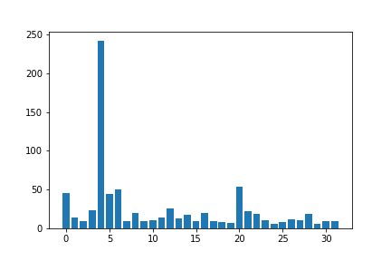

# 量子游走算法

量子游走（Quantum Walk）有两种常见的模型，分别是带硬币的量子游走（Coined quantum walk）和 Szegedy 量子游走（Szegedy quantum walk），前者是在图的顶点上进行的游走，而后者是沿图的边进行的游走，它们在某些情况下是等价的。本教程旨在介绍如何使用 QuICT 中内置的量子游走模块，并结合量子游走搜索这一重要应用进一步阐述此算法。

!!! note

    本教程目前只针对**无权图**上**离散时间**的，**带硬币**的量子游走算法。

## 带硬币的量子游走算法

### 算法原理

带硬币的量子游走是在图的顶点上进行的游走，因此每个节点都可以被视为一个状态，粒子可以在有边相连的两个状态之间移动。在硬币模型中，包含两个量子态和两个算子：

- 两个量子态

    - 位置状态 $|\psi_t⟩$ ：用于描述粒子在 $t$ 时刻时的位置，即粒子在游走的过程中处于各个位置的叠加态。
    - 硬币状态 $|\psi_C⟩$ ：用于描述粒子下一步如何移动。

- 两个算子

    - 硬币算子 $C$ （Coin Operator）：一个酉矩阵，模拟抛硬币的过程以获得硬币状态 $|\psi_C⟩$ 。
    - 移动算子 $S$ （Shift Operator）：一个置换矩阵，根据硬币状态 $|\psi_C⟩$ 决定粒子的移动情况。

!!! note

    一种常用的硬币是 Hadamard 硬币：

    $$
    H=\frac{1}{\sqrt{2}} \begin{bmatrix}
    1 & 1\\
    1 & -1
    \end{bmatrix}
    $$

    Hadamard 硬币可以视为公平硬币，能够使粒子处于相等的叠加状态。

带硬币的量子游走本质上就是，先抛硬币，然后根据抛硬币结果让粒子进行移动：

$$|\psi_{t}⟩ \overset{C}{\rightarrow} \overset{S}{\rightarrow} |\psi_{t+1}⟩$$

因此，单步的量子游走算子 $U$ 可以被表示为：

$$U = S \cdot C$$

### 算法流程

1. 设初态 $|\psi_0⟩=|0⟩$ ，即粒子只位于节点0，且尚未进行抛硬币操作。运行 $t$ 轮量子游走，每轮迭代的步骤为：
   
      1. 执行抛硬币操作 $C$ 以获得 $|\psi_C⟩$ ，即对所有硬币寄存器应用相同的硬币 $c$ 。
      2. 根据抛硬币结果 $|\psi_C⟩$ 执行移动操作 $S$ 。
   
    即：
    
    $$|\psi_{t}⟩ = U^t|\psi_0⟩$$
   
2. 对最终的状态进行量子测量。

### 用 QuICT 实现量子游走

#### 基本用法

`QuantumWalk` 位于 `QuICT.algorithm.quantum_algorithm` ，运行函数的输入参数为：

- `step`: 自定义的量子游走轮数
- `position`: 给定图的节点数
- `edges:` 给定图的边
- `operators`: 定义对各节点的操作
- `coin_operator`: 定义抛硬币操作（酉矩阵）
- `switched_time`: 单次搜索的硬币操作次数
- `shots`: 采样次数

最终输出对最终状态测量后的采样结果。

#### 代码实例

接下来，我们将以下图为例使用 QuICT 进行量子游走模拟，初始位置为节点0。

<figure markdown>
{:width="400px"}
</figure>

首先，导入运行库：

``` python
from QuICT.algorithm.quantum_algorithm import QuantumWalk
from QuICT.core.gate import *
from QuICT.simulation.state_vector import StateVectorSimulator
from QuICT.algorithm.tools.drawer.graph_drawer import *
```

初始化状态向量模拟器和 `QuantumWalk` 模块：

``` python
simulator = StateVectorSimulator()
qw = QuantumWalk(simulator)
```

根据图定义节点数和边：

!!! warning "edge需要满足的条件"

    - edge列表每一项对应一个节点，因此edge列表长度应等于节点数。
    - 子列表代表与其对应节点相连的节点编号。
    - 所有子列表长度应相等，代表图的维度。不足时应使用重复节点补齐。
    - 子列表内部的元素是有顺序的。如此例中：节点0的第一维连接节点1，节点1的第二维连接节点0。

``` python
position = 4
edges = [[1, 3], [2, 0], [3, 1], [0, 2]]
```

用均匀的 Hadamard 硬币模拟 1 step 的量子游走，并使用内置的画图函数画出 1 step 后的采样结果：

``` python
sample = qw.run(step=1, position=position, edges=edges, coin_operator=H.matrix)
draw_samples_with_auxiliary(sample, 2, 1)
```

<figure markdown>
{:width="500px"}
</figure>

可以见得 1 step 后，原本处于节点0的量子游走到节点1和3上。

## 基于硬币的量子游走搜索算法

### 算法原理

量子游走搜索算法旨在通过量子游走模型解决在图中寻找标记节点的问题。其本质是在标记节点与非标记节点上使用不同的硬币算子。

假设一个节点数为 $N=2^n$ 的 $n$ 维超立方体，每个节点都与 $n$ 个邻居节点相连，并且每个节点都可以由一个 二进制的 n-bit 向量 $\vec{x}$ 表示，则这个 $n$ 维超立方体上的移动算子 $S$ 为：

$$S=\sum_{d=0}^{n-1} \sum_{\vec{x}}^{} |d,\vec{x} \oplus \vec{e}_d⟩ ⟨d,\vec{x}|$$

其中 $d$ 为粒子游走的方向， $\vec{e}_d$ 为超立方体第 $d$ 个方向基向量。

给定一个黑盒硬币 $C'$ （Coin Oracle）用于标记其中 $M$ 个节点为待搜索节点，在标记节点与非标记节点上使用不同的硬币。通常选用 Grover 硬币用作非标记硬币 $C_0$ ：

$$C_0=G=I-2|S^C⟩⟨S^C|$$

其中 $|S^C⟩$ 为各个位置上的等权重叠加：

$$|S^C⟩=\frac{1}{\sqrt{N}}\sum_{j=0}^{N-1}|j⟩$$

$|j⟩=|0,\dots,0,1,0,\dots,0⟩$ 为第 $j$ 个位置基向量。可见 Grover 硬币可以视作超立方体上的公平硬币。

标记硬币 $C_1$ 为：

$$C_1=I-2|\chi⟩⟨\chi|$$

$$|\chi⟩=\sum_{j=0}^{N-1}\frac{a_j}{a}|j⟩$$

$$a=\sqrt{\sum_{j=0}^{N-1}{a_j}^2}$$

$a_j$ 为实数且 $a\neq 0$ ，$a_j$ 描述了标记硬币 $C_1$ 的不对称性。通常取 $a_r=x$ ， $a_{\neq r}=y$ ，且 $|y|<|x|$

因此，单步的量子游走搜索算子 $U'$ 可以被表示为：

$$U' = S \cdot C'$$

### 算法流程

1. 初始化硬币寄存器和节点寄存器为所有状态的等权重叠加态，即在全部量子比特上施加 $H$ 门。
2. 对于上一节定义的包含 $M$ 个标记节点的 $n$ 维超立方体，运行 $O(1/\sqrt{\frac{M}{N}})$ 轮量子游走搜索，每轮迭代的步骤为：
   
      1. 对于给定的黑盒硬币 $C'$，对未标记节点的对应状态应用硬币 $C_0$ ，对标记节点的对应状态应用硬币 $C_1$ 。
      2. 根据抛硬币结果执行移动操作 $S$ 。
   
3. 对最终的状态进行量子测量

### 用 QuICT 实现 N 维超立方体上的量子游走搜索

#### 基本用法

`QuantumWalkSearch` 位于 `QuICT.algorithm.quantum_algorithm` ，运行函数的输入参数为：

- `index_qubits`: 超立方体维度 $n$
- `targets`: 标记的节点编号
- `step`: 自定义的搜索轮数
- `r`: 硬币参数 $r$
- `a_r`: 硬币参数 $a_r$
- `a_nr`: 硬币参数 $a_{\neq r}$
- `switched_time`: 单次搜索的硬币操作次数
- `shots`: 采样次数

最终输出对最终状态测量后的采样结果。

#### 代码实例

接下来，我们将以 5-cube 为例使用 QuICT 进行量子游走搜索，即节点数为32个，标记节点4。

``` python
# 导入运行库
from QuICT.algorithm.quantum_algorithm import QuantumWalkSearch
from QuICT.simulation.state_vector import StateVectorSimulator
from QuICT.algorithm.tools.drawer.graph_drawer import *

# 初始化状态向量模拟器和QuantumWalkSearch模块：
simulator = StateVectorSimulator()
qws = QuantumWalkSearch(simulator)

# 开始搜索
N = 5
sample = qws.run(index_qubits=N, targets=[4], a_r=5 / 8, a_nr=1 / 8)

# 画出采样图
draw_samples_with_auxiliary(sample, N, int(np.ceil(np.log2(N))))
```

<figure markdown>
{:width="500px"}
</figure>

!!! warning "硬币参数 $a_r$ 和 $a_{\neq r}$ 的选择"

    选择适合的硬币参数 $a_r$ 和 $a_{\neq r}$ 非常重要。特别地，当 $a_r$ 和 $a_{\neq r}$ 非常接近时，标记硬币将失去标记作用：

    ``` python
    sample = qws.run(index_qubits=N, targets=[4], a_r=1 / 8, a_nr=0.9 / 8)
    draw_samples_with_auxiliary(sample, N, int(np.ceil(np.log2(N))))
    ```

    <figure markdown>
    {:width="400px"}
    </figure>

特别地， QuICT 支持多节点的量子游走搜索，如同时标记节点4和节点15：

``` python
sample = qws.run(index_qubits=N, targets=[4, 15], a_r=5 / 8, a_nr=1 / 8)
draw_samples_with_auxiliary(sample, N, int(np.ceil(np.log2(N))))
```

<figure markdown>
{:width="500px"}
</figure>

但是搜索效果通常会随着标记节点的增加而下降。

---

## 参考文献

<div id="refer1"></div>

<font size=3>
[1] Portugal, Renato. Quantum walks and search algorithms. Vol. 19. New York: Springer, 2013. [DOI: https://doi.org/10.1007/978-3-319-97813-0](https://doi.org/10.1007/978-3-319-97813-0)
</font>

<div id="refer2"></div>

<font size=3>
[2] Neil Shenvi, Julia Kempe, and K. Birgitta Whaley. A Quantum Random Walk Search Algorithm. Phys. Rev. A. [arXiv:quant-ph/0210064 (2003)](https://arxiv.org/abs/quant-ph/0210064)
</font>

<div id="refer3"></div>

<font size=3>
[3] Hristo Tonchev. Alternative Coins for Quantum Random Walk Search Optimized for a Hypercube. Journal of Quantum Information Science, Vol.5 No.1, 2015. [DOI: 10.4236/jqis.2015.51002](https://www.scirp.org/journal/paperinformation.aspx?paperid=55017)
</font>

---