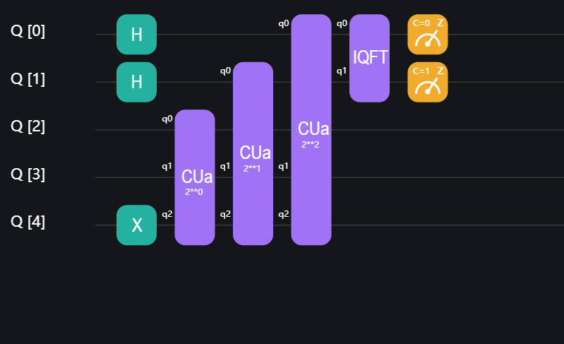
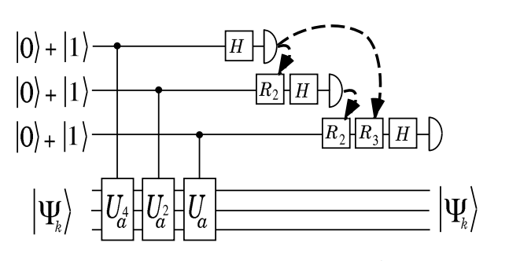
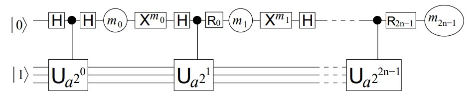

# Shor因子分解算法

Shor算法是一个解决因数分解问题的量子算法，在时间复杂度上该算法相对最好的经典算法实现了指数加速，在 $O(n^3)$ 的时间内以高概率给出合数输入的非平凡因子。本教程旨在介绍如何使用QuICT的Shor模块，并结合代码实例进一步阐述此算法。

## 算法原理

Shor算法的核心思想是通过解决周期寻找（period finding）问题，从而解决因式分解问题。具体来说，Shor算法将大整数分解的过程分为两个部分：量子部分和经典部分。量子部分使用相位估计（Quantum Phase Estimation，QPE）和量子算术电路，来找到与输入整数互质的一个随机数的[阶](https://en.wikipedia.org/wiki/Multiplicative_order)。经典部分则根据这个周期来求得输入整数的因子。接下来本教程将分别叙述这两个部分。

### 量子部分

对于待分解数 $N$ 以及满足 $\gcd(a,N)=1$ 的数 $a$ ，周期寻找问题要求找到 $f(x)=a^x\bmod N$ 的周期 $r$。对于酉矩阵：

$$U_a|y⟩=|ay\bmod N⟩$$

有以下本征向量：

$$|u_s\rangle = \tfrac{1}{\sqrt{r}}\sum_{k=0}^{r-1}{e^{-\tfrac{2\pi i s k}{r}}|a^k \bmod N\rangle}\\[10pt] $$

$$U|u_s\rangle = e^{\tfrac{2\pi i s}{r}}|u_s\rangle$$

并且：

$$\tfrac{1}{\sqrt{r}}\sum_{s=0}^{r-1} |u_s\rangle = |1\rangle$$

这意味着在 $U_a$ 和初态 $|1⟩$ 上的相位估计可以得到相位：

$$\phi=\frac{s}{r},s\in [0,r-1]$$

#### iterative QPE

iterative QPE技术可以减少使用的量子比特数量。根据使用的量子算数电路与是否使用iterative QPE，QuICT上给出了四种Shor算法的变体。

考虑一个 $m=3, n=2, N=2^2$ 的情况，其电路与状态变换如下图所示（$\tilde{s/r}=(0.a_1\cdots a_m)_2$ ，其中 $a_i$ 是第i个比特的测量结果）：

<figure markdown>

</figure>

上图中的前三步（对应前三条虚线）完成了如下变换：

$$
\sqrt\frac{1}{2^m}\sum_{k=0...2^m-1}|k\rangle|u\rangle
$$

$$
\sqrt\frac{1}{2^m}\sum_{k=0...2^m-1}e^{\tfrac{2\pi i s k}{r}}|k\rangle|u\rangle
$$

$$
\tilde{|s/r\rangle}|u\rangle
$$

这是一个标准的相位估计子程序，这一转换需要在原始酉变换所需的n个量子比特（也就是第二个寄存器）之外使用m个量子比特（也就是第一个寄存器）用于存储相位。但是，如果只关心测量结果 $\tilde{s/r}$ ，而且允许由测量结果构建量子电路，那么第一个寄存器只需要一个比特即可。其核心想法是利用 $CU_a$ 电路的可交换性，用一个量子比特逐个完成m个量子比特的制备和测量，这个方法也就是迭代相位估计（iterative QPE）。这一方法减少了所需要的量子比特。

下图描述了iterative QPE如何逐个制备和测量第一个寄存器中的量子比特。在每个量子比特被用作控制位之前对其进行测量，根据测量结果来进行受控旋转，测量结果的概率分布与标准相位估计是相同的。

<figure markdown>
{:width="500px"}
    <p markdown="1" style="font-size:12px;"> 图片引用自*Semiclassical Fourier transform for quantum computation.* [<sup>[3]</sup>](#refer3)
</figure>

iterative QPE的电路如下图所示，其中 $X^m$ 将量子比特还原到0， $R$ 门受控于之前的测量结果：

<figure markdown>

    <p markdown="1" style="font-size:12px;"> 图片引用自*Circuit for Shor's algorithm using 2n+3 qubits.* [<sup>[1]</sup>](#refer1)
</figure>

### 经典部分

首先需要确保算法的输入是一个合数。可以使用能够在多项式时间内完成的[素性判别算法](https://en.wikipedia.org/wiki/Miller%E2%80%93Rabin_primality_test)对此进行判断。

其次，为了运行求阶算法，需要找到满足 $\gcd(a,N)=1$ 的数 $a$ ，只需随机选取即可，因为当 $\gcd(a,N)\neq 1$ 时， $\gcd(a,N)$ 即为 $N$ 的非平凡因子。如果 $\gcd(s,r)=1$ ，可使用[连分数算法](https://en.wikipedia.org/wiki/Continued_fraction)计算 $r$ ，使之满足：

$$a^r=1\bmod N \land a^{r'}\neq 1\bmod N \forall 0\leq r'<r$$

以下两个事实保证了算法能够以高概率得到 $N$ 的非平凡因子：

1. 对于合数 $N$ ，如果 $x\in[0,N]$ 满足 $x^2=1\bmod N$ ，则 $\gcd(x-1,N)$ 与 $\gcd(x+1,N)$ 中至少有一个是 $N$ 的非平凡因子。
2. 考虑 $N=\Pi_{i=1}^{m} p_i^{\alpha_i}$ ，$x$ 从 $\{x|x\in[1,N-1]\land \gcd(x,N)=1\}$ 中随机选取，则 $2|r=\text{ord}_N(x),x^{r/2}\neq -1\bmod N$ 的概率至少是 $1-\frac{1}{2^m}$ 。

## 用QuICT实现Shor算法

QuICT根据量子部分中使用的乘幂电路，以及是否使用iterative QPE实现了四种Shor因数分解算法的变体，4种方法在电路宽度与深度上有常数上的差别，详见下表：

$n$ 为输入数的位数， $t$ 为求阶算法中QPE的精度位数。默认 $t=2n+1$ 。

| 算法    | 电路宽度 | 电路深度   | 电路规模   | 模拟器上的运行速度 |
| ------- | -------- | ---------- | ---------- | ------------------ |
| BEA     | n+2+t    | $O(n^2 t)$ | $O(n^3 t)$ | 快                 |
| HRS     | n+1+t    | $O(n^2 t)$ | $O(n^3 t)$ | 快                 |
| BEA-zip | 2n+3     | $O(n^2 t)$ | $O(n^3 t)$ | 慢                 |
| HRS-zip | 2n+2     | $O(n^2 t)$ | $O(n^3 t)$ | 慢                 |
### 基本用法

`ShorFactor`类位于`QuICT.algorithm.quantum_algorithm`，初始化参数包括：

- `mode`：字符串，可以指定为`BEA`[<sup>[1]</sup>](#refer1)、`HRS`[<sup>[2]</sup>](#refer2)、`BEA_zip`、`HRS_zip`中的一个。`*_zip`指使用了iterative QPE[<sup>[3]</sup>](#refer3)（即原论文中提到的one-bit trick）
- `eps`：相位估计的精度
- `max_rd`：order-finding子程序的最大可执行次数。默认为2
- `simulator`：模拟器。默认为`StateVectorSimulator()`

函数包括：

- `circuit()`：获取order-finding部分的电路
- `run()`：直接执行算法

### 正确性测试

周期寻找算法实现的行为与理论预测一致。

| mode    | original | reinforced(MAX_ROUND=3) | $Pr(r\neq 0\text{ and }r\nmid\text{order}(a,N))$ | repetitions |
| ------- | -------- | ----------------------- | ------------------------------------------------ | ----------- |
| BEA     | 0.47     | 0.12                    | 0                                                | 108         |
| BEA_zip | 0.48     | 0.11                    | 0                                                | 108         |
| HRS     | 0.44     | 0.06                    | 0                                                | 108         |
| HRS_zip | 0.44     | 0.03                    | 0                                                | 108         |

该数据集是 $[4,54)$ 中的合数，共36个，其中9个是奇合数。测试程序如下：

```python
for mode in order_finding_test_modes.keys():
    failure = 0
    for N in number_list:
        p = random.choice(
            list(filter(lambda x: gcd(x, N) == 1 and x != 1, list(range(N))))
        )
        print(f"testing ({p:2},{N:2})...", end="")
        a = order_finding_test_modes[mode](p, N, simulator=simulator)
        print(f"{'T' if (p**a)%N==1 and a!=0 else 'F'}: {p}**{a}==1 mod {N}")
        if a == 0 or (p ** a) % N != 1:
            failure += 1
print(f"success rate: {1-failure/len(number_list):.3f}")
if 1 - failure / len(number_list) < threthold_rate:
    assert False
```

Shor算法正确性测试结果如下。表格中给出了不同模式下的错误率，`original`指的是上面给出的**原始**程序，`forced`只在第3步不同，我们挑选一个满足$gcd(x,N)=1$的数$x$来**强制**执行周期寻找子程序。数字指第4步中重复子程序的次数。

| mode    | original-2 | forced-2 | original-3 | forced-3 |
| ------- | ---------- | -------- | ---------- | :------- |
| BEA_zip | 0.028      | 0.028    | 0.0        | 0.0      |
| HRS_zip | 0.028      | 0.028    | 0.0        | 0.0      |

测试程序如下：

```python
for mode in run_test_modes:
    print(f"mode: {mode}")
    failure = 0
    for number in number_list:
        a = ShorFactor(mode=mode).run(N=number)
        if a == 0 or number % a != 0:
            failure += 1
    print(f"success rate: {1-failure/len(number_list):.3f}")
    if 1 - failure / len(number_list) < threthold_rate:
        assert False
```

### 代码实例

接下来，将以21为例用QuICT内置的Shor模块对其进行因数分解，使用的是加入iterative QPE的Beauregard[<sup>[1]</sup>](#refer1)的电路：

```python
from QuICT.simulation.state_vector.cpu_simulator import CircuitSimulator
from QuICT.algorithm.quantum_algorithm import ShorFactor

input  = 21
sf = ShorFactor(mode="BEA_zip", max_rd=2)
circ, indices = sf.circuit(N=input)

output = sf.run(N=input, circuit=circ, indices=indices, forced_quantum_approach=True)
print(f"input  = {input}")
print(f"output = {output}")
```

```
2023-02-16 13:17:11 | BEA-zip | INFO | 	circuit construction begin: circuit: n = 5 t = 13
2023-02-16 13:17:14 | Shor | INFO | round = 0
2023-02-16 13:17:14 | Shor | INFO | forced quantum approach, looking for coprime number...
2023-02-16 13:17:14 | Shor | INFO | Quantumly determine the order of the randomly chosen a = 11
2023-02-16 13:18:26 | Shor | INFO | phi: 0.167
2023-02-16 13:18:26 | Shor | INFO | Shor succeed: found factor 7, with the help of a = 11, r = 6
input  = 21
output = 7
```

如果输入为素数，程序将会返回0，表示无法分解。将上述程序中`input`修改为`13`，运行结果如下：

```
2023-02-16 12:55:02 | BEA-zip | INFO | circuit construction begin: circuit: n = 4 t = 11
2023-02-16 12:55:04 | Shor    | INFO | N does not pass miller rabin test, may be a prime number
input  = 13
output = 0
```

---

## 参考文献

<div id="refer1"></div>

<font size=3>
[1] Beauregard, S. (2002). Circuit for Shor's algorithm using 2n+3 qubits. Quantum Inf. Comput., 3, 175-185. [arXiv:quant-ph/0205095](https://arxiv.org/abs/quant-ph/0205095)
</font>

<div id="refer2"></div>

<font size=3>
[2] Häner, T., Rötteler, M., & Svore, K.M. (2016). Factoring using $2n+2$ qubits with Toffoli based modular multiplication. ArXiv, abs/1611.07995. [arXiv:1611.07995](https://arxiv.org/abs/1611.07995)
</font>

<div id="refer3"></div>

<font size=3>
[3] Griffiths, & Niu (1995). Semiclassical Fourier transform for quantum computation. Physical review letters, 76 17, 3228-3231. [arXiv:quant-ph/9511007](https://arxiv.org/abs/quant-ph/9511007)
</font>

---