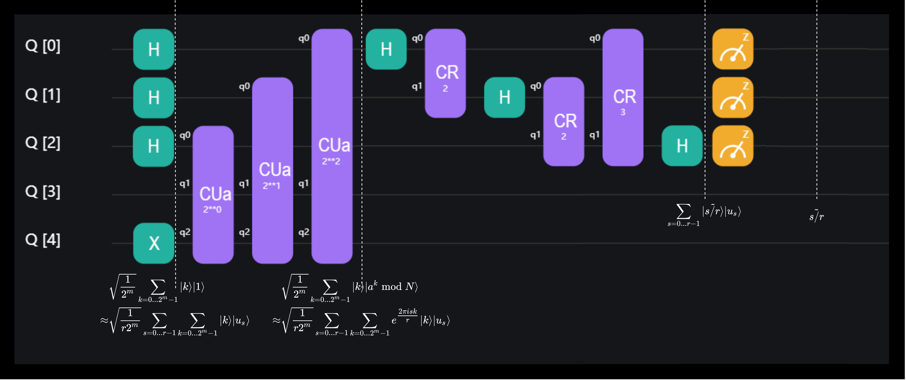

# Shor因子分解算法

本教程将讲解QuICT中Shor模块的算法设置、基本用法以及代码示例。

## 概要

Shor算法是一个解决因数分解问题的量子算法，在时间复杂度上该算法相对最好的经典算法实现了指数加速，在 $O(n^3)$ 的时间内以高概率给出输入的非平凡因子（如果有）。本框架实现了四个Shor因数分解算法的变体（根据量子部分中使用的乘幂电路/是否使用iterative QPE），在电路宽度与深度上有常数上的差别。

下列表格中，$n$是输入数的位数，$t$是求阶算法中QPE的精度位数。默认$t=2n+1$。

| 算法    | 电路宽度 | 电路深度   | 电路规模   | 模拟器上的运行速度 |
| ------- | -------- | ---------- | ---------- | ------------------ |
| BEA     | 2n+2+t   | $O(n^2 t)$ | $O(n^3 t)$ | 快                 |
| HRS     | 2n+1+t   | $O(n^2 t)$ | $O(n^3 t)$ | 快                 |
| BEA-zip | 2n+3     | $O(n^2 t)$ | $O(n^3 t)$ | 慢                 |
| HRS-zip | 2n+2     | $O(n^2 t)$ | $O(n^3 t)$ | 慢                 |

Shor因子分解算法包含了经典部分（素数判定、求最大公约数等等）与量子部分（求阶算法）。如果在量子部分，对于待分解数 $N$ ，我们使用数 $a$ 满足：

$$(a,N)=1, \quad \text{ord}_N(a)=r, \quad 2|r, \quad a^{r/2}\neq -1\bmod N$$

那么 $\gcd(a^{r/2}-1,N)$ 和 $\gcd(a^{r/2}+1,N)$ 中必然包含 $N$ 的非平凡因子。更详细的成功概率分析可以参考教科书。我们只考虑对于量子部分的时间开销，对于 $n=11$ 的输入，求阶算法在单块GPU上可以在一小时内完成。

## 算法设置

本节将重点讨论Shor算法的量子部分，它实际上是解决了寻找周期（period finding）的问题。由于一个因式分解问题可以在多项式时间内转化为一个周期查找问题，一个有效的周期查找算法也可以用来有效地分解整数。现在，我们只需证明，如果我们能高效计算出 $a^x\bmod N$ 的周期，那么我们也可以高效地进行因子计算。由于寻找周期本身就是一个有价值的问题，我们将首先解决这个问题，然后再讨论如何利用这个问题进行因式分解。

### 周期寻找

考虑酉矩阵 $U_a|y⟩=|ay\bmod N⟩$ ，注意到他有以下本征向量：

$$|u_s\rangle = \tfrac{1}{\sqrt{r}}\sum_{k=0}^{r-1}{e^{-\tfrac{2\pi i s k}{r}}|a^k \bmod N\rangle}\\[10pt] $$

$$U|u_s\rangle = e^{\tfrac{2\pi i s}{r}}|u_s\rangle$$

而且

$$\tfrac{1}{\sqrt{r}}\sum_{s=0}^{r-1} |u_s\rangle = |1\rangle$$

这意味着我们在 $U_a$ 和初态 $|1⟩$ 上的相位估计（phase estimation）可以得到相位：

$$\phi=\frac{s}{r},s\in [0,r-1]$$

如果 $\gcd(s,r)=1$ ，[连分数算法](https://en.wikipedia.org/wiki/Continued_fraction)允许我们找到 $r$ 。最终的线路如图：

<figure markdown>
{:width="500px"}
</figure>

其中的IQFT电路为：

<figure markdown>
{:width="500px"}
</figure>

而迭代相位估计（iterative QPE）则减少了所需要的量子比特：

<figure markdown>
{:width="600px"}
</figure>[<sup>[3]</sup>](#refer3)

### ...到因数分解

量子部分成功运行返回的结果 $r$ 满足 $a^r=1\bmod N \land a^{r'}\neq 1\bmod N \forall 0\leq r'<r$ 。以下两个事实保证了算法以高概率得到待分解数的非平凡因子（如果有）：

1. 对于合数 $N$ ，如果 $x\in[0,N]$ 满足 $x^2=1\bmod N$ ，则 $\gcd(x-1,N)$ 与 $\gcd(x+1,N)$ 中至少有一个是 $N$ 的非平凡因子。
2. 考虑 $N=\Pi_{i=1}^{m} p_i^{\alpha_i}$ ，$x$ 从 $\{x|x\in[1,N-1]\land \gcd(x,N)=1\}$ 中随机选取，则 $2|r=\text{ord}_N(x),x^{r/2}\neq -1\bmod N$ 的概率至少是 $1-\frac{1}{2^m}$ 。

## 基本用法

`ShorFactor`类位于`QuICT.algorithm.quantum_algorithm.shor`，初始化参数包括

1. `mode`：字符串，可以指定为`BEA`[<sup>[1]</sup>](#refer1)、`HRS`[<sup>[2]</sup>](#refer2)、`BEA_zip`、`HRS_zip`中的一个。`*_zip`指使用了iterative QPE[<sup>[3]</sup>](#refer3)（也就是原论文中所说的one-bit trick）
2. `eps`：相位估计的精度
3. `max_rd`：order-finding子程序的最大可执行次数。默认为2
4. `simulator`：模拟器。默认为`StateVectorSimulator()`

调用`circuit`方法可以得到order-finding部分的电路；调用`run`方法可以直接执行整个算法。

## 代码示例

使用`ShorFactor(mode, N).run()`来通过QuICT内置的Shor算法实现来寻找一个数字$N$的因子：


```python
from QuICT.simulation.state_vector.cpu_simulator import CircuitSimulator
from QuICT.algorithm.quantum_algorithm import ShorFactor

input  = 35
sf = ShorFactor(mode="BEA_zip", max_rd=2)
circ, indices = sf.circuit(N=input)

output = sf.run(N=input, circuit=circ, indices=indices, forced_quantum_approach=True)
print(f"input  = {input}")
print(f"output = {output}")
```

```
2023-02-06 11:22:57 | Shor | INFO | round = 0
2023-02-06 11:22:57 | Shor | INFO | forced quantum approach, looking for coprime number...
2023-02-06 11:22:57 | Shor | INFO | Quantumly determine the order of the randomly chosen a = 22
2023-02-06 11:24:02 | Shor | INFO | phi: 0.000
2023-02-06 11:24:02 | Shor | INFO | Shor failed: found odd order r = 1 of a = 22
2023-02-06 11:24:02 | Shor | INFO | round = 1
2023-02-06 11:24:02 | Shor | INFO | forced quantum approach, looking for coprime number...
2023-02-06 11:24:02 | Shor | INFO | Quantumly determine the order of the randomly chosen a = 2
2023-02-06 11:25:25 | Shor | INFO | phi: 0.250
2023-02-06 11:25:25 | Shor | INFO | Shor succeed: found factor 5, with the help of a = 2, r = 4
input  = 35
output = 5
```


### 错误率

周期寻找算法的行为与理论预测一致。 

| mode    | original | reinforced(MAX_ROUND=3) | $Pr(r\neq 0\text{ and }r\nmid\text{order}(a,N))$ | repetitions |
| ------- | -------- | ----------------------- | ------------------------------------------------ | ----------- |
| BEA     | 0.47     | 0.12                    | 0                                                | 108         |
| BEA_zip | 0.48     | 0.11                    | 0                                                | 108         |
| HRS     | 0.44     | 0.06                    | 0                                                | 108         |
| HRS_zip | 0.44     | 0.03                    | 0                                                | 108         |

该数据集是$[4,54)$中的合数，共36个，其中9个是奇合数。

`original`指的是上面给出的**原始**程序，`forced`只在第3步不同，我们挑选一个随机数$x$，即$gcd(x,N)=1$来**强制**执行周期寻找子程序。数字指第4步中重复子程序的次数。

| mode    | original-2 | forced-2 | original-3 | forced-3 |
| ------- | ---------- | -------- | ---------- | :------- |
| BEA_zip | 0.028      | 0.028    | 0.0        | 0.0      |
| HRS_zip | 0.028      | 0.028    | 0.0        | 0.0      |

## 参考文献

<div id="refer1"></div>

<font size=3>
[1] Beauregard, S. (2002). Circuit for Shor's algorithm using 2n+3 qubits. Quantum Inf. Comput., 3, 175-185. [arXiv:quant-ph/0205095](https://arxiv.org/abs/quant-ph/0205095)
</font>

<div id="refer2"></div>

<font size=3>
[2] Häner, T., Rötteler, M., & Svore, K.M. (2016). Factoring using $2n+2$ qubits with Toffoli based modular multiplication. ArXiv, abs/1611.07995. [arXiv:1611.07995](https://arxiv.org/abs/1611.07995)
</font>

<div id="refer3"></div>

<font size=3>
[3] Griffiths, & Niu (1995). Semiclassical Fourier transform for quantum computation. Physical review letters, 76 17, 3228-3231. [arXiv:quant-ph/9511007](https://arxiv.org/abs/quant-ph/9511007)
</font>
