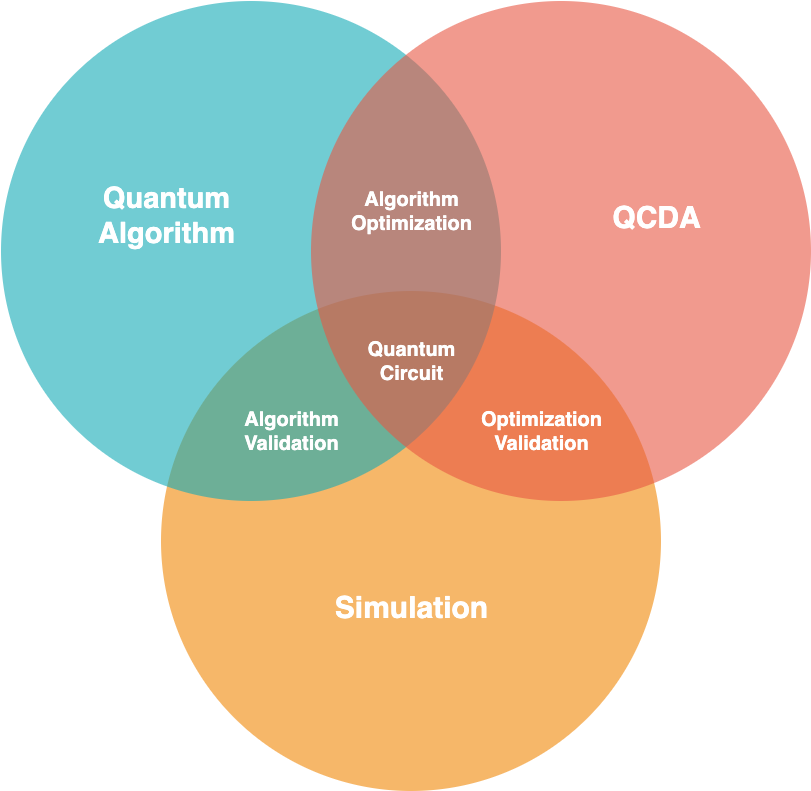
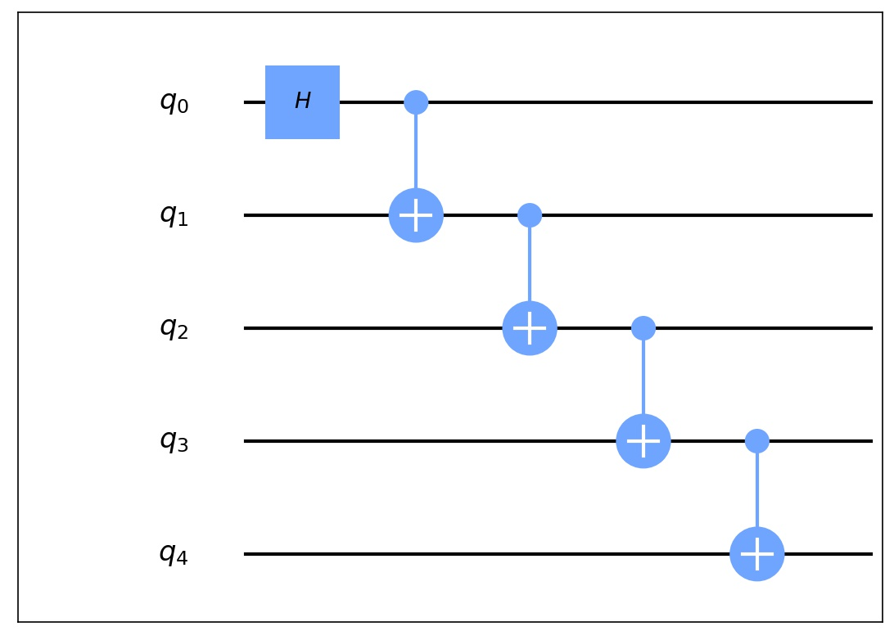

# 量子电路基础使用
量子电路 (Circuit) 是 QuICT 中最为基础的模块，无论是量子算法，还是优化映射，都需要构建相对应的量子电路。本文将介绍如何使用 QuICT 构建我们所需要的量子电路，以及如何通过量子计算模拟器得到相对应的结果。

<div align=center></div>

## 构建量子电路
----
构建量子电路是整个量子计算中最为重要的一部分，量子电路是由量子比特和量子门组成的，通过将量子比特和量子门进行特定组合可以实现所需要的功能。QuICT 提供了灵活便捷的构建电路方式，也内置了很多关于量子电路信息的功能，例如：深度、宽度、门数、矩阵等。另一方面，QuICT 也支持量子电路可视化，OPENQASM 转换器，动态构建量子电路多种辅助构建功能。

```python
from QuICT.core import Circuit
from QuICT.core.gate import H, CX

# 构建 5 比特GHZ态量子电路
circuit = Circuit(5)
H | circuit(0)
CX | circuit([0, 1])
CX | circuit([1, 2])
CX | circuit([2, 3])
CX | circuit([3, 4])
```

### 组合量子门
----
组合量子门也可以被加入到量子电路中，作为量子电路的一部分。通过构建组合量子门可以大大简化量子电路的构建难度，也可以提高代码的复用性。

```python
from QuICT.core import Circuit
from QuICT.core.gate import CompositeGate, H, CX

# 构建组合量子门
cg = CompositeGate()
CX | cg([0, 1])
CX | cg([1, 2])

# 构建 5 比特GHZ态量子电路
circuit = Circuit(5)
H | circuit(0)
cg | circuit([0, 1, 2])
cg | circuit([2, 3, 4])
```

### 动态量子电路
----
QuICT 构建了 Trigger 类，来支持量子电路的动态构建。与普通量子门不同的是，Trigger 类支持根据当前状态下的量子比特测量结果，运行不同的量子电路。
```python
from QuICT.core import Circuit
from QuICT.core.gate import CompositeGate, H, CX
from QuICT.core.operator import Trigger

cir = Circuit(5)
cir.random_append(20)

# 构建组合量子门，测试用示例
cgate0 = CompositeGate()
X | cgate0(0)
X | cgate0(1)
cgate1 = CompositeGate()
Y | cgate1(0)
Y | cgate1(1)

# 构建 Trigger
state_mapping = {
    0: cgate0,      # 当量子比特测量值为0时，执行的电路
    1: cgate1       # 当量子比特测量值为1时，执行的电路
}

trigger = Trigger(
    targets=1,      # 量子比特数量
    state_gate_mapping=state_mapping    # 量子比特测量结果所对应的量子电路或者量子门
)

trigger | cir(0)
```
```python
# 目标比特测量值为0的模拟结果
[ 0.00000000e+00+0.00000000e+00j  0.00000000e+00+0.00000000e+00j
  0.00000000e+00+0.00000000e+00j  0.00000000e+00+0.00000000e+00j
  0.00000000e+00+0.00000000e+00j  0.00000000e+00+0.00000000e+00j
  0.00000000e+00+0.00000000e+00j  0.00000000e+00+0.00000000e+00j
  0.00000000e+00+0.00000000e+00j  0.00000000e+00+0.00000000e+00j
  0.00000000e+00+0.00000000e+00j  0.00000000e+00+0.00000000e+00j
  0.00000000e+00+0.00000000e+00j  0.00000000e+00+0.00000000e+00j
  0.00000000e+00+0.00000000e+00j  0.00000000e+00+0.00000000e+00j
 -3.26096418e-17+1.79602524e-17j -2.50000000e-01-2.50000000e-01j
 -2.62688254e-17+2.65216738e-18j -2.50000000e-01-2.50000000e-01j
 -2.50000000e-01+2.50000000e-01j  1.15104767e-16+1.09607404e-17j
 -2.50000000e-01+2.50000000e-01j  9.97966820e-17+4.79177268e-17j
  2.03413043e-17+2.11129060e-17j  7.90939352e-18-3.53553391e-01j
  5.03321933e-18+1.47720895e-17j  7.90939352e-18-3.53553391e-01j
  3.53553391e-01+3.13429179e-17j -5.60471467e-17-3.42190921e-17j
  3.53553391e-01+2.20026363e-19j -1.90901603e-17-1.89110071e-17j]

# 目标比特测量值为1的模拟结果
[-4.26776695e-01-1.76776695e-01j  4.86989377e-17-5.03083881e-17j
 -4.26776695e-01-1.76776695e-01j  6.40070227e-17-5.66492045e-17j
 -2.51872252e-17-3.45677891e-17j -1.76776695e-01-7.32233047e-02j
 -6.21442116e-17-1.92597041e-17j -1.76776695e-01-7.32233047e-02j
  4.26776695e-01+1.76776695e-01j -7.38943082e-17+1.11302842e-17j
  4.26776695e-01+1.76776695e-01j -6.75534918e-17+2.64383692e-17j
  1.66252914e-17-3.83676190e-17j  1.76776695e-01+7.32233047e-02j
  1.31720638e-18-7.53246054e-17j  1.76776695e-01+7.32233047e-02j
  0.00000000e+00-0.00000000e+00j  0.00000000e+00-0.00000000e+00j
  0.00000000e+00-0.00000000e+00j  0.00000000e+00-0.00000000e+00j
  0.00000000e+00-0.00000000e+00j  0.00000000e+00-0.00000000e+00j
  0.00000000e+00-0.00000000e+00j  0.00000000e+00-0.00000000e+00j
  0.00000000e+00+0.00000000e+00j  0.00000000e+00+0.00000000e+00j
  0.00000000e+00+0.00000000e+00j  0.00000000e+00+0.00000000e+00j
  0.00000000e+00+0.00000000e+00j  0.00000000e+00+0.00000000e+00j
  0.00000000e+00+0.00000000e+00j  0.00000000e+00+0.00000000e+00j]
```

## 量子电路的矩阵表示
----
对于每一个量子电路，都可以由一个 $2^n \times 2^n$ 的酉矩阵所表示。
```python
circuit.matrix()
```
```python
[[0.70710678+0.j 0.        +0.j 0.        +0.j ... 0.        +0.j
  0.        +0.j 0.        +0.j]
 [0.        +0.j 0.70710678+0.j 0.        +0.j ... 0.        +0.j
  0.        +0.j 0.        +0.j]
 [0.        +0.j 0.        +0.j 0.        +0.j ... 0.        +0.j
  0.        +0.j 0.        +0.j]
 ...
 [0.        +0.j 0.        +0.j 0.        +0.j ... 0.        +0.j
  0.        +0.j 0.        +0.j]
 [0.        +0.j 0.70710678+0.j 0.        +0.j ... 0.        +0.j
  0.        +0.j 0.        +0.j]
 [0.70710678+0.j 0.        +0.j 0.        +0.j ... 0.        +0.j
  0.        +0.j 0.        +0.j]]
```

## 量子电路可视化
----
QuICT 支持量子电路可视化，可以通过 Circuit.draw() 实现。
```python
circuit.draw()
```
<div align=center></div>

## 量子电路与 OPENQASM
----
QuICT 支持与 OPENQASM 之间的相互转换。
> 目前暂不支持 Unitary 门的 OPENQASM 转换。
```python
from QuICT.tools.interface import OPENQASMInterface

# 将 QASM 文件转换为 Circuit
qasm_circuit = OPENQASMInterface.load_file("/path/to/qasm/file").circuit

# 将 Circuit 转换为 QASM
qasm_circuit.qasm(output_file="/path/to/store/qasm/file")
```

## 量子电路模拟
----
QuICT 通过使用 Simulator 来进行量子电路模拟，目前实现了三种模拟器。模拟器支持量子电路和初始状态向量作为输入，输出经过量子电路之后的状态向量，通常为一个 $2^n$ 的复数向量，如果模拟器选择使用密度矩阵模拟器，输出则会是密度矩阵，为一个 $2^n \times 2^n$ 的复数矩阵。
```python
from QuICT.simulation.state_vector import CircuitSimulator

# 使用上方构建的 5 比特GHZ态量子电路
circuit = ...

# 使用状态向量模拟器来进行量子电路模拟
simulator = CircuitSimulator()
state_vector = simulator.run(circuit)
```
```python
[0.70710678+0.j 0.        +0.j 0.        +0.j 0.        +0.j
 0.        +0.j 0.        +0.j 0.        +0.j 0.        +0.j
 0.        +0.j 0.        +0.j 0.        +0.j 0.        +0.j
 0.        +0.j 0.        +0.j 0.        +0.j 0.        +0.j
 0.        +0.j 0.        +0.j 0.        +0.j 0.        +0.j
 0.        +0.j 0.        +0.j 0.        +0.j 0.        +0.j
 0.        +0.j 0.        +0.j 0.        +0.j 0.        +0.j
 0.        +0.j 0.        +0.j 0.        +0.j 0.70710678+0.j]
```

```python
counts = simulator.sample(shots=3000)   # 3000次重复模拟实验结果
```
```python
[1484, 0, 0, 0, 0, 0, 0, 0, 0, 0, 0, 0, 0, 0, 0, 0, 0, 0, 0, 0, 0, 0, 0, 0, 0, 0, 0, 0, 0, 0, 0, 1516]
```

