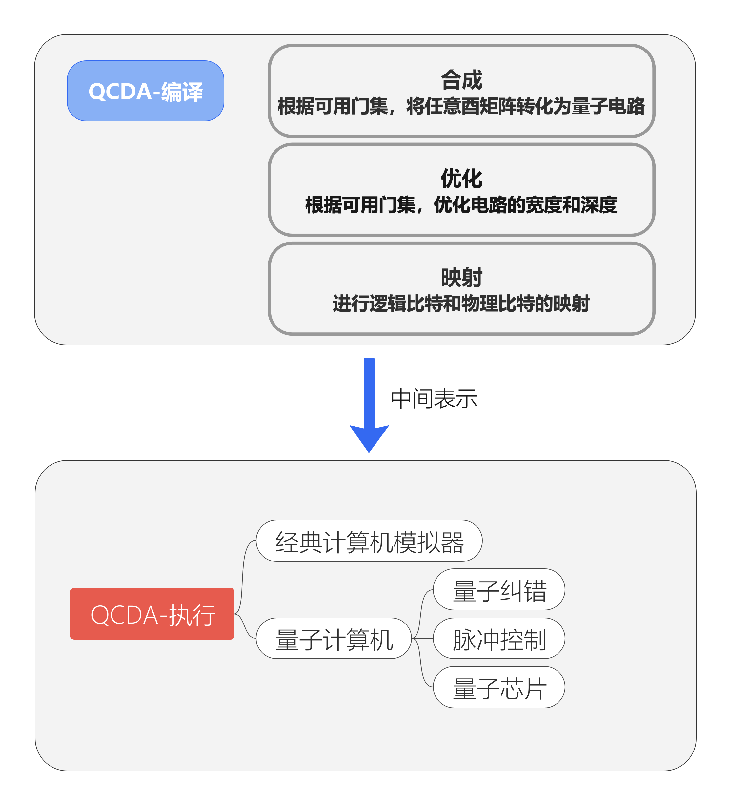

QuICT
===============

.. QuICT documentation master file, created by
   sphinx-quickstart on Tue Apr 13 22:47:38 2021.
   You can adapt this file completely to your liking, but it should at least
   contain the root `toctree` directive.

Design Philosophy
---------------------

Quick Start
-------------

.. code-block:: python

    from QuICT.core import Circuit, H, X, Measure, PermFx

    def deutsch_jozsa_main_oracle(f, qreg, ancilla):
        PermFx(f) | (qreg, ancilla)

    def run_deutsch_jozsa(f, n, oracle):
        """ an oracle, use Deutsch_Jozsa to decide whether f is balanced

        f(list): the function to be decided
        n(int): the input bit
        oracle(function): oracle function
        """

        # Determine number of qreg
        circuit = Circuit(n + 1)

        # start the eng and allocate qubits
        qreg = circuit([i for i in range(n)])
        ancilla = circuit(n)

        # Start with qreg in equal superposition and ancilla in |->
        H | qreg
        X | ancilla
        H | ancilla

        # Apply oracle U_f which flips the phase of every state |x> with f(x) = 1
        oracle(f, qreg, ancilla)

        # Apply H
        H | qreg
        # Measure
        Measure | qreg
        Measure | ancilla

        circuit.exec()

        y = int(qreg)

        if y == 0:
            print('Function is constant. y={}'.format(y))
        else:
            print('Function is balanced. y={}'.format(y))

    if __name__ == '__main__':
        test_number = 5
        test = [0, 1] * 2 ** (test_number - 1)
        run_deutsch_jozsa(test, test_number, deutsch_jozsa_main_oracle)

How To Use
-------------

Contents
----------

.. toctree::
   :maxdepth: 2
   :caption: Synthesis

   synthesis/gate_transform.rst
