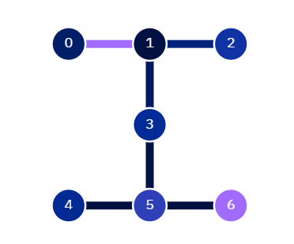
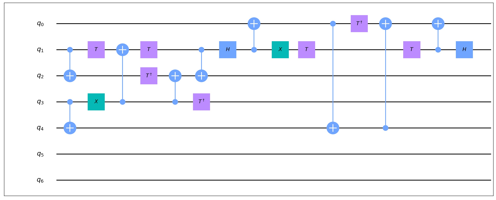
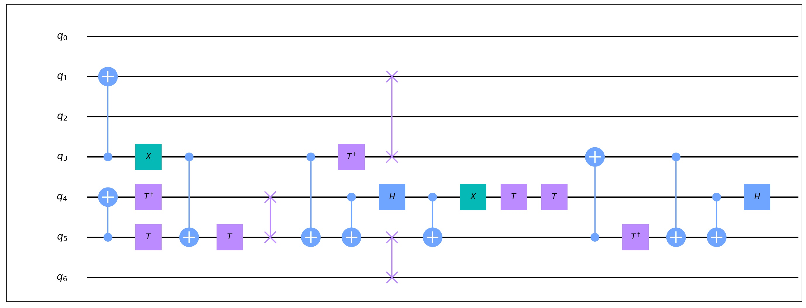

Qubit Mapping
===============

Most of the NISQ devices are limited to topological constraints, 2-qubit gates can only be performed between qubits connected in the topological graph of the physical device. In order to run a quantum program on the physical device, the logical qubits need to be mapped physical qubits and all the two-qubit gates should be mapped to the coupled qubits on the device. If there exists some two-qubit gates not satisfying the topological constraints, SWAP gates need to be inserted into the circuit to make the illegal gate compatible with the physical device. 

Next, we will give a simple example show the procedure of transforming the logical quantum program to a hardware-compliant circuit in QuICT.  

Example
--------

IBMQ Casablanca chip is used as the physical device and its layout  is shown as follows.

Supposes we want to run the following quantum circuits on IBMQ Casablanca chip.

The cirucit has 9 CNOT gates and 11 single-qubit gates. QuICT provide users convenient method to make the quantum circuit compatible with IBM Q20 chip. The code is shown as follows.

.. code-block:: python
    :linenos:

    from QuICT.qcda.mapping.utility import CouplingGraph
    from QuICT.tools.interface import OPENQASMInterface
    from QuICT.core.circuit import * 
    from QuICT.core.layout import *
    from QuICT.qcda.mapping import Mapping

    if __name__ == "__main__":
        file_path = os.path.realpath(__file__)
        dir, _ = os.path.split(file_path)
        layout = Layout.load_file(f"{dir}/ibmq_casablanca.layout") 
        qc = OPENQASMInterface.load_file(f"{dir}/test_example.qasm").circuit
        transformed_circuit = Mapping.run(circuit = qc, layout = layout, init_mapping_method = "anneal")

The Mapping method generate a transformed circuit as follows.

Techniques
-----------
In QuICT, We utilize simulated annealing method to choose a optimum initial mapping and implement a state-of-the-art Monte Carlo tree search algorithm to determine the best SWAP gate to insert in the circuit.

TODO.

